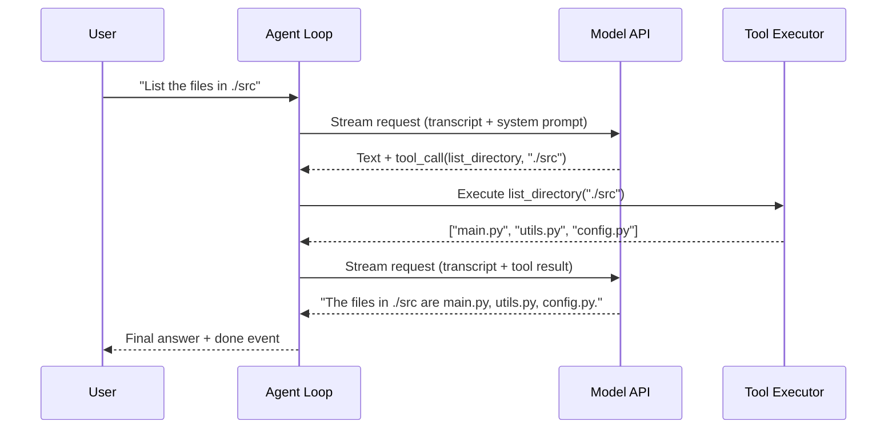
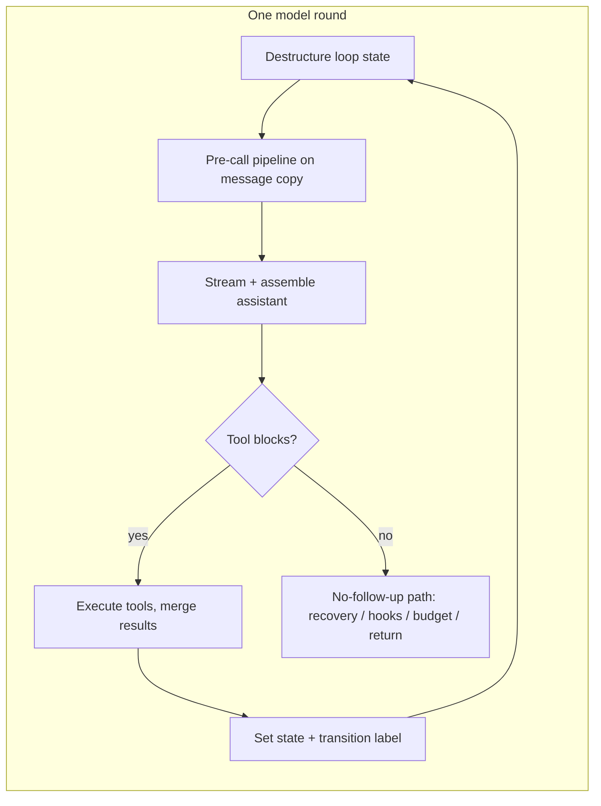

# Chapter 01: The Agent Loop

> A single async, streaming orchestration loop that turns model calls, partial responses, and tool execution into one coherent session the client can observe and cancel.

## Overview

An **agent loop** is the control program that repeatedly asks the language model what to do next, applies its decisions (including calling tools), updates what the model will see on the following round, and stops only when the model is done or a safety limit trips. It is not the model itself; it is the **scheduler** around the model. Each pass through the loop that ends in a new API request is one **model round** (often called a **turn** in logs -- just keep your own definition consistent for billing and UX).

Why does the loop need to be **async and streaming**? The model emits text and structured fragments over time. If you buffer the full reply before showing anything, latency feels high and you cannot cancel mid-flight. An asynchronous loop with streaming lets the UI or SDK pull events as they arrive, apply backpressure naturally, and abort a round without blocking a thread. The same loop shape can power a terminal UI, a headless API, and tests.

This chapter covers the core streaming loop, the distinction between transcript state and engine state, recovery from failures, and the pre-call pipeline that runs before each API request. Detailed production concerns, design decisions, and code samples follow in later sections.

### Concrete walkthrough: one complete loop iteration

Here is what happens when the user asks "List the files in ./src":

1. **User message appended** -- the transcript now ends with the user turn.
2. **Pre-call pipeline runs** -- budgets are checked, history is trimmed if needed, tool payloads are clamped.
3. **Model streams** -- the API streams back text and a structured tool-call block for `list_directory(path="./src")`.
4. **Assistant message assembled** -- text fragments and tool-call blocks are collected into one complete assistant message.
5. **Tool call detected** -- the loop sees a tool-call block in the assembled message.
6. **Tool executes** -- the tool runner calls `list_directory`, returns `["main.py", "utils.py", "config.py"]`.
7. **Tool result appended** -- a tool-result message (correlated to the original call by id) is added to the transcript.
8. **Model called again** -- the loop re-enters the pre-call pipeline with the updated transcript.
9. **Model streams final answer** -- "The files in ./src are main.py, utils.py, and config.py."
10. **No tool calls present** -- the loop exits and yields the completion event.

### Tie-in: [Chapter 02 -- Tool System](../02-tool-system/README.md)

Tool-result budgets and replacement records compose with compaction; executed tools yield normalized results back into the same transcript the loop recurses on. The tool system defines **what** can be called; the agent loop decides **when** and **how often**.

### Tie-in: [Chapter 03 -- Permission System](../03-permission-system/README.md)

Permission checks belong inside tool execution, not in the loop's branching logic. The loop sees completed tool-call and tool-result pairs and does not need to know whether a human approved the action or a policy auto-allowed it.

### Tie-in: [Chapter 06 -- Streaming & Messages](../06-streaming-and-messages/README.md)

Streaming deltas assemble into assistant messages inside the loop. Error-shaped assistant payloads and withhold rules are part of the message model, but the loop must classify them to decide whether to recover or yield.

### Tie-in: [Chapter 07 -- Context Management](../07-context-management/README.md)

The pre-call pipeline applies context management strategies (trim, compact, summarize) before each API request. Ordering of these steps and task-budget sync after summarization are detailed in Chapter 07; the loop consumes their outputs and continues with a rewritten message list.

---

## How it fits together

Architecturally, a thin **stream consumer** assembles one complete assistant message per model call (text plus any tool-call blocks). A **tool executor** runs those calls (with permission checks where your design requires them) and returns normalized **tool result** messages. The loop appends those results to the transcript and either calls the model again or exits. **Recovery** wraps the same skeleton: on classified failures, rewrite messages or parameters, then re-enter without discarding user intent.

Many implementations expose **one** async iterator to callers but implement it as a **delegating wrapper** around an inner generator: the inner body holds the `while` loop and yields stream and message events; the outer function delegates with async iteration and runs **completion-only** bookkeeping after the inner loop returns normally (for example notifying a command queue that work was consumed). **Cancellation, thrown errors, and early client `return()`** on the iterator then bypass that bookkeeping by design -- avoid double notifications or orphaned side effects.

**Continuation sites.** Each time the loop "starts over" toward another API call, mutable state should be replaced in one place: messages (and sometimes tool context) update together with counters and flags. Optional **transition labels** make it obvious whether you arrived at this iteration after a normal tool round, after draining collapsible context, after a reactive compact, after a token-budget nudge, and so on -- so branching logic and recovery ordering stay consistent.

---

## 1.1 The streaming loop

**User turn vs inner rounds.** In full products, one **user submission** may spin up work once (e.g. warming memory or context that stays valid for every model round in that submission), while the **inner loop** runs many times: stream, assemble assistant message, run tools, prepend results, repeat. Document which hooks fire **once per user input** versus **once per model round** so prefetch and telemetry stay correct.

The core loop body follows this pattern on every iteration:

1. Run the **pre-call pipeline** (see Section 1.4) on a copy of the current transcript.
2. **Stream** the model response, yielding token-level events to the consumer as they arrive.
3. **Assemble** text fragments and structured tool-call blocks into one complete assistant message.
4. **Decide**: if tool-call blocks are present, execute tools, append results to the transcript, and loop back to step 1. If no tool calls are present, check for recoverable failures or exit.

Rely on **assembled tool-call blocks** in the assistant message to decide whether another round is needed, not on the API's reported stop reason alone, because streaming transports can report that field inconsistently. Treat collected tool blocks as the authoritative signal that another iteration is needed (with hook-driven retries as a special case when the stream ends without tool blocks but policy says retry).

---

## 1.2 Transcript vs engine state

The **transcript** is the ordered list of **messages you actually send to the model** on the next call: system and developer instructions, prior user turns, assistant replies, tool invocations, and tool results. Everything the model is allowed to "read" when it generates the next token should be reflected there.

If something affects behavior but never appears in that message list, it lives **outside the transcript** -- this is engine state that **controls** the loop without being copied into the chat history.

| Field | Purpose | Example |
|-------|---------|---------|
| Turn counter | Track how many model rounds have been used in this session or sub-task, to enforce a maximum and avoid infinite tool chatter. | `turn_count: 14` with a cap of 25 |
| Recovery attempts for output limits | Count how many times you have retried after the model hit its per-response output cap; paired with a hard ceiling so recovery cannot loop forever. | `output_limit_retries: 2` with a cap of 3 |
| Reactive compaction flag | Ensure that after a failure (e.g. context too large) you try an on-the-fly summarization path at most once per incident instead of burning cost in a tight loop. | `reactive_compact_tried: true` |
| Autocompact failure streak / circuit breaker | Track repeated failures of full-context summarization; after enough consecutive failures stop retrying and surface the error or fall back. | `compact_fail_streak: 3`, breaker opens at 4 |
| Pending tool summary | Optional scratch state when tool outputs are large or deferred; the loop may track what still needs to be merged or shown without dumping raw blobs into the transcript. | Deferred 2 MB shell output awaiting policy check |
| Stop-hook flag | A signal from hooks or policy that says "end this trajectory now" even if the model might otherwise continue. | `stop_requested: true` set by a cost hook |
| Temporary output limit bump | A short-lived raise of the model's maximum output length used only as a last-resort recovery step, then cleared so normal runs keep tighter defaults. | `max_tokens` raised from 4096 to 8192 for one round |
| Labeled transition reason | A record of why the previous round chose to continue (e.g. drained staged context, reactive compact retry, token-budget nudge, stop-hook retry). The next iteration uses this to avoid repeating the same expensive step. | `transition: "reactive_compact_retry"` |

Immutable inputs to the loop (for example permission callbacks and fixed configuration) should stay separate from this mutable state. Updates should happen at well-defined **continuation** points -- single assignments or spreads of a state object -- so long sessions stay debuggable.

---

## 1.3 Recovery cascade

When things go wrong -- context overflow, truncated answers, transient API faults -- production systems use a **recovery cascade**: try the cheapest fix first, then heavier steps, each with caps so the system never spins without bound.

**Concrete example: recovering from a truncated response**

Suppose the model hits its per-response output limit mid-sentence on round 8 of a coding task:

1. **Classify the failure** -- the stream ends with a `length` stop reason and incomplete content. The loop classifies this as an output-limit truncation.
2. **Step 1: Collapse context** (cheapest) -- large tool results from earlier rounds are replaced with summaries. Cost: near zero. The loop retries.
3. **Step 2: Reactive compaction** (medium) -- if collapsing was not enough or already done, the loop triggers a one-shot summarization of the conversation history, sets `reactive_compact_tried: true`, and retries.
4. **Step 3: Raise output limit** (expensive, bounded) -- the loop temporarily bumps `max_tokens`, increments `output_limit_retries`, and retries. If the counter hits its cap (e.g. 3), stop.
5. **Step 4: Surface the error** -- if all steps are exhausted, yield a single clear error to the consumer. Do not retry further.

Each step checks the relevant counter or flag before proceeding. The **labeled transition reason** (Section 1.2) records which recovery step was taken so the next iteration does not blindly repeat it.

**Withheld errors during recovery.** Truncation-class failures may stay internal while recovery runs, so thin clients do not treat every warning as fatal. When recovery is exhausted, surface a single clear error. The same classification that decides "do not yield yet" must drive the recovery branch (for example media limits vs prompt-too-long); otherwise buffered assistant errors are dropped or mishandled.

---

## 1.4 Pre-call pipeline

The pre-call pipeline runs **before each API request**. Ordering matters -- later steps assume earlier steps have already run.

1. **Tool-result budgeting** -- clamp or spill oversized tool payloads (and optional spill-to-storage with placeholders) *before* cache-aware compaction so compaction keys stay consistent whether bodies are inlined or replaced.
2. **History trimming** -- drop or truncate older messages that exceed a sliding window, preserving system instructions and recent context.
3. **Micro-compaction** -- lighter, cache-aware edits to reduce token count without full summarization. When compaction edits segments that participate in prompt caching, a boundary message may be **deferred** until after the response so real cache-invalidation metrics can be attached accurately.
4. **Collapse archived context** -- optionally merge previously "archived" or "staged" context blocks into compact representations.
5. **Full summarization** -- heavier summarization if still over budget, with a circuit breaker on repeated failure (see autocompact failure streak in Section 1.2).
6. **Task-budget sync** -- after aggressive compaction, the API may under-count tokens already "spent" in the pre-summary window; sync the remaining task budget the model should respect with what the client already accounted for (see [Chapter 07 -- Context Management](../07-context-management/README.md)).

---

## Production concepts

### Immutable inputs and mutable state

- **Immutable loop inputs vs mutable loop state** -- arguments that should not change mid-session stay fixed; counters, flags, pending work, and optional transition labels live in one state object updated only at explicit continue points, not scattered globals.
- **Stable chain identity and depth** -- a logical **chain id** plus monotonic **depth** for nested or delegated work helps tracing, analytics, and debugging without overloading the transcript.
- **Injected dependencies** -- model calling, compaction, identifiers, and clocks are passed in so tests can substitute fakes without patching modules.

### Streaming and iteration

- **Delegating async generator** -- a small outer iterator can forward yields from an inner loop and centralize asymmetric cleanup (success-only paths), matching how streaming clients actually stop.
- **Completion vs cancellation** -- "work finished" notifications often fire only on **normal** generator completion; cancellation or early exit may intentionally skip side effects such as final hooks or dequeue notifications.
- **Prefetch overlap** -- memory or retrieval warm-up can start once per user submission; per-iteration discovery work can run under streaming and tool execution to hide latency.

### Recovery and error handling

- **Withheld recoverable errors** -- truncation-class failures may stay internal while recovery runs, so thin clients do not treat every warning as fatal; when recovery is exhausted, surface a single clear error.
- **Lifecycle hooks vs API-error shapes** -- when the last assistant-shaped payload is a **transport or quota error** (not a normal completion), be careful which hooks run before retry; uninformed hook rounds can inject more context and amplify failure loops.
- **Honest task token allowance after summarization** -- after aggressive compaction, the API may under-count tokens already "spent" in the pre-summary window; sync the **remaining task budget** the model should respect with what the client already accounted for (see [Chapter 07 -- Context Management](../07-context-management/README.md)).

### Tool round triggers and continuation

- **What triggers another tool round** -- rely on **assembled tool-call blocks** in the assistant message, not on the API's reported stop reason alone, because streaming transports can report that field inconsistently; treat collected tool blocks as the authoritative signal that another iteration is needed (with hook-driven retries as a special case when the stream ends without tool blocks but policy says retry).
- **Tool-result budgeting before compaction** -- enforce size limits on tool outputs (and optional spill-to-storage with placeholders) *before* cache-aware compaction so compaction keys stay consistent whether bodies are inlined or replaced.

### How this chapter connects to the rest of the spine

- **[Chapter 02 -- Tool system](../02-tool-system/README.md)** -- Tool-result budgets and replacement records compose with compaction; executed tools yield normalized results back into the same transcript the loop recurses on.
- **[Chapter 03 -- Permission system](../03-permission-system/README.md)** -- Permission checks belong inside tool execution; the loop branches on completed tool-call and tool-result pairs.
- **[Chapter 04 -- System prompt](../04-system-prompt/README.md)** -- Per-iteration "request start" hooks align with assembling prompts and fork context while mutable loop state stays out of immutable prompt inputs.
- **[Chapter 05 -- Tool implementations](../05-tool-implementations/README.md)** -- Registry-backed runners produce the tool-result streams the loop merges; streaming vs batch execution stays behind the same contract.
- **[Chapter 06 -- Streaming & messages](../06-streaming-and-messages/README.md)** -- Streaming deltas assemble into assistant messages; error-shaped assistants and withhold rules belong with the message model.
- **[Chapter 07 -- Context management](../07-context-management/README.md)** -- Ordering of trim, micro-compaction, collapse, autocompact, reactive compaction, and task-budget sync lives here; the loop applies outputs and continues with a rewritten message list.

## Key design decisions

- **Async iterator (generator) instead of callbacks** -- uniform yielded events (tokens, tool progress, final messages) let one core implementation serve terminal UI, SDK, and tests; trade-off: consumers must understand async iteration and cancellation.
- **Bounded recovery** -- capped retries for expensive paths (for example repeated output-limit bumps) prevent infinite loops when the task is fundamentally too large; trade-off: some edge cases stop with an error instead of trying forever.
- **Tool execution decoupled from parsing** -- the loop orchestrates; a dedicated executor owns concurrency and ordering so stream assembly stays simple; trade-off: more interfaces to maintain.
- **Continuation gates** -- if a tool or attachment path requests "stop the run," return without starting a new user round; distinct from normal completion, which may still run stop hooks and budget checks.
- **Command queue and lifecycle** -- attachments derived from queued commands dequeue only after a successful attachment pass so retries do not double-notify; trade-off: slightly more state around partial failures.
- **Labeled transitions** -- storing why the loop continued (recovery type, budget nudge, hook retry) costs a field or two but prevents ambiguous "retry everything" behavior and documents execution paths for operators.

## Insights

- **Cache-aware micro-compaction** -- when compaction edits segments that participate in prompt caching, a boundary message may be **deferred** until after the response so real cache-invalidation metrics can be attached accurately.
- **Withheld errors must match recovery** -- the same classification that decides "do not yield yet" must drive the recovery branch (for example media limits vs prompt-too-long); otherwise buffered assistant errors are dropped or mishandled.
- **Turn vs trajectory** -- validators and UX often need assistant messages, tool results, and the following assistant reply treated as one logical unit; document that for anyone building message schemas.
- **Nested cancellation** -- child abort scopes let you cancel sibling subprocesses (for example shell tools) without tearing down the entire session iterator.
- **Streaming transport fallback** -- if the client falls back mid-stream, discard partial assistant content and pending tool results so the next attempt does not emit orphan tool-result rows without matching tool calls.
- **Stop hooks after withheld prompt-too-long** -- if you skip or narrow stop hooks when recovering from context overflow, document that invariant: hooks meant for "normal" completions are not always safe when the model never produced a valid answer.

## Code samples

The examples are small, runnable Python sketches that mirror the ideas above without embedding any vendor implementation. Use them as patterns, not drop-in production modules.

| Sample | Description |
|--------|-------------|
| [`minimal_agent_loop.py`](code-samples/minimal_agent_loop.py) | Minimal async-generator loop with a mock model and tools; request-start event; chain id and per-round depth; continuation keyed off tool blocks, not stop reason. |
| [`state_machine.py`](code-samples/state_machine.py) | Mutable loop state carried across iterations; fields align with "outside the transcript" tracking, including an optional last-transition label. |
| [`recovery_cascade.py`](code-samples/recovery_cascade.py) | Layered recovery with caps: collapse, optional one-shot reactive compact, full compact, then bounded output-limit retries. |
| [`prefetch_and_task_budget.py`](code-samples/prefetch_and_task_budget.py) | Prefetch overlap with streaming/tools; adjusting remaining task budget after summarization; settle-then-consume prefetch gating. |
| [`withheld_stream_stub.py`](code-samples/withheld_stream_stub.py) | Recoverable errors buffered internally and only yielded to the consumer after recovery fails. |

## Build your own

1. **Define a small event vocabulary** -- token deltas, tool started, tool finished, message finalized, done, error -- whatever your UI needs -- and yield them from one async iterator.
2. **Implement one model pass** -- stream until one assistant message is complete (text plus structured tool-call blocks if any).
3. **Execute tools from structured blocks** -- for each tool call, run your registry, enforce permissions inside execution, append tool results with stable correlation ids matching the calls.
4. **Introduce explicit loop state** -- turn count, recovery counters, compaction flags, hook flags, optional transition label; reset only what each recovery level requires.
5. **Order pre-call steps** -- tool-result size policy before cache-sensitive compaction; then trim, lighter compaction, optional collapse, heavier summarization with a failure circuit breaker.
6. **Classify failures** -- map API and transport errors to recovery steps; for recoverable cases, keep assistant error payloads in an internal buffer for recovery logic but omit them from the outward stream until recovery succeeds, fails definitively, or is skipped -- then yield once.
7. **Wire cancellation** -- ensure subprocesses and prefetches cancel cleanly when the consumer aborts the iterator.
8. **Document trajectory rules** -- how your stack defines a single "turn" for analytics, billing, and user-visible completion.
9. **Decide success-only side effects** -- if something must run only when the loop finishes cleanly (not on cancel), place it in an outer delegating generator or an explicit `finally` that distinguishes completion kinds.

---

**Navigation:** [Overview](../README.md) | [Next: Chapter 02 -- Tool System ->](../02-tool-system/README.md)
