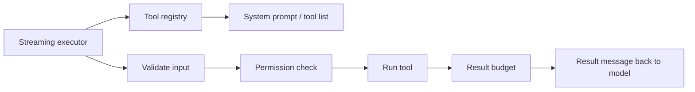
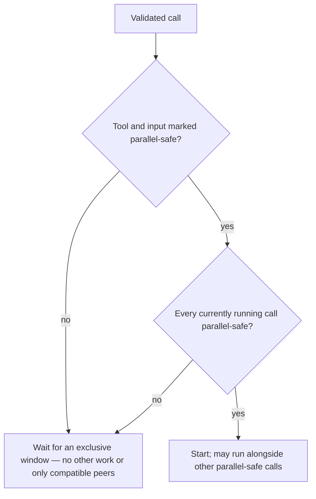

# Chapter 02: The Tool System

> Treat every capability the model can invoke as the same kind of thing: a named action with validated inputs, enforced policy, bounded outputs, and a trace the loop can schedule and audit consistently.

## Overview

If you build or operate an agent that can **call tools** (run code, read files, hit APIs), you quickly need more than ad hoc `if name == "bash"`. A **tool** is best thought of as a **contract**: a stable name, a description the model sees, rules for what arguments are allowed, and an implementation that returns something you can put back into the conversation.

**Why a contract matters.** The model emits structured call requests (a tool name plus arguments, usually as JSON). Before any side effect runs, you validate those arguments against the same rules you advertised in the system prompt or tool list. That way the loop stays predictable and safe: it does not special-case “this one tool”; it always validates, checks policy, runs, and packages a result. Permissions and budgets apply **once per call** in one place, so new tools extend a **registry** instead of forking the main loop. How the outer loop turns model output into the next model input is covered in [Chapter 01 – Agent Loop](../01-agent-loop/README.md); this chapter is about the machinery **between** “model asked for a tool” and “model sees a result.”

**Registry.** A registry is a single lookup table (or equivalent) from tool name to contract plus implementation. It drives two jobs: (1) expose the tool list and schemas to the API or prompt builder, and (2) resolve an incoming call by name at execution time. Serious deployments almost always support **aliases** (the model might say `read_file` while your canonical name is `Read`) so renames and bridges to external tool providers do not multiply code paths.

**Concurrent execution.** Tool calls often arrive in a stream, not one at a time. An executor holds a **queue** and decides what may run in parallel. Some tools are safe to overlap (e.g. independent reads); others need **exclusive** execution (e.g. anything that mutates shared state or a shell session). Scheduling rules should use **validated** inputs: you only know whether a call is “parallel-safe” after parsing succeeds; a parse failure should fall back to conservative, non-parallel behavior so you never schedule risky overlap by mistake.

**Result size limits.** Command output, retrieved documents, or API payloads can be huge. Sending megabytes straight back into the model context wastes tokens, slows inference, and can break limits. A **per-tool** cap (truncate, summarize, or spill) is necessary but not sufficient: many tools may finish in one batch, so you also need an **aggregate** budget for all results bundled into a single user-side message. Oversized pieces are often replaced with short previews plus stable references (e.g. paths or ids) so the transcript stays consistent across turns and any caching of prompt prefixes stays valid. That ties tightly to [Chapter 07 – Context Management](../07-context-management/README.md). Permission details live in [Chapter 03 – Permission System](../03-permission-system/README.md).

## How it fits together

Data flows at a high level:

The **registry** feeds the model-facing catalog. The **streaming executor** accepts tool requests as they appear, resolves names (including aliases), **validates** inputs, runs permission checks, executes with concurrency rules, then passes outputs through **result budgeting** before emitting the messages the model consumes next.

Concurrency in one sentence: start a new tool when either nothing is running, or everything currently running is marked parallel-safe **and** the new call is parallel-safe too; otherwise wait, so exclusive tools keep a clear order.

After validation, the scheduling gate reduces to two questions:

## Production concepts

- **Validated concurrency** — Whether a call may run alongside others should depend on the tool definition **after** structured input validation. If validation fails, treat the call as not parallel-safe so you do not guess from malformed input.

- **Registry lookup** — Resolve the incoming name against the canonical name **and** aliases. If the name is unknown, still emit a structured error result tied to the same call id so the conversation stays balanced (every pending call gets a matching result) and the model can recover on the next turn.

- **Cancellation hierarchy** — Long-running tools need cooperative cancellation. A common pattern is a **child** cancellation scope under a **broader sibling** scope. In many designs, only failures from **process-oriented** tools (e.g. a shell whose commands form implicit chains) propagate cancellation to sibling tools, so unrelated reads can finish; permission failures or user abort may still cancel the wider turn so the user does not see half-finished work.

- **Synthetic error results** — When a tool is cancelled, interrupted, or bypassed (e.g. streaming retry), emit an explicit error-style result for that call id instead of leaving the transcript asymmetric.

- **Discard / reset on retry** — If the outer loop **retries** the same user request (model fallback, streaming reconnect, etc.), discard or recreate the executor so **stale call ids** from the abandoned attempt cannot produce results that belong to a new attempt. Queued work is dropped; in-flight work gets synthetic errors as needed.

- **Interrupt semantics** — Tools may declare whether user interrupt **cancels** them or **blocks** until done; the executor can surface whether any interruptible work is in flight for the UI.

- **Progress vs final results** — Stream partial progress to the user or logs immediately, but keep **final** result messages ordered consistently with how calls were submitted.

- **Context updates from tools** — If a tool returns patches to shared session context, apply them only when the tool ran **exclusively** (or when your stack explicitly supports concurrent context merges). Otherwise concurrent tools can race on the same mutable state.

- **Aggregate result budget** — Enforce both per-tool limits and a cap on the total size of all tool results in one user message. When over budget, replace the largest blocks first (often with disk-backed storage and short previews) until the message fits.

- **Stable replacement decisions** — Track which call ids were already replaced so reapplied budgets across turns match earlier behavior; this helps **prompt cache** stability when the stack caches prefixes of the conversation.

- **When to persist replacements** — Persist replacement metadata only for sessions that can **reload** the same transcript later; ephemeral or fork-only runs can skip disk writes.

- **Timeouts and deadlines** — Attach per-call or per-tool deadlines where side effects are unbounded (network, subprocess). Surface timeout as a normal tool error result so the model and telemetry see a closed loop.

- **Stable tool catalog order** — When merging built-in and extension-provided tools, use a deterministic order (for example sorted partitions with a fixed precedence rule) so system-prompt slices and cache keys do not churn between sessions.

## Key design decisions

- **Schema first** — Validate every call with the same schema the model was shown; never execute from unchecked raw JSON.

- **Concurrency from parsed input** — Decide parallel vs exclusive using validated arguments so dynamic properties (paths, flags, resource scope) can affect scheduling safely.

- **Alias-aware registry** — One resolution path for built-ins, renamed tools, and bridged external tools.

- **Selective sibling cancellation** — Let independent tools finish when an unrelated tool fails; still cancel siblings when a **shell-class** (or similar) failure implies dangerous or inconsistent shared state for the rest of the batch.

## Insights

- Unknown tool names deserve a proper error result, not silence—balance the transcript and give the model something to fix next turn.

- Progress can stream early; keep final tool results ordered and separate from progress buffers.

- Prefer “store huge output elsewhere + short pointer in context” over silent truncation with no signal.

- Plan for **aggregate** overflow: parallel batches sum past per-tool limits; stable, id-keyed replacement beats re-deriving content from scratch each turn for cache and replay correctness (see [Chapter 07](../07-context-management/README.md)).

## Code samples

Illustrative Python sketches live beside this chapter. They intentionally omit cancellation trees, permission hooks, and streaming pull APIs so the core ideas stay visible.

| Sample | Description |
|--------|-------------|
| [`code-samples/tool_contract.py`](code-samples/tool_contract.py) | Minimal tool shape: typed inputs and a single async entrypoint |
| [`code-samples/tool_registry.py`](code-samples/tool_registry.py) | Registration, lookup by primary name, alias matching |
| [`code-samples/streaming_executor.py`](code-samples/streaming_executor.py) | Queue, parallel vs exclusive scheduling, discard, validation → concurrency helper |
| [`code-samples/tool_result_budget.py`](code-samples/tool_result_budget.py) | Per-tool clamp, aggregate shrink, replacement-state sketch |
| [`code-samples/content_replacement_persist.py`](code-samples/content_replacement_persist.py) | When to persist replacement records for resume vs ephemeral runs |

## Build your own

1. **Define the contract** — For each tool: public name, description, input validation type (in the samples, Pydantic models), and one async function that takes validated input plus a small context bag and returns a string or structured payload you can serialize.

2. **Build the registry** — Store tools in a flat map or list; support optional aliases. Incoming names resolve through the same path for listing and execution.

3. **Implement the executor** — Queue each validated call; run permission checks ([Chapter 03](../03-permission-system/README.md)); start tasks in parallel only when allowed; await exclusive tools alone. On outer-loop retry, reset the executor so call ids from the old attempt cannot leak.

4. **Budget results** — Clamp each tool output; then enforce a per-message aggregate cap when many results land together ([Chapter 07](../07-context-management/README.md)).

5. **Observability** — Log tool names and hashed or redacted inputs for analytics; never log raw secrets. Record latency, success vs error, and cancellation reason per call id.

---

**Navigation:** [← Chapter 01 – Agent Loop](../01-agent-loop/README.md) | [Overview](../README.md) | [Next: Chapter 03 – Permissions →](../03-permission-system/README.md)
