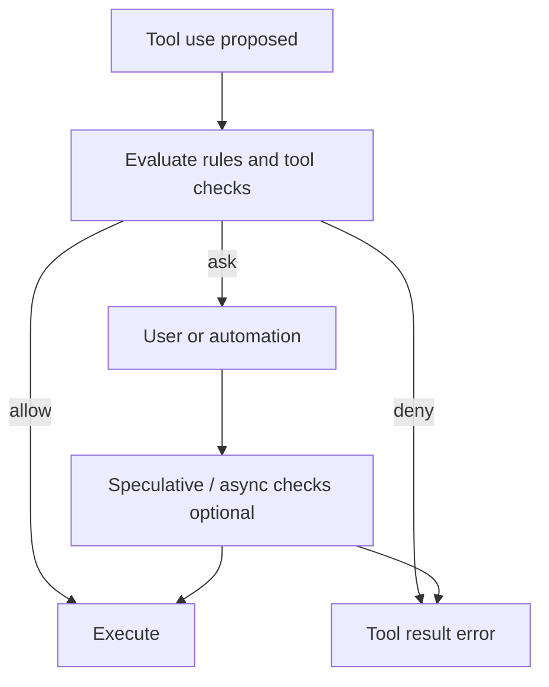
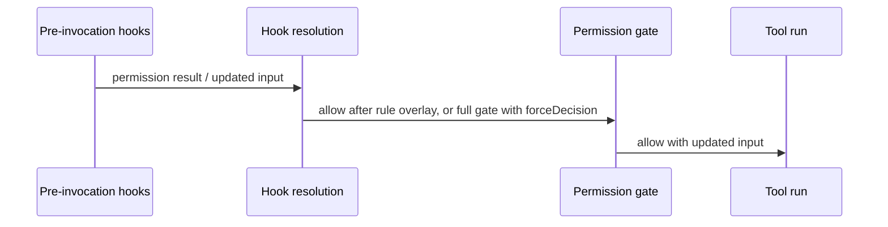

# Chapter 03: The Permission System

> How an agent runtime decides whether a proposed action may run—and how to overlap human time with cheap or expensive checks.

## Overview

Every proposed tool call is a **request to leave the model’s text world and touch the real one** (files, shell, network, remote APIs). A **permission system** is the gate: for each request it yields **allow**, **deny** (with a reason the UI or logs can show), or **ask** (pause for a human or an automation policy).

This chapter is **conceptual**. It matches the shape of a full product implementation: ordered layers, async resolution, optional classifiers.

### Modes as presets

Modes are **not** different models—they are **policy presets** on the same tool surface:

- **Default** — conservative: side effects usually need explicit approval unless rules say otherwise.
- **Plan** — exploration-first: read-oriented tools may proceed without interrupting the user; mutating tools still reach the gate.
- **Accept edits** — in-scope file edits can auto-approve when product rules align; deny lists and tool-specific checks still apply.
- **Bypass** — minimize prompts where policy allows; **bypass-immune** paths remain (explicit ask rules, safety checks, tools that require human interaction, enterprise deny lists).
- **Dont-ask / auto** — map unresolved **ask** to **deny**, or route **ask** through an **automation classifier** instead of a person.

### Speculative work

When the outcome is **ask**, wall-clock time is often dominated by human reaction. You can start an async job (risk scoring, command classification, validation) **in parallel with the dialog**. When the user confirms, **consume** the result under a **stable key** (tool-use id, hash, or normalized command string) so parallel dialogs never share state. If the user cancels, tear down tasks so you do not leak **unhandled rejection** noise.

Some interactive sessions use a **short bounded wait**: race the classifier against a timer; if the classifier returns a high-confidence **allow** before the timeout, skip the dialog and **consume** the speculative result so it is not reused. Coordinator-style workers may **await** automated checks **before** showing a dialog—same building blocks, different scheduling.

### Frozen permission context

Treat policy as an **immutable snapshot** for the in-flight request: mode, merged rules, and any other inputs the gate must not mutate mid-flight. A buggy or adversarial tool must not widen privileges by mutating live policy while resolution runs—same spirit as passing **read-only config** into a training step. In UI-driven apps, updating global policy after an approval may **re-queue** still-pending items; that is a separate concern from the snapshot semantics **during** one resolution.

## How it fits together



**Execution order (conceptual):**

1. **Pre-invocation hooks** run first. They may attach a **permission result**, adjust input, or block continuation.
2. **Hook resolution** interprets that result: a hook **allow** still flows through a **rule-only** overlay—configured **deny** and **ask** rules are not overridden by the hook. A hook **deny** ends the story. A hook **ask** enters the interactive gate, optionally with a **forced decision** for tests or scripted flows while the UI still shows hook messaging.
3. The shared **can-use-tool** path walks **deny rules**, **ask rules**, the tool’s own **checkPermissions** (and optional static checks for shell-like tools), then **mode** and allow rules, optional **classifiers**, and the dialog or non-interactive fallback.



**Multi-session shapes:** a **leader** UI, in-process bridge, or serialized mailbox may determine **who** sees **ask**. Shell-heavy **workers** may **await** a classifier before escalating to the leader; the **main** interactive agent may **race** the classifier against a short timeout instead—different scheduling, same primitives.

## Production concepts

- **Layered rules** — User, project, session, CLI, and managed policy merge with explicit precedence; matchers can target whole tools or content patterns (e.g. command prefixes).
- **Async gate** — Permission resolution is async per tool use; tests inject a **forced decision** to skip UI.
- **Two classifier roles** — (1) **Shell / risk allow** classifiers tied to command text, safe to run speculatively while a dialog is open; (2) **auto-mode** classifiers that read broader transcript context when automation replaces the human. Different inputs, different contracts.
- **Structured logging** — Log tool identity and decision **source** (config vs dialog vs classifier), not raw secrets; numeric **reason codes** help telemetry without PII.
- **Managed policy** — Enterprise may enforce **managed-only** rules so user or project shortcuts cannot widen access; UI “always allow” may be hidden so approvals stay policy-bound.

## Key design decisions

- **Modes as presets** — Same capability graph; modes change how **ask** is resolved by default, not which tools exist, unless a mode definition explicitly removes tools from the graph.
- **Forced decision** — Automation and tests need allow/deny without a person; the dialog can still show hook copy while the outcome is predetermined.
- **Classifier overlap** — Use human latency for shell speculative work; use **auto** mode to overlap classifier work when there is no dialog.
- **Hook allow is not blanket allow** — After hook **allow**, **rule-only** checks still apply so hooks cannot override enterprise deny lists or configured **ask** rules.
- **Explicit partial re-checks** — Some paths re-run only the rule subset (not full classifiers, bypass, or post-hooks) so behavior stays testable and auditable.

## Insights

- Treat **ask** as **scheduling surface**: speculative work is cheap relative to human wait time if you bound concurrency and key results correctly.
- **Peek / consume** (often by normalized command string for shell allow classifiers) keeps speculative results aligned with the final permission key; clear abandoned tasks on cancel.
- **Permission-style hooks** in non-interactive contexts must **decide** (allow/deny/interrupt) or fall back to **deny**, not hang waiting for a UI that does not exist.
- **Post-invocation** hooks see permission **mode** for context but do not re-run the allow gate—they observe completed output.
- In multi-agent setups, preserve the **leader’s permission mode** when applying permission updates from workers so teammate context does not widen policy unintentionally.

## Code samples

All snippets below live under `docs/03-permission-system/code-samples/` only.

| Sample | Description |
|--------|-------------|
| [`permission_modes.py`](code-samples/permission_modes.py) | Mode enum and a tiny “would this mode skip a prompt?” sketch |
| [`permission_checker.py`](code-samples/permission_checker.py) | Frozen context + rule list with deny-first precedence → allow / deny / ask |
| [`speculative_classifier.py`](code-samples/speculative_classifier.py) | Start async classification early; peek, consume, optional race vs timeout |

**Modes (excerpt):**

```python
class PermissionMode(str, Enum):
    DEFAULT = "default"
    PLAN = "plan"
    ACCEPT_EDITS = "acceptEdits"
    BYPASS = "bypassPermissions"
```

**Frozen context + resolution (excerpt):**

```python
@dataclass(frozen=True)
class FrozenPermissionContext:
    mode: str
    rules: tuple[PermissionRule, ...]

def resolve_tool_permission(tool_name: str, ctx: FrozenPermissionContext) -> PermissionBehavior:
    ...
```

**Speculative task lifecycle (excerpt):**

```python
def start(self, tool_use_id: str, command: str) -> None:
    ...
    task = asyncio.create_task(classify())
    task.add_done_callback(lambda t: t.exception())
    self._tasks[tool_use_id] = task

async def consume(self, tool_use_id: str) -> str | None:
    ...
```

Run any sample: `python docs/03-permission-system/code-samples/<file>.py`.

## Build your own

1. Define a small **mode enum** and a matrix: mode × tool category → default (prompt vs silent), then layer **deny-wins** rules on top.
2. Store rules in **priority order**; support **managed-only** if you have enterprise policy.
3. Expose `can_use_tool(tool_name, payload, frozen_context) -> Decision` where `frozen_context` is immutable (e.g. `dataclass(frozen=True)` or a deep snapshot).
4. On **ask** for risky tools, start `asyncio.create_task(classify(...))` before awaiting the user; **consume** by stable key (tool-use id or normalized command). Optionally **race** against a short timeout if skipping the dialog on high-confidence **allow** is acceptable.
5. If you add **hooks**, run them **before** the main gate; after hook **allow**, run a **rule-only** re-check; thread **force_decision** for tests and scripted flows.

---

**Navigation:** [← Chapter 02 – Tool System](../02-tool-system/README.md) | [Overview](../README.md) | [Next: Chapter 04 – System Prompt →](../04-system-prompt/README.md)
