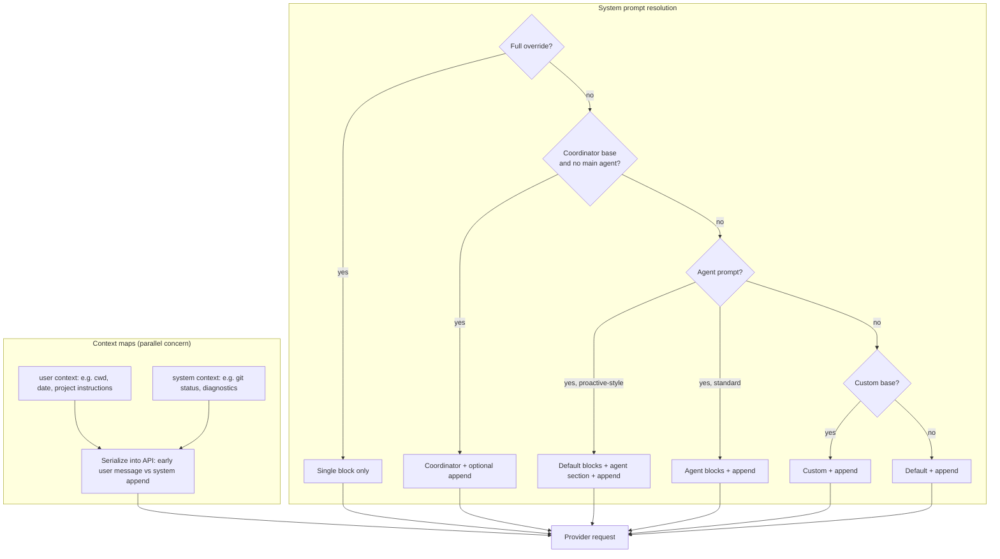

# Chapter 04: System Prompt Engineering

> Layered system instructions, separate context maps, and cache-stable request prefixes.

## Overview

The **effective system prompt** is not one immutable string. It is an **ordered list of blocks** whose **priority rules** decide which layers appear and whether they **replace** or **stack** on top of a product default. A separate pipeline gathers **user** and **system** context as small key–value maps; those maps are merged into the API shape alongside (not inside) the prose you think of as “the system prompt,” which keeps tests and observability honest.

**Why split context from system prose?** Default product prompts assume specific metadata (tool lists, environment hints, git summaries). If a caller passes a **fully custom** system prompt, building the same default-derived **system** context map would attach data the model never agreed to interpret—wasteful and confusing. Mature implementations therefore **skip default system-context collection** when the default prompt stack is not used, while still loading **user**-side context such as project instruction files when policy allows.

**Cache-safe design** applies to everything that participates in the provider’s **prefix fingerprint**: model id, tool schemas, system blocks, context maps, the start of the transcript, and options like thinking or output caps. Volatile strings (timestamps, random ids, non-deterministic serialization) in those regions **break** prefix reuse. Stable blocks first, volatile blocks after an intentional breakpoint, and **frozen snapshots** for forks or sub-sessions prevent silent drift mid-run.

### Tie-in: [Chapter 07 – Context management](../07-context-management/README.md)

Compaction and token budgets assume you can tell **what changed** in the transcript and in the API prefix. If system text, tool JSON, or cache-control metadata drifts unnoticed, you pay for **cache misses** exactly when compaction is already tight. Treat **hash-stable prefixes** as part of context hygiene.

### Tie-in: [Chapter 10 – Subagents](../10-subagents/README.md)

Nested agents should inherit a **frozen bundle**: rendered system blocks, user and system context maps, tools, model-related options, and the shared message prefix. A live builder that re-reads flags or disk mid-run **desynchronizes** cache identity with the parent.

---

## Priority at a glance

| Step | Outcome |
|------|---------|
| **Full override** | Single authoritative system block; no default stack, no append tail, no “default” system-context map in typical designs. |
| **Coordinator base** (when enabled and **no** main-thread agent) | Replaces the product default for that loop; append tail still applies. Does not compose with agent/custom/default in the same turn—this path returns early. |
| **Main-thread agent** | Normally **replaces** the default prompt. In **proactive-style** modes, the agent block is **appended** after the default (same idea as teammate stacking). |
| **Custom CLI/SDK string** | Used when **no** agent block is selected—never competes with an active main-thread agent prompt. |
| **Product default** | Fallback when nothing above supplies the base. |
| **Append tail** | Extra system material **after** all of the above, except under full override. |

---

## Context collection vs system assembly

**User context** usually lands **early in the message list** inside a dedicated meta turn: structured sections per key so the model can ignore irrelevant material. **System context** is often **appended to the system side** as labeled lines derived from the same map. Both maps are part of the **same cache family** as system prose—changing `claudeMd` or `gitStatus` without intent can invalidate the prefix.

**Project instruction files (CLAUDE.md-style)** are a recurring pattern:

1. **Discovery** — Walk from the working directory toward filesystem root (and optionally merge additional roots the user asked to include). Files **closer to cwd** are typically merged **later** so nearby rules win.
2. **Layers** — Think in terms of **managed**, **user-global**, **project**, and **local-private** instruction files; products differ on exact paths, but the **ordering story** is always “later / closer overrides earlier / farther.”
3. **Includes** — Markdown-style `@path` inclusion pulls fragments in with **cycle detection**; missing files are skipped so one broken reference does not fail the whole session.
4. **Gating** — Environment flags or “bare” modes can disable automatic discovery while still honoring **explicit** extra directories—useful for CI or minimal repros.
5. **Dual surfaces** — The same aggregated text may feed a **user-context field** for the main agent and, separately, a **classifier-only** message with its own delimiter and cache hint—without duplicating filesystem reads once a session cache exists.

None of this replaces the **system prompt priority ladder**; it **enriches** what the model sees in a controlled slot.

---

## Production concepts

- **Strict priority ladder** — Override wins absolutely. Coordinator base applies only in its gated mode **and** when no main-thread agent owns the loop. Agent beats custom string. Proactive-style modes flip agent from replace to stack.
- **Append-only tail** — Survives coordinator, agent, custom, and default branches; omitted only under full override.
- **Optional extra blocks** — Integrations may inject another system segment when a custom base is combined with an **opt-in** memory or tooling path (so the model knows filenames and write semantics without resurrecting the full default prompt).
- **Context maps** — Pure, testable builders for cwd, shell, date, aggregated instructions, git/VCS snippets, coordinator addenda, etc.
- **Cache fingerprint** — Hash or log the tuple your provider actually keys on; keep cached segments free of wall-clock noise.
- **Side paths and resume** — Secondary entrypoints that must match the main loop’s prefix should mirror the same assembly order; a controlled cache miss beats failing the call.

---

## Key design decisions

- **Append versus replace** — Agent and mode dictate whether domain rules **replace** the default or **stack** after it; teammates often follow the append pattern.
- **System prompt as an array** — Enables per-block cache scope and clean separation of attribution headers, product prefixes, and body text.
- **Fork safety** — Pass **rendered** bytes and frozen maps at spawn time ([Chapter 10 – Subagents](../10-subagents/README.md)).
- **Custom prompt + empty system context** — Skipping default-derived system metadata when the default stack is bypassed avoids dangling context.

---

## Insights

- **Ordering beats length** — A short default plus a labeled agent section behaves differently than a single merged paragraph.
- **Coordinator is not composable** with a main-thread agent in the same resolution step—it short-circuits before agent selection.
- **Diagnostics** — When prefix cache misses, diff **structured** fields (model, tool schema hash, system hash, context keys) instead of eyeballing one giant string.
- **Classifiers** — Permission or auto-mode models may see project instructions in a **dedicated** user-shaped message with stable cache control; that is separate from the main chat meta turn but shares the same underlying aggregated text.

---

## Code samples

| Sample | Description |
|--------|-------------|
| [`prompt_assembly.py`](code-samples/prompt_assembly.py) | Priority ladder: override, coordinator short-circuit, proactive append vs replace, append tail |
| [`context_builder.py`](code-samples/context_builder.py) | User/system maps, instruction-file layering, merge order |
| [`cache_safe_params.py`](code-samples/cache_safe_params.py) | Stable JSON and a toy prefix fingerprint |

---

## Build your own

1. Model the system side as a **list of blocks** with explicit labels for logging.
2. Implement `build_effective_prompt(...)` with override, coordinator (early exit without agent), agent (replace vs append), custom, default, and append.
3. Build context with **pure functions** and a single session cache where I/O is expensive.
4. Hash the tuple your provider uses for prefix cache; exclude volatile fields from the stable slice.
5. For forks, **serialize** effective prompt + context at spawn and pass immutable copies forward ([Chapter 10 – Subagents](../10-subagents/README.md)).

---

**Navigation:** [← Chapter 03 – Permissions](../03-permission-system/README.md) | [Overview](../README.md) | [Next: Chapter 05 – Tool Implementations →](../05-tool-implementations/README.md)
