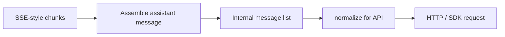

# Chapter 06: Streaming and Messages

> Typed messages, SSE-style events, and normalization before the API.

## Overview

**What are messages?** A chat with the model is not one blob of text—it is an ordered **list of messages**. Each item has a **role** (for example user, assistant, system) and **content**: either a string or a list of **content blocks**. Assistant rows are usually block lists: plain text, a request to run a tool, the tool’s result, optional “thinking” payloads, and so on. Treating blocks as a small set of named shapes (a **discriminated union** in type terms) keeps parsers honest: every block has a `type` tag, and you handle each variant explicitly.

Production transcripts often add **envelope-only** roles or flags that never go on the wire: for example **progress** updates, **attachment** rows used for UI or prefetch bookkeeping, or **virtual** placeholders. Keep those in your internal model, then drop or remap them in one normalization pass.

**What is streaming (SSE-style)?** The model often does not return the full answer in one HTTP body. The server sends a **stream** of small events—similar in spirit to **Server-Sent Events (SSE)**: many lines or frames, each describing a piece of progress (a text fragment, start/end of a block, metadata). Your client **assembles** those events into one logical assistant message: buffers grow with each text delta; when the stream signals completion, you **commit** a full message to your transcript. The UI can show partial text while the stream is open; after commit, you should not show the same text twice as both “streaming” and “final.” A robust handler clears **streaming buffers** in the same update batch as the final message so the handoff is atomic (no gap, no duplication).

**What is normalization?** Your app may store a **rich** internal transcript (UI-only rows, merged envelopes, extra fields). The remote API expects a **strict** shape: allowed roles, block order (for example each `tool_result` paired with its `tool_use`), no stray fields, and sometimes stripped thinking or signatures on replay. **Normalization** is the pure step that turns “what we keep for the UI” into “what we send on the wire.” If you skip it or get the order wrong, you often get opaque **400** errors—so **normalize in one place** and test it like any other critical function.

**Practical habit:** keep a clear split between **internal** messages and **API-ready** messages; run the same `normalize → request body` path in unit tests with golden examples for tricky shapes (tool pairs, thinking, compaction leftovers, attachments).

This chapter connects **[Chapter 01 – The Agent Loop](../01-agent-loop/README.md)** (the loop consumes stream events, runs tools, appends results) and **[Chapter 07 – Context Management](../07-context-management/README.md)** (compaction and trimming change what reaches normalization—orphan thinking, estimates, ordering).

## Message types and utilities (conceptual)

- **Block-level types** — `text`, `thinking`, `redacted_thinking`, `tool_use`, `tool_result`, plus provider-specific blocks (server tools, search, and so on). Your reducer should branch on `type` and stay exhaustive as new variants appear.
- **Transcript envelopes** — Besides user/assistant/system, you may store **attachment** or **progress** messages, **tombstones** for deletion, or **virtual** rows. Utilities typically: filter virtual rows, map attachments into user content blocks, and ensure tool pairs stay adjacent for the API.
- **Split vs merge** — Some pipelines **split** one assistant message into several rows (one content block each) to stabilize ordering and ids; before send, **merge** assistant fragments that share the same provider **message id** so one logical completion becomes one API assistant turn (concurrent agents interleave different ids—merge must key on id, not only adjacency).
- **Attachments** — Images and files become user-side blocks with **stable attachment ids**; after compaction or memory injection, **dedupe** by id so the same file is not repeated many times.

## How it fits together

The agent loop yields stream deltas and, when blocks complete, finalized assistant or user rows. **Normalization** is the last gate before HTTP: reorder or flatten attachments, merge assistant segments that belong to one completion, drop display-only virtual rows, then strip or reshape blocks the provider rejects on replay.

## Production concepts

- **Streaming assembly** — Build assistant messages incrementally from stream events; keep **progress** payloads separate from **committed** transcript rows. When a turn finalizes, clear streaming buffers so the UI does not duplicate partial and committed text in one frame.
- **Thinking blocks** — Extended-thinking content (`thinking` / `redacted_thinking`) participates in streaming (deltas may be excluded from token counters) and in replay rules: orphan **thinking-only** assistant rows after history surgery can be dropped; trailing thinking may be stripped from the last assistant before send when the API requires it.
- **Compaction artifacts** — Micro-compact and full compact can insert boundary or summary messages with metadata for cache accounting; after **[autocompact or snip](../07-context-management/README.md)**, re-run the same normalization path and watch for stale token estimates until the next refresh.
- **Attachments** — User attachments and prefetched files become additional user **content** blocks (or dedicated internal rows that you fold into the next user message). Assign **stable ids**, dedupe after compaction, and keep binary or large payloads behind URLs or handles the API accepts.
- **Missing tool results** — If a turn aborts mid-tool, synthesize error `tool_result` rows so the transcript stays balanced for the next model call.
- **Tool use exit signal** — Completion metadata that says “stopped for tool use” is **not** reliable across APIs and SDK versions. The robust rule: if the assembled assistant content includes any **`tool_use`** (or equivalent server-tool blocks your stack treats as executable), you **must** run tools and continue the loop; **do not** branch on `stop_reason` alone. See [`tool_use_exit_signal.py`](code-samples/tool_use_exit_signal.py).
- **In-progress assistant** — Persisted rows with no final stop reason may mean incomplete streaming; strip or replace them before replay to the API.
- **Assistant trajectory / API round** — Chunks from one completion share a stable assistant **message id**; merging by that id reconstructs one logical assistant row. Grouping by changing assistant id yields **API-round** segments used alongside compaction (see grouping notes in [Chapter 07 – Context Management](../07-context-management/README.md)).

## Key design decisions

- **Discriminated unions** — Model message and block types with an explicit tag field so parsers stay exhaustive and refactors stay safe.
- **Separate progress** — Long-running tools can emit progress updates that are not part of the API transcript.
- **Attachment pipeline** — Images and files become dedicated blocks with stable ids; dedupe when the same attachment is re-injected.
- **Idempotent merge** — Assistant segments with the same response **id** concatenate content blocks; concurrent agents interleave different ids—merge must key on id, not only adjacency.
- **Compaction-aware cleanup** — After **[context trimming or summarization](../07-context-management/README.md)**, run orphan-thinking filters and whitespace-only assistant filters in an order that avoids invalid tail shapes (for example text that is only newlines after thinking is removed).

## Insights

- Signature or ephemeral blocks may need stripping before re-sending history (for example after credential rotation).
- Duplicate memory attachments should be filtered so compaction does not amplify noise.
- **Post-compact:** If **[blocking limits use estimated tokens](../07-context-management/README.md)** from messages, estimates can lag right after a compact—align gates with the actual trimmed transcript.
- **Thinking-only orphans:** If compaction removes the non-thinking half of a split assistant turn, drop remaining thinking-only rows or the API may reject mismatched thinking signatures.

## Code samples

Python teaching samples live under [`code-samples/`](code-samples/):

| Sample | Description |
|--------|-------------|
| [`message_types.py`](code-samples/message_types.py) | Typed content blocks (`TextBlock`, `ThinkingBlock`, `ToolUseBlock`, …); helper `is_thinking_only_assistant` |
| [`stream_handler.py`](code-samples/stream_handler.py) | Text delta buffer with reset after finalize; merge assistant chunks by shared `response_id` |
| [`message_normalization.py`](code-samples/message_normalization.py) | One-block split, virtual strip, orphan thinking filter, strip thinking for replay |
| [`assistant_api_rounds.py`](code-samples/assistant_api_rounds.py) | Group rows by changing assistant `response_id` (API-round boundaries) |
| [`tool_use_exit_signal.py`](code-samples/tool_use_exit_signal.py) | Prefer inspecting assembled `tool_use` blocks over `stop_reason` for continuation |
| [`attachments_pipeline.py`](code-samples/attachments_pipeline.py) | Image blocks with stable ids; dedupe by `attachment_id`; build user rows from uploads |

## Build your own

1. Define message and block variants in Python with explicit discriminators (`TypedDict` + `Literal` tags, or dataclasses with a `type` field).
2. Build a small reducer that folds streaming events into one assistant message: append text deltas to buffers; on end-of-block, finalize blocks and append to the transcript; reset buffers after finalize.
3. Implement `normalize(messages) -> api_payload` as pure functions with tests—cover virtual-row stripping, same-id assistant merge, thinking-orphan cases if you compact, and attachment dedupe.
4. Log shape mismatches in development only so production logs stay quiet.

---

**Navigation:** [← Chapter 05 – Tool Implementations](../05-tool-implementations/README.md) | [Overview](../README.md) | [Next: Chapter 07 – Context Management →](../07-context-management/README.md)
