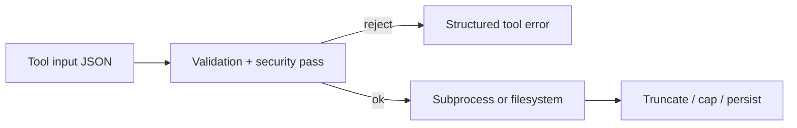

# Chapter 05: Tool Implementations

> Bash, file edits, and search—three "function tools" with different inputs, risks, and guardrails (same idea as named tools in a chat-completions API).

## Overview

If you already use **ML APIs with tools** (the model emits a tool name + JSON arguments; your server runs something and returns text or JSON), then Bash, file, and search tools are just **three handler families** behind that contract. The model never talks to the OS directly: your runtime receives structured arguments, runs **validation** (is this input allowed and sane?), runs **security checks** for risky classes (especially shell), then executes and returns a bounded result the next API call can read.

### Concrete example: one tool call, end to end

To make the lifecycle tangible, here is what happens when the agent calls a shell tool:

```
Agent calls: bash("cat src/main.py | wc -l")
→ Parse: AST finds "cat" reading src/main.py, pipe to wc
→ Security: no command substitution, no redirects outside scope → OK
→ Permission: bash tool, mode=default → ask user
→ Execute: subprocess, 5s timeout, capture stdout
→ Budget: output is "142\n" (5 chars) → well under limit
→ Result: tool_result with "142"
```

Every tool family (shell, file edit, search) walks through the same stages—parse, security, permission, execute, budget—but the specifics of each stage differ based on what can go wrong.

> **Tie-in — Chapter 02 (Tool System):** These three handler families are concrete implementations of the tool contract defined in [Chapter 02](../02-tool-system/README.md). The shared executor dispatches structured input, applies concurrency rules, and expects a `tool_result` back. Everything described below happens *inside* that contract.

> **Tie-in — Chapter 03 (Permission System):** Every tool call passes through `checkPermissions` before execution. Shell tools use rule-based and allowlist checks; file tools map to read/write scopes; search tools are typically read-only. See [Chapter 03](../03-permission-system/README.md) for the full permission model.

> **Tie-in — Chapter 04 (System Prompt & Execution Scope):** The execution scope constrains which filesystem paths a tool can touch. Path resolution, workspace roots, and symlink-following rules all derive from the boundaries established in [Chapter 04](../04-system-prompt/README.md).

## How it fits together



---

## 5.1 Shared patterns

These cross-cutting concerns apply to all three tool families.

### Security

The goal is to avoid "helpful" execution of hidden danger. A command string can nest extra commands inside `$()` or backticks; a path can try to walk outside the project; a search can return more text than fits in context. Security layers **reject or narrow** those cases *before* side effects, and return **clear error messages** (ideally with stable reason codes) so the model can retry safely—same spirit as refusing an invalid tool argument at the HTTP boundary.

### Validation

Check arguments the same way you would validate any API body. For files: resolve paths only inside allowed roots, require the old snippet to match exactly once before replace, and cap file size if needed. For search: cap file count and match count so one call cannot dump the repo into the transcript. For shell: combine lightweight parsing with pattern rules so constructs you do not want to execute never reach `exec`.

### Shared executor integration

These tools still go through the same path—parse/validate structured input, apply concurrency rules, run **`checkPermissions`** ([Chapter 03 – Permission System](../03-permission-system/README.md)), then execute. Unknown tool names still get a synthetic `tool_result` error so the message sequence stays balanced. Shell-class tools often participate in **sibling abort** (one shell failure can cancel other in-flight shell work); independent read/search calls are usually left alone.

### Permissions

Path-based tools map to read vs write scopes; shell tools add rule-based and optional read-only allowlists before spawn. Tools may expose matchers on structured fields (e.g. path patterns) so policies do not depend only on the tool name.

### Result budget

Each tool can declare a **maximum serialized size**; oversized payloads may be truncated, summarized, or stored with a pointer—same "don't blow the context window" idea as trimming a huge retrieval result before the next model call. Search-style tools also use **limits** (head/offset or max lines) so exploration stays cheap. Per-tool caps compose with **aggregate** limits on one user message ([Chapter 02](../02-tool-system/README.md), [Chapter 07 – Context Management](../07-context-management/README.md)).

### Patterns in production (concepts)

- **Shell** — Prefer a real parse (AST or tokenizer) so you know what words and redirects are; add pattern denylists for substitution, heredocs, dialect-specific expansions, and dangerous builtins; optional stricter path when the session is read-only.
- **Stable reason codes** — Map rejections to enums or numeric ids for logs and analytics instead of echoing raw user command text.
- **File edits** — Workspace roots, optional history/snapshots, and replacement rules (unique match or explicit `replace_all`) before write.
- **Search** — Fast engine (commonly ripgrep) behind timeouts, ignore rules, VCS-directory exclusions, and hard caps on hits.

---

## 5.2 Shell (Bash) tools

**Why shell is different.** A single string can hide multiple commands, redirections, and nested expansions. Regex-only filters miss edge cases (nested quotes, comment/hash boundaries, dialect-specific tokens). Production-style agents therefore tend to:

1. **Parse first, then rule-check** — Use a shell-aware parser or AST when feasible so "first word" and argument boundaries reflect real syntax, not naive `split()`.
2. **Layer deny patterns** — Block command substitution (`$()`, backticks), process substitution, and known-bad expansion families (e.g. zsh-style `=cmd` word expansion that can rewrite the apparent base command). Extend the set deliberately ("defense in depth") so enabling a new shell backend does not silently widen what runs.
3. **Order permission checks carefully** — Evaluate explicit allow/deny/ask rules for the *logical* command before trusting path-only constraints; otherwise absolute paths or parser quirks can create gaps between "what the user sees" and "what you validated."
4. **Path and redirect awareness** — If you validate filesystem paths inside argv, use the same parsed structure you trust for permissions; re-parsing with a different quoter can drop arguments and skip checks.
5. **Read-only mode** — Often implemented as a separate allowlist of command prefixes and flag-walking rules, not just "block `rm`," because many tools have write-capable flags.
6. **Timeouts and output bounds** — Long-running or noisy commands get wall-clock limits and streaming caps aligned with your global tool-result budget.

**Stable diagnostics.** Prefer machine-readable rejection reasons (short codes or enums) for telemetry; keep human-readable text for the model in the same payload when useful.

---

## 5.3 File edit tools

**Path safety.** Normalize paths (e.g. consistent separators on Windows) before lookup. Resolve **relative** paths against an allowed workspace root, not only the process cwd—otherwise `../` escapes the jail. After resolution, ensure the real path stays under an allowed root (symlink following can point outside; `resolve()`-style APIs help catch that).

**Edit semantics.** Reject no-op edits (`old == new`). Require `old_string` to appear **exactly once** unless `replace_all` is set; ambiguous matches should fail with a message that tells the model to add context or enable replace-all. Optional: normalize quotes or line endings for resilience, but do not strip semantics that matter (e.g. markdown trailing spaces).

**Resource limits.** Stat or cap file size before reading the whole file into a single string so multi-gigabyte paths cannot OOM the host.

**Policy hooks.** Deny-by-path rules (permissions) should run in the same preflight as schema validation so ignored or sensitive trees never reach write APIs.

**Special path classes.** Network paths and similar URLs-on-disk can trigger unexpected side effects on some OS APIs; production code often short-circuits those before naive `exists` checks.

---

## 5.4 Search (grep) tools

**Engine.** Delegate to a fast indexed searcher (typically **ripgrep**) with explicit CLI arguments: pattern, optional base path, `--glob` filters, case and multiline flags.

**Limits.** Support **`head_limit`** and **`offset`** on the result stream so the model can paginate without pulling the whole repo into context. Default limits should be conservative; "unlimited" should be rare and obvious.

**Noise control.** Merge in ignore patterns from the same source as file-read permissions where possible; exclude common VCS metadata directories so searches do not waste time or leak junk.

**Timeouts.** If the search subprocess can hang on huge trees, enforce a timeout and surface a **distinguishable error** (timeout vs zero matches) so the model does not assume "nothing found."

**Output budget.** Apply a per-tool character cap on serialized results; combine with persistence or previews for large outputs, consistent with [Chapter 07 – Context Management](../07-context-management/README.md).

---

## Conceptual validation

This chapter's patterns were cross-checked against **public-facing concepts** in typical agent stacks: structured tool args, permission layers, and the three handler families above. The Python samples are **standalone educators**—they are not excerpts from any shipping product. When you implement your own system, replace patterns with vetted parsers, your permission module, and real ripgrep integration.

## Key design decisions

- **Parse then rule-check** — Regex-only gates miss nested shell constructs; combine light parsing with explicit deny patterns.
- **Defense in depth** — Block syntax you do not intend to support yet (e.g. extra shell dialects) so future executor changes do not open new holes.
- **Unified output path** — Large command stdout and large search results should share one **result budget** policy so behavior stays predictable across tools.

## Insights

- Shell-specific features (e.g. zsh `=command` expansion) can look innocent in a flat string until you know the shell dialect.
- Command substitution and heredocs behave differently when nested; treat "nested inside a string" as its own case in tests.
- Educational samples below use **stdlib-only** Python; production stacks swap in real parsers, ripgrep, and permission hooks.

## Code samples

| Sample | Description |
|--------|-------------|
| [`bash_tool.py`](code-samples/bash_tool.py) | Pattern-based pre-flight on a command string with stable reason codes (`analyze_command`) |
| [`file_edit_tool.py`](code-samples/file_edit_tool.py) | Root-joined resolution (`resolve_allowed_path`) + safe replace with optional `replace_all` (`apply_replacement`) |
| [`search_tools.py`](code-samples/search_tools.py) | Glob + line grep with `max_files`, `max_matches`, and `head_limit` / `offset` |

Run with **`python3`** (stdlib only):

`python3 docs/05-tool-implementations/code-samples/bash_tool.py`  
`python3 docs/05-tool-implementations/code-samples/file_edit_tool.py`  
`python3 docs/05-tool-implementations/code-samples/search_tools.py`

## Build your own

1. Treat each tool like an API handler: strict schema in, structured errors out.
2. For shell, use a real tokenizer or parser where possible; map every deny path to a short machine-readable reason.
3. For edits, prefer path jail + "old string must match once" (or explicit patch ranges) over unconstrained rewrites.
4. For search, enforce timeouts and line/file caps before building the `tool_result` payload.

---

**Navigation:** [← Chapter 04 – System Prompt](../04-system-prompt/README.md) | [Overview](../README.md) | [Next: Chapter 06 – Streaming →](../06-streaming-and-messages/README.md)
