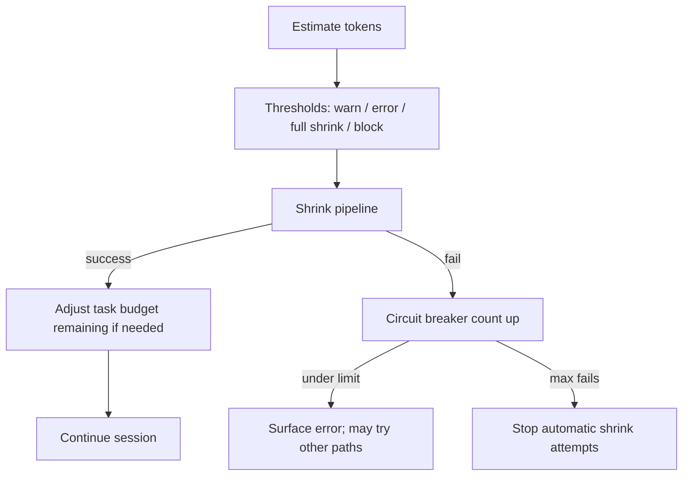

# Chapter 07: Context Management

> How long sessions stay inside the model’s memory limit: measuring fullness, early warnings, shrinking history, and stopping doomed retries.

## Overview

**Context window** — Think of a fixed-size notepad the model reads every turn. Everything you send (system text, past turns, tool output) must fit on that notepad. When it overflows, the provider rejects the request or truncates unpredictably, so production agents treat the limit as a hard planning constraint.

**Rough size on the client vs what the model is told** — You usually do not re-tokenize the whole transcript on every keystroke; you **estimate** tokens from the last real usage figures plus guesses for new messages. Separately, the API may expose a **task budget** (total and remaining) that the model actually sees in its instructions. Those two ideas answer different questions: “Are we about to blow the window?” (estimate + thresholds) versus “What number is the model using to pace itself?” (task budget). After you replace a long history with a short summary, the server’s view of “how much was spent” can get out of sync; honest clients adjust **remaining** using the **final** pre-compact footprint so the next call does not lie to the model.

**Three ways to make room**

1. **Full automatic shrink** — Replace a large stretch of transcript with a shorter prefix (often via the model). Costly but faithful; triggers on a buffer **below** the real ceiling so tool results and formatting still fit.
2. **Spot edits on bulky tool rows (micro-compaction)** — Target repeatable, large chunks (reads, command output, search hits) and rewrite them shorter without re-summarizing the whole history. May respect cache placement or age out stale bodies; a full shrink resets this layer because the transcript is replaced wholesale.
3. **Archival projection (context collapse)** — Archived or staged history is projected so the primary thread can stay under the limit **without** always paying for a full summarize pass. Commits and snapshots tie into resume; sometimes automatic full shrink is skipped while this path is active so two writers do not fight.

**Circuit breaker** — If automatic shrinking fails several times in a row (oversized prompt, API errors), a counter increments. After a small fixed maximum, the loop **stops** trying to auto-shrink and surfaces failure instead of burning calls on a prompt that cannot be recovered.

**Warning bands** — Before you hit the **automatic full-shrink threshold**, you show a **warning** band (early heads-up). Closer to the edge, an **error** band signals critical UI urgency (not always identical to an API hard stop). A **blocking** limit sits just inside the absolute edge so you refuse new work before the provider does. Together they form a graduated safety margin before the hard limit.

*Ship one estimation approach, one shrink pipeline, and explicit thresholds; tune buffers from real traces.*

## How it fits together

**Related chapters**

- **[Chapter 01 – Agent loop](../01-agent-loop/README.md)** — Where automatic shrink, spot-edit state, circuit breaker state, and optional task-budget fields flow through the turn loop; order matters (e.g. tool-result pressure before spot edits).
- **[Chapter 04 – System prompt](../04-system-prompt/README.md)** — Prompt cache stability: volatile prefixes hurt reuse; spot edits change which slice stays stable.
- **[Chapter 06 – Streaming and messages](../06-streaming-and-messages/README.md)** — Normalized messages, shrink boundaries, and usage on assistant rows—the estimator walks the same list the API will see.

## Production concepts

Numbers below match the **educational** samples in `code-samples/`; they are patterns, not a public API contract.

### Effective window and when to run automatic full shrink

- **Headroom for the summarizer** — Treat the usable window as the model’s advertised window minus a cap reserved for summary output (capped so planning stays predictable).
- **Automatic full-shrink threshold** — Fire automatic full shrink when estimated usage reaches **effective window minus about thirteen thousand tokens**, leaving slack for tool results and formatting.
- **Optional test tuning** — A percentage-of-window override can lower the line for experiments (same idea as a compact-percent environment override).

### Warning bands (UI and gating)

Given estimated usage and the same threshold used for automatic full shrink (or full effective window when that feature is off):

- **Warning** — When usage reaches **about twenty thousand tokens below** the automatic full-shrink threshold (early signal).
- **Error** — Same **about twenty thousand** spacing band in the reference stack (treat as strong UI signal; not always a hard provider stop).
- **Automatic full shrink** — When enabled, crossing that threshold starts the full shrink pipeline.
- **Blocking limit** — Defaults to **effective window minus about three thousand**; overridable in tests. Do not trust a stale estimate right after snip or compact without refreshing—see *Insights*.

### Two ways to count for policy

- **Session / memory thresholds** — Anchor on the **last real assistant usage** (input, cache, output), then add rough increments for messages appended afterward. When tool results are interleaved with parallel assistant branches, walk back so sibling rows share one logical response and nothing is under-counted.
- **Task budget countdown** — From the last usage, take the **final** iteration’s input plus output when present; otherwise top-level input plus output **without** cache—aligned with how server-side **remaining** is often derived. Use that **pre-compact** total when subtracting from **task budget remaining** after each successful compact, cumulatively.

### Spot edits on tool output

- Applies to a **subset of tool kinds** (large, repeatable blobs: file reads, shell, search, web, writes/edits—conceptually).
- May mix rough token math, stable replay positions for cache-friendly edits, and time-based clearing of stale tool bodies when enough wall time passed since the last full shrink (feature-gated).
- Any **manual or automatic full compact** resets spot-edit state.

### Archival projection

- A separate path projects archived or staged history so the **main** thread may stay under limits without always running full summarization; metadata records commits and snapshots and interacts with resume.
- Policy often uses a **threshold ladder** (for example an earlier rung that commits staged work and a later rung that blocks expensive spawns) so the session degrades gracefully before the hard window.
- **autoCompact** is typically **suppressed** while this mode owns headroom so archival state and proactive summarization do not race on the same transcript.

### Task budget in output config

- **Total** — Budget for the agentic turn as shown to the model.
- **Remaining** — Often counts down while history is large. After compact, the server may only see a summary and under-count; the client subtracts the **final pre-compact** window (from the task-budget counting method above) from **remaining** after each compact so the next request stays consistent.

### Circuit breaker

- Track **consecutive failures** for automatic full shrink: increment on compaction error (except user abort), reset on success.
- After **three** failures, skip further automatic shrink for that session—avoids repeated doomed API calls when the prompt stays too large.

### Turn continuation budget (inside one user turn)

- Separate from API task budget: optional continuation inside one user-facing turn stops when a soft fraction of a **loop budget** is consumed or when **diminishing returns** appear (tiny token deltas across iterations). **[Chapter 01 – Agent loop](../01-agent-loop/README.md)** covers that loop; see its code samples for the continuation pattern.

## Key design decisions

- **Reserve tokens for summary output** — Effective window = model window minus reserved summarizer headroom.
- **Buffer below the hard limit** — Automatic full shrink fires before the last possible token so tool results still fit.
- **Diminishing returns** — Stop turn continuation when extra iterations add almost no tokens (loop budget policy).
- **Two budget stories** — API **task budget** (model-visible, corrected after compact) vs **loop continuation budget** (client-only pacing).

## Insights

- Environment overrides exist to tune automatic full shrink for testing and for power users.
- Post-compact cleanup hooks fix auxiliary state (session memory pointers, archival staging, and similar).
- If a **blocking** gate uses estimated input tokens from messages, estimates can **lag** immediately after **snip** or **compact**—the transcript already shrank, but per-message usage metadata may still reflect the old size until the next refresh. Hard gates should **skip or adjust** in that window.

## Code samples

Run with **`python3`** from this directory (stdlib only for these files):

| Sample | Description |
|--------|-------------|
| [`auto_compaction.py`](code-samples/auto_compaction.py) | Effective window, buffers, optional percent override |
| [`token_warning_thresholds.py`](code-samples/token_warning_thresholds.py) | Warn / error / full-shrink / blocking bands |
| [`micro_compaction.py`](code-samples/micro_compaction.py) | Replace a transcript slice; tool-scope note |
| [`token_budget.py`](code-samples/token_budget.py) | Turn continuation: soft cap, diminishing returns, forked `agent_id` disables |
| [`circuit_breaker.py`](code-samples/circuit_breaker.py) | Consecutive failure cap (aligned with max 3) |
| [`api_task_budget_remaining.py`](code-samples/api_task_budget_remaining.py) | `TaskBudgetState`, cumulative `remaining` after `subtract_pre_compact_window` |
| [`context_collapse_stub.py`](code-samples/context_collapse_stub.py) | Minimal commit + snapshot staging (educational) |

## Build your own

1. Centralize token estimation (provider tokenizer or heuristic).
2. Track **automatic shrink state**: turn id, compacted flag, **consecutive failures** for the circuit breaker.
3. Wire compaction failure to increment the breaker; reset on success.
4. Expose manual compact with a **smaller** buffer than automatic (manual buffer on the order of a few thousand tokens vs automatic on the order of tens of thousands in the samples).
5. After each successful compact, recompute **task budget remaining** using the **final** pre-compact window size if you expose API task budgets.

---

**Navigation:** [← Chapter 06 – Streaming](../06-streaming-and-messages/README.md) | [Overview](../README.md) | [Next: Chapter 08 – Memory →](../08-memory-system/README.md)
