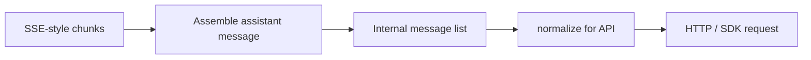

# Chapter 06: Streaming and Messages

> Typed messages, SSE-style events, and normalization before the API.

---

> **Tie-in -- Chapter 01 (The Agent Loop):** The agent loop is the primary consumer of stream events. Each delta flows into the assembly logic described here; when a tool-use block finalizes, the loop executes the tool, appends the result, and continues. See [Chapter 01](../01-agent-loop/README.md).

> **Tie-in -- Chapter 08 (Context Management):** Compaction and trimming reshape the transcript *before* normalization runs. Orphan thinking blocks, stale token estimates, and reordered attachments are all artifacts of compaction that normalization must handle. See [Chapter 07 -- Context Management](../07-context-management/README.md).

---

## Overview

**What are messages?** A chat with the model is an ordered list of messages, each with a **role** (user, assistant, system) and **content** (a string or a list of typed content blocks). Assistant content is usually a list of blocks -- text, tool-use requests, tool results, thinking payloads, and others. Each block carries a `type` tag, forming a **discriminated union** so parsers handle every variant explicitly.

**What is streaming?** The model does not return the full answer in one HTTP body. The server sends a stream of small **SSE-style events** -- text fragments, block boundaries, metadata. Your client assembles those events into one logical assistant message, then commits it to the transcript. A robust handler clears streaming buffers in the same update batch as the final message so the handoff is atomic.

**What is normalization?** Your app may store a rich internal transcript with UI-only rows, merged envelopes, and extra fields. The remote API expects a strict shape: allowed roles, paired tool blocks, no stray fields. Normalization is the pure step that converts internal messages to wire-ready messages. Skip it or get the order wrong and you get opaque 400 errors.

**Practical habit:** Keep a clear split between **internal** messages and **API-ready** messages; run the same `normalize -> request body` path in unit tests with golden examples for tricky shapes.

---

## 6.1 Message structure

Each message in the transcript has a **role** and a list of **content blocks**.

**Roles** include the standard `user`, `assistant`, and `system`, plus envelope-only roles your internal model may use: `progress` updates, `attachment` rows for UI or prefetch bookkeeping, `virtual` placeholders. Envelope-only roles never go on the wire -- drop or remap them during normalization.

**Content blocks** are a discriminated union keyed on `type`:

- `text` -- plain text from the model
- `thinking` / `redacted_thinking` -- extended-thinking payloads
- `tool_use` -- a request to invoke a tool (id, name, input)
- `tool_result` -- the outcome of that tool invocation
- Provider-specific blocks (server tools, search, etc.)

**Split vs merge.** Some pipelines split one assistant message into several rows (one block each) to stabilize ordering and ids. Before sending, merge assistant fragments that share the same provider **message id** so one logical completion becomes one API assistant turn. Concurrent agents interleave different ids -- merge must key on id, not only adjacency.

---

## 6.2 Streaming assembly

The server emits a sequence of SSE-style events. A simplified raw stream looks like this:

```
event: message_start       { "type": "message_start", "message": { "id": "msg_01X", "role": "assistant" } }
event: content_block_start { "type": "content_block_start", "index": 0, "content_block": { "type": "text", "text": "" } }
event: content_block_delta { "type": "content_block_delta", "index": 0, "delta": { "type": "text_delta", "text": "Hello" } }
event: content_block_delta { "type": "content_block_delta", "index": 0, "delta": { "type": "text_delta", "text": ", world!" } }
event: content_block_stop  { "type": "content_block_stop", "index": 0 }
event: message_stop        { "type": "message_stop" }
```

**Assembly process:**

1. On `message_start`, create a new assistant message shell with the given id.
2. On `content_block_start`, initialize a buffer for that block index and type.
3. On `content_block_delta`, append the delta payload to the buffer (text deltas concatenate; tool-use deltas accumulate JSON fragments).
4. On `content_block_stop`, finalize the buffer into a committed content block.
5. On `message_stop`, commit the fully assembled message to the transcript and **clear all streaming buffers** in the same update batch.

The assembled message from the stream above:

```json
{
  "id": "msg_01X",
  "role": "assistant",
  "content": [
    { "type": "text", "text": "Hello, world!" }
  ]
}
```

The UI can display partial text while the stream is open. After commit, only the final message should be visible -- never both the streaming preview and the committed version.

---

## 6.3 Normalization

Normalization converts the internal transcript into the strict shape the API expects. It is a pure function: `normalize(internal_messages) -> api_messages`.

**What normalization does:**

- Strips virtual / progress / envelope-only rows
- Merges split assistant fragments that share the same response id
- Ensures every `tool_use` is followed by a matching `tool_result`
- Removes or reshapes thinking blocks when replay rules require it (orphan thinking, trailing thinking before send)
- Folds attachment rows into user content blocks
- Deduplicates attachments by stable id

**Before / after example:**

Internal transcript (what your app stores):

```python
internal_messages = [
    {"role": "system", "content": "You are helpful."},
    {"role": "user", "content": [
        {"type": "text", "text": "Resize this image"},
        {"type": "image", "attachment_id": "att_42", "source": "uploads/photo.png"},
    ]},
    {"role": "virtual", "content": "── progress: reading file ──"},       # display-only
    {"role": "assistant", "response_id": "resp_A", "content": [
        {"type": "thinking", "text": "I need to call the resize tool..."},
    ]},
    {"role": "assistant", "response_id": "resp_A", "content": [           # split fragment
        {"type": "tool_use", "id": "tu_1", "name": "resize", "input": {"w": 800}},
    ]},
    {"role": "tool_result", "tool_use_id": "tu_1", "content": "ok, resized"},
    {"role": "attachment", "attachment_id": "att_42", "source": "uploads/photo.png"},  # duplicate
]
```

After `normalize()` (what goes on the wire):

```python
api_messages = [
    {"role": "user", "content": [
        {"type": "text", "text": "Resize this image"},
        {"type": "image", "source": {"type": "url", "url": "uploads/photo.png"}},
        # att_42 NOT repeated -- deduplicated
    ]},
    {"role": "assistant", "content": [
        # thinking stripped for replay (provider rule)
        {"type": "tool_use", "id": "tu_1", "name": "resize", "input": {"w": 800}},
    ]},
    {"role": "user", "content": [
        {"type": "tool_result", "tool_use_id": "tu_1", "content": "ok, resized"},
    ]},
]
```

Key changes: virtual row dropped, split assistant fragments merged by `response_id`, thinking stripped for replay, duplicate attachment removed, tool result wrapped in a user turn per API convention.

---

## 6.4 Attachments and deduplication

User attachments (images, files) and prefetched resources become additional user-side content blocks or dedicated internal rows that fold into the next user message.

**Pipeline:**

1. **Assign stable ids.** Each attachment gets an `attachment_id` at upload time that survives compaction and re-injection.
2. **Convert to content blocks.** Images become `image` blocks; files become `text` or `document` blocks with the appropriate source handle.
3. **Deduplicate after compaction.** Compaction or memory injection can re-introduce the same attachment. Before normalization, dedupe by `attachment_id` so the same file is not repeated.
4. **Respect API limits.** Large payloads should remain behind URLs or handles the API accepts rather than being inlined as base64.

---

## How it fits together

The agent loop yields stream deltas and, when blocks complete, finalized assistant or user rows. **Normalization** is the last gate before HTTP: reorder or flatten attachments, merge assistant segments that belong to one completion, drop display-only virtual rows, then strip or reshape blocks the provider rejects on replay.



---

## Production concepts

### Streaming

- **Streaming assembly** -- Build assistant messages incrementally from stream events; keep **progress** payloads separate from **committed** transcript rows. When a turn finalizes, clear streaming buffers so the UI does not duplicate partial and committed text in one frame.
- **In-progress assistant** -- Persisted rows with no final stop reason may mean incomplete streaming; strip or replace them before replay to the API.
- **Tool use exit signal** -- Completion metadata that says "stopped for tool use" is **not** reliable across APIs and SDK versions. The robust rule: if the assembled assistant content includes any **`tool_use`** (or equivalent server-tool blocks), you **must** run tools and continue the loop; **do not** branch on `stop_reason` alone. See [`tool_use_exit_signal.py`](code-samples/tool_use_exit_signal.py).
- **Missing tool results** -- If a turn aborts mid-tool, synthesize error `tool_result` rows so the transcript stays balanced for the next model call.

### Thinking blocks

- **Thinking blocks** -- Extended-thinking content (`thinking` / `redacted_thinking`) participates in streaming (deltas may be excluded from token counters) and in replay rules: orphan thinking-only assistant rows after history surgery can be dropped; trailing thinking may be stripped from the last assistant before send when the API requires it.

### Compaction artifacts

- **Compaction artifacts** -- Micro-compact and full compact can insert boundary or summary messages with metadata for cache accounting; after **[autocompact or snip](../07-context-management/README.md)**, re-run the same normalization path and watch for stale token estimates until the next refresh.
- **Assistant trajectory / API round** -- Chunks from one completion share a stable assistant **message id**; merging by that id reconstructs one logical assistant row. Grouping by changing assistant id yields **API-round** segments used alongside compaction (see grouping notes in [Chapter 07 -- Context Management](../07-context-management/README.md)).

### Attachments

- **Attachments** -- User attachments and prefetched files become additional user **content** blocks (or dedicated internal rows that fold into the next user message). Assign **stable ids**, dedupe after compaction, and keep binary or large payloads behind URLs or handles the API accepts.

---

## Key design decisions

- **Discriminated unions** -- Model message and block types with an explicit tag field so parsers stay exhaustive and refactors stay safe.
- **Separate progress** -- Long-running tools can emit progress updates that are not part of the API transcript.
- **Attachment pipeline** -- Images and files become dedicated blocks with stable ids; dedupe when the same attachment is re-injected.
- **Idempotent merge** -- Assistant segments with the same response **id** concatenate content blocks; concurrent agents interleave different ids -- merge must key on id, not only adjacency.
- **Compaction-aware cleanup** -- After **[context trimming or summarization](../07-context-management/README.md)**, run orphan-thinking filters and whitespace-only assistant filters in an order that avoids invalid tail shapes (for example text that is only newlines after thinking is removed).

## Insights

- Signature or ephemeral blocks may need stripping before re-sending history (for example after credential rotation).
- Duplicate memory attachments should be filtered so compaction does not amplify noise.
- **Post-compact:** If **[blocking limits use estimated tokens](../07-context-management/README.md)** from messages, estimates can lag right after a compact -- align gates with the actual trimmed transcript.
- **Thinking-only orphans:** If compaction removes the non-thinking half of a split assistant turn, drop remaining thinking-only rows or the API may reject mismatched thinking signatures.

## Message types and utilities (conceptual)

- **Block-level types** -- `text`, `thinking`, `redacted_thinking`, `tool_use`, `tool_result`, plus provider-specific blocks (server tools, search, and so on). Your reducer should branch on `type` and stay exhaustive as new variants appear.
- **Transcript envelopes** -- Besides user/assistant/system, you may store **attachment** or **progress** messages, **tombstones** for deletion, or **virtual** rows. Utilities typically: filter virtual rows, map attachments into user content blocks, and ensure tool pairs stay adjacent for the API.
- **Split vs merge** -- Some pipelines **split** one assistant message into several rows (one content block each) to stabilize ordering and ids; before send, **merge** assistant fragments that share the same provider **message id** so one logical completion becomes one API assistant turn (concurrent agents interleave different ids -- merge must key on id, not only adjacency).
- **Attachments** -- Images and files become user-side blocks with **stable attachment ids**; after compaction or memory injection, **dedupe** by id so the same file is not repeated many times.

## Code samples

Python teaching samples live under [`code-samples/`](code-samples/):

| Sample | Description |
|--------|-------------|
| [`message_types.py`](code-samples/message_types.py) | Typed content blocks (`TextBlock`, `ThinkingBlock`, `ToolUseBlock`, ...); helper `is_thinking_only_assistant` |
| [`stream_handler.py`](code-samples/stream_handler.py) | Text delta buffer with reset after finalize; merge assistant chunks by shared `response_id` |
| [`message_normalization.py`](code-samples/message_normalization.py) | One-block split, virtual strip, orphan thinking filter, strip thinking for replay |
| [`assistant_api_rounds.py`](code-samples/assistant_api_rounds.py) | Group rows by changing assistant `response_id` (API-round boundaries) |
| [`tool_use_exit_signal.py`](code-samples/tool_use_exit_signal.py) | Prefer inspecting assembled `tool_use` blocks over `stop_reason` for continuation |
| [`attachments_pipeline.py`](code-samples/attachments_pipeline.py) | Image blocks with stable ids; dedupe by `attachment_id`; build user rows from uploads |

## Build your own

1. Define message and block variants in Python with explicit discriminators (`TypedDict` + `Literal` tags, or dataclasses with a `type` field).
2. Build a small reducer that folds streaming events into one assistant message: append text deltas to buffers; on end-of-block, finalize blocks and append to the transcript; reset buffers after finalize.
3. Implement `normalize(messages) -> api_payload` as pure functions with tests -- cover virtual-row stripping, same-id assistant merge, thinking-orphan cases if you compact, and attachment dedupe.
4. Log shape mismatches in development only so production logs stay quiet.

---

**Navigation:** [< Chapter 05 -- Tool Implementations](../05-tool-implementations/README.md) | [Overview](../README.md) | [Next: Chapter 07 -- Context Management >](../07-context-management/README.md)
