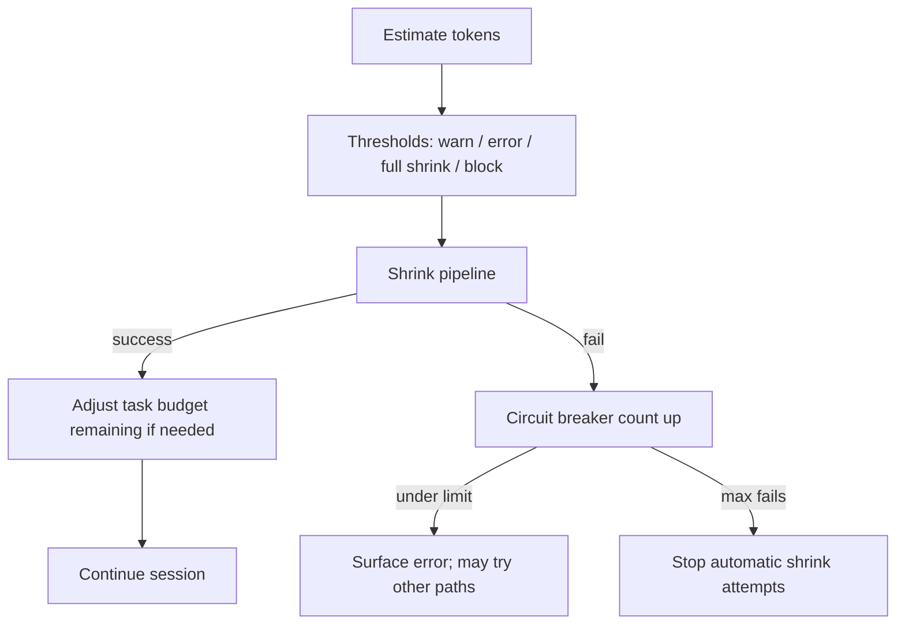

# Chapter 07: Context Management

> How long sessions stay inside the model's memory limit: measuring fullness, early warnings, shrinking history, and stopping doomed retries.

## Overview

Think of the context window as a **fixed-size notepad** the model re-reads on every turn. System text, conversation history, tool output --- everything must fit. When the notepad overflows, the provider rejects the request or truncates unpredictably, so production agents treat the limit as a hard planning constraint.

This chapter covers how to **measure** how full the notepad is (7.1), **make room** when it fills up (7.2), **warn** the user at graduated thresholds (7.3), **estimate** tokens and pace work (7.4), **stop** retrying when compaction is doomed (7.5), and **surgically trim** bulky tool output (7.6).

---

## 7.1 The context window as a budget

Every API call sends the **entire** conversation so far --- system prompt, every user and assistant turn, every tool-call result. The model's advertised context window (e.g., 200K tokens) is the hard ceiling.

But you cannot use all of it. You must reserve space for:

- **Summary output headroom** --- room for the model to write a summary when compaction fires (capped so planning stays predictable).
- **Tool-result slack** --- the next tool call might return a large blob.
- **Formatting overhead** --- message wrappers, JSON framing, etc.

The **effective window** is therefore:

```
effective_window = model_window - summary_headroom
```

Everything below is measured against this effective window, not the raw model limit.

> **Concrete example.** Your session has consumed 180K tokens in a 200K window. After reserving ~5K for summary headroom, the effective window is ~195K. The auto-shrink threshold fires at effective_window minus ~13K tokens (configurable) --- roughly equivalent to 30--40 pages of code --- so at ~182K you are already past the trigger. The full shrink pipeline kicks in, replaces history with a compact summary, and the session continues.

---

## 7.2 Three ways to make room

### 7.2.1 Full automatic shrink

Replace a large stretch of transcript with a shorter summary (typically generated by the model). This is the **primary** compaction path.

- Fires when estimated usage crosses the auto-shrink threshold (~13K tokens below the effective window).
- Costly (an extra model call) but faithful --- the summary preserves essential context.
- A percentage-of-window override can lower the trigger for experiments (same idea as a compact-percent environment override).

### 7.2.2 Spot edits on bulky tool rows (micro-compaction)

Target specific large, repeatable chunks --- file reads, shell output, search results --- and rewrite them shorter **without** re-summarizing the whole history.

- Applies to a **subset of tool kinds** (large, repeatable blobs: file reads, shell, search, web, writes/edits).
- May mix rough token math, stable replay positions for cache-friendly edits, and time-based clearing of stale tool bodies when enough wall time has passed since the last full shrink (feature-gated).
- Any **manual or automatic full compact** resets spot-edit state --- the transcript is replaced wholesale.

See **Section 7.6** for more detail.

### 7.2.3 Archival projection (context collapse)

Archived or staged history is projected so the primary thread can stay under the limit **without** always paying for a full summarize pass.

- Metadata records commits and snapshots and interacts with resume.
- Policy often uses a **threshold ladder** (e.g., an earlier rung that commits staged work and a later rung that blocks expensive spawns) so the session degrades gracefully before the hard window.
- **autoCompact** is typically **suppressed** while this mode owns headroom so archival state and proactive summarization do not race on the same transcript.

---

## 7.3 Warning bands and thresholds

Before the hard limit, a graduated series of bands gives the user and the system time to react. All distances are measured from the auto-shrink threshold (or from the full effective window when auto-shrink is disabled).

| Band | Distance from limit | Action | UI signal |
|------|---------------------|--------|-----------|
| **Warning** | ~20K tokens below auto-shrink threshold | Early heads-up to the user | Yellow indicator |
| **Error** | Near auto-shrink threshold (same ~20K spacing band in reference stack) | Strong signal; not always a hard provider stop | Red indicator |
| **Auto-shrink** | ~13K tokens below effective window (configurable) | Full summarization pipeline fires | Background |
| **Blocking** | ~3K tokens below effective window (overridable in tests) | Refuse new work before the provider does | Error message |

> **Stale-estimate caveat.** Right after a snip or compact the transcript has already shrunk, but per-message usage metadata may still reflect the old size until the next API round-trip. Hard gates (especially blocking) should **skip or adjust** in that window to avoid false positives.

---

## 7.4 Token estimation and task budget

There are **two separate counting systems** serving different questions:

| Aspect | Session / memory estimation | API task budget |
|--------|---------------------------|-----------------|
| **Purpose** | "Are we about to blow the window?" | "What number is the model using to pace itself?" |
| **Source** | Last real assistant usage (input + cache + output) plus rough increments for new messages | Server-provided `total` and `remaining` fields |
| **After compaction** | Re-estimate from the now-shorter transcript | Client subtracts the **final pre-compact** window from `remaining` so the next call does not lie to the model |
| **Edge cases** | When tool results interleave with parallel assistant branches, walk back so sibling rows share one logical response and nothing is under-counted | Use the **final** iteration's input + output when present; otherwise top-level input + output **without** cache --- aligned with how server-side remaining is often derived |

### Task budget in output config

- **Total** --- Budget for the agentic turn as shown to the model.
- **Remaining** --- Counts down while history is large. After compact, the server may only see a summary and under-count; the client subtracts the **final pre-compact** window from **remaining** after each compact so the next request stays consistent.

---

## 7.5 Circuit breaker

If automatic shrinking fails several times in a row (oversized prompt, API errors), a counter increments. After **three consecutive failures**, the loop **stops** trying to auto-shrink and surfaces failure instead of burning calls on a prompt that cannot be recovered.

- Increment on compaction error (except user abort).
- Reset on success.
- After three failures, skip further automatic shrink for that session.

---

## 7.6 Spot edits (micro-compaction)

Spot edits are a **lighter-weight** alternative to full summarization. Instead of replacing the entire transcript, they target individual tool-output rows that are large and replaceable.

Typical candidates: file-read results, shell output, search hits, web fetches, write/edit confirmations.

Mechanics:

- Rough token math identifies oversized rows.
- Stable replay positions allow cache-friendly edits (the prefix before the edit stays cacheable).
- Time-based clearing can expire stale tool bodies after enough wall time since the last full shrink (feature-gated).
- Any full compact (manual or automatic) **resets** spot-edit state because the transcript is replaced wholesale.

> **Tie-in: Chapter 01 --- Agent loop.** The agent loop (Chapter 01) carries compaction state --- auto-shrink flags, spot-edit positions, and circuit-breaker counters --- across iterations. Order matters: tool-result pressure is evaluated before spot edits run, and a full compact resets the spot-edit layer. See [Chapter 01](../01-agent-loop/README.md).

> **Tie-in: Chapter 05 --- System prompt and cache stability.** Volatile system-prompt prefixes hurt prompt-cache reuse. Spot edits change which transcript slice stays stable for caching, so system-prompt design (Chapter 05) and micro-compaction strategy are coupled. See [Chapter 04](../04-system-prompt/README.md).

---

## How it fits together



**Related chapters**

- **[Chapter 01 -- Agent loop](../01-agent-loop/README.md)** --- Where automatic shrink, spot-edit state, circuit breaker state, and optional task-budget fields flow through the turn loop; order matters (e.g. tool-result pressure before spot edits).
- **[Chapter 04 -- System prompt](../04-system-prompt/README.md)** --- Prompt cache stability: volatile prefixes hurt reuse; spot edits change which slice stays stable.
- **[Chapter 06 -- Streaming and messages](../06-streaming-and-messages/README.md)** --- Normalized messages, shrink boundaries, and usage on assistant rows --- the estimator walks the same list the API will see.

## Key design decisions

- **Reserve tokens for summary output** --- Effective window = model window minus reserved summarizer headroom.
- **Buffer below the hard limit** --- Automatic full shrink fires before the last possible token so tool results still fit.
- **Diminishing returns** --- Stop turn continuation when extra iterations add almost no tokens (loop budget policy).
- **Two budget stories** --- API **task budget** (model-visible, corrected after compact) vs **loop continuation budget** (client-only pacing).

## Turn continuation budget (inside one user turn)

Separate from API task budget: optional continuation inside one user-facing turn stops when a soft fraction of a **loop budget** is consumed or when **diminishing returns** appear (tiny token deltas across iterations). **[Chapter 01 -- Agent loop](../01-agent-loop/README.md)** covers that loop; see its code samples for the continuation pattern.

## Insights

- Environment overrides exist to tune automatic full shrink for testing and for power users.
- Post-compact cleanup hooks fix auxiliary state (session memory pointers, archival staging, and similar).
- If a **blocking** gate uses estimated input tokens from messages, estimates can **lag** immediately after **snip** or **compact** --- the transcript already shrank, but per-message usage metadata may still reflect the old size until the next refresh. Hard gates should **skip or adjust** in that window.

## Code samples

Run with **`python3`** from this directory (stdlib only for these files):

| Sample | Description |
|--------|-------------|
| [`auto_compaction.py`](code-samples/auto_compaction.py) | Effective window, buffers, optional percent override |
| [`token_warning_thresholds.py`](code-samples/token_warning_thresholds.py) | Warn / error / full-shrink / blocking bands |
| [`micro_compaction.py`](code-samples/micro_compaction.py) | Replace a transcript slice; tool-scope note |
| [`token_budget.py`](code-samples/token_budget.py) | Turn continuation: soft cap, diminishing returns, forked `agent_id` disables |
| [`circuit_breaker.py`](code-samples/circuit_breaker.py) | Consecutive failure cap (aligned with max 3) |
| [`api_task_budget_remaining.py`](code-samples/api_task_budget_remaining.py) | `TaskBudgetState`, cumulative `remaining` after `subtract_pre_compact_window` |
| [`context_collapse_stub.py`](code-samples/context_collapse_stub.py) | Minimal commit + snapshot staging (educational) |

## Build your own

1. Centralize token estimation (provider tokenizer or heuristic).
2. Track **automatic shrink state**: turn id, compacted flag, **consecutive failures** for the circuit breaker.
3. Wire compaction failure to increment the breaker; reset on success.
4. Expose manual compact with a **smaller** buffer than automatic (manual buffer on the order of a few thousand tokens vs automatic on the order of tens of thousands in the samples).
5. After each successful compact, recompute **task budget remaining** using the **final** pre-compact window size if you expose API task budgets.

---

**Navigation:** [< Chapter 06 -- Streaming](../06-streaming-and-messages/README.md) | [Overview](../README.md) | [Next: Chapter 08 -- Memory >](../08-memory-system/README.md)
