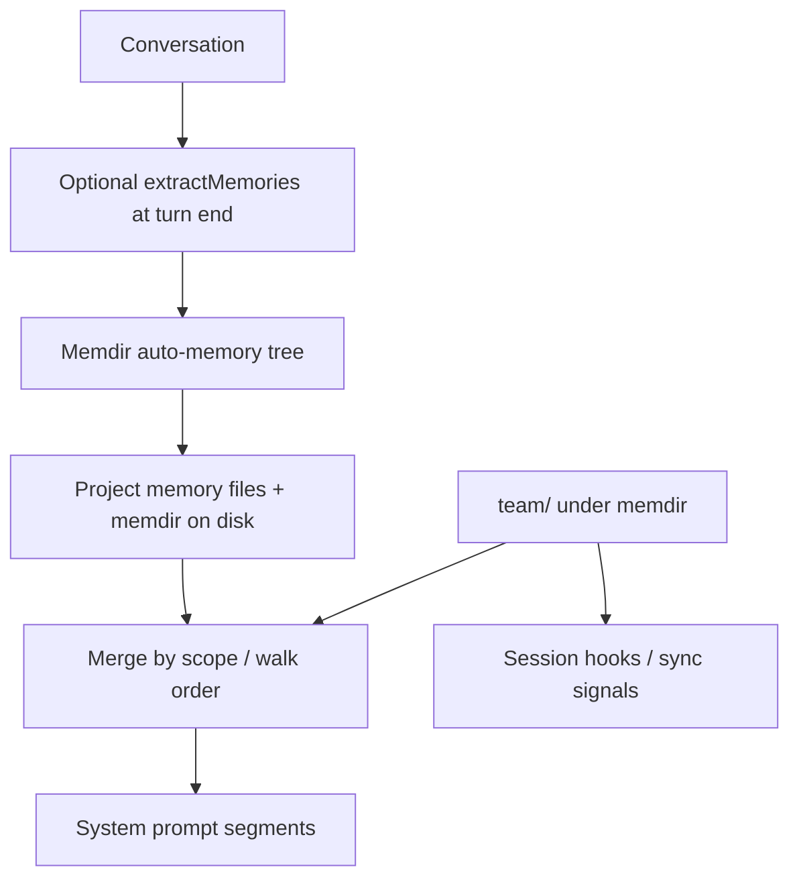

# Chapter 08: Memory System

> Scoped instruction memory, disk entrypoints, optional end-of-turn extraction (`extractMemories`-style jobs), and a separate team namespace with sync-oriented hooks.

## Overview

**Memory** is text you want the model to see again on later turns: coding standards, repo facts, conventions. Think of four ideas working together:

1. **Scoped memory** — Rules are not one global blob. Layers stack in a fixed order (broad to narrow), and later layers override earlier ones.
2. **Entrypoint files and memdir** — Each subsystem has a canonical filename or tree the loader recognizes on disk.
3. **Extraction** — After a completed user turn, an optional background job can propose writes into memdir.
4. **Team sync** — Team memory is a separate subtree inside memdir with its own validation and sync hooks.

Each concept is expanded in its own subsection below.

---

## 8.1 Scoped memory

Rules are not one global blob. Layers stack in a fixed order from broad to narrow: managed policy, user home, project memory files discovered by walking parents from `cwd`, local-only overrides, and optional memdir entries. **Project memory files** discovered along the path from `cwd` toward the filesystem root apply more specifically when they sit in directories closer to where you work.

When two layers disagree, the **later** (more specific) layer in the merge order wins. That keeps "workspace default vs nested folder vs local override" predictable without any explicit priority numbers.

### Concrete example: layer merge

```
/AGENT.md                    -> "Use Python 3.12"
/project/AGENT.md            -> "Use pytest for tests"
/project/src/AGENT.md        -> "Follow strict typing"

Agent working in /project/src/ sees all three, later overrides earlier.
```

If `/AGENT.md` said "Use Python 3.10" and `/project/src/AGENT.md` said "Use Python 3.12", the agent working in `/project/src/` would follow 3.12 because the closer file wins. Rules that do not conflict simply accumulate, so the agent also picks up "Use pytest for tests" from the middle layer.

> **Tie-in -- Chapter 05 (System prompt):** The merged memory segments are injected into the ordered system prompt stack described in Chapter 05. Volatile or oversized memory segments hurt cache identity and cost, exactly as with tool lists and context maps. Keeping memory layers small and stable improves prompt caching.

---

## 8.2 Entrypoint files and memdir

Each subsystem has a **canonical filename or tree** the loader recognizes. **Instruction-style** layers use names like `AGENT.md` (and optional `.agent/rules/*.md`), found by walking parents from `cwd` toward the filesystem root. This walk is deterministic: same working directory always produces the same set of files in the same order.

**Auto-memory** lives in a dedicated **memdir**: a project-scoped directory whose primary entry is `MEMORY.md`, with additional `.md` topic files under the same tree. Large entrypoints are **truncated** (line and byte caps) before injection so one runaway file cannot fill the context window.

`@path`-style **includes** expand before the host body, letting one instruction file pull in shared snippets. Cycles are rejected during expansion so a pair of files that include each other does not loop forever.

---

## 8.3 Memory extraction

After a completed user turn, an optional **background** job (conceptually an `extractMemories` pass) can read the transcript and propose **writes** into memdir. The extraction job has tight permissions: it can only write to memdir paths and it reuses the same scan/manifest strategy as query-time recall, so the main agent does not spend turns listing files.

If the main agent **already wrote** under memdir in the same turn window, extraction **skips** to avoid duplicate notes. This deduplication is important because both the agent and the extraction job see the same conversation context and would often produce the same observations.

Extraction is gated by settings. It can be disabled entirely in simple mode, in remote sessions without a stable memdir, or through explicit user configuration.

> **Tie-in -- Chapter 01 (Agent loop):** Memory prefetch runs once per user turn while the system prompt is stable; the loop awaits prefetch together with skill discovery, then folds results into the prompt. Stop hooks at normal turn completion can schedule extraction without blocking the same inner tool round.

---

## 8.4 Team sync

**Team memory** is a **separate subtree** inside memdir (conventionally `team/`). It is validated and permissioned differently from personal instruction files and from arbitrary repo paths. The namespace separation means a team rule cannot accidentally shadow a user's local override or vice versa.

Implementations can emit **session hooks** (telemetry, notifications, or sync events) when team paths are read or updated, so shared knowledge stays observable and can be reconciled across collaborators. Team memory requires auto-memory to be enabled plus an extra feature gate.

Team memory paths deserve the same containment checks as any shared writable tree: resolve symlinks and reject `..` escapes before trusting a prefix. This prevents a malicious repo from steering writes to sensitive paths outside the expected subtree.

---

### How this chapter connects

- **[Chapter 01 -- Agent loop](../01-agent-loop/README.md)** -- Memory **prefetch** can run once per user turn while the system prompt is stable; the loop **awaits** prefetch with skill discovery, then folds results into the prompt. **Stop hooks** at normal turn completion can schedule extraction without blocking the same inner tool round.
- **[Chapter 04 -- System prompt](../04-system-prompt/README.md)** -- Instruction and auto-memory segments sit in the **ordered system stack**; volatile or oversized segments hurt **cache identity** and cost -- same concerns as tool lists and context maps.

---

## Production concepts

### Loading

- **Layered files** -- Managed policy, user home, **project memory files** (parent-walk from cwd), local-only overrides, optional memdir (with `MEMORY.md`) and team entrypoints; later layers override earlier ones where they conflict.
- **Includes** -- `@path`-style includes expand before the host body; cycles are rejected.
- **Truncation** -- Large entrypoints (especially `MEMORY.md`) are capped before injection.
- **Gates** -- Auto-memory can be disabled (simple mode, remote sessions without a stable memdir, settings). Team memory needs auto-memory plus an extra feature gate.

### Extraction

- **End-of-turn job** -- Restricted write allowlist to memdir; shares scan/manifest helpers with query-time recall.
- **Deduplication** -- If the main agent wrote to memdir in the same turn window, extraction skips to avoid double-writing.

### Team

- **Team subtree** -- Shared files under `team/` with stricter path validation (e.g. symlink-safe containment).
- **Hooks** -- Session hooks support sync and auditing in the product.

## How it fits together



## Key design decisions

- **Walk from cwd upward** -- Nested worktrees get nearest-directory rules; overrides stay local to the folder you are working in.
- **Memdir vs checked-in project memory** -- Repo instruction files are **versioned** guidance; memdir holds **session-derived** or curated notes under a dedicated layout.
- **Team vs personal** -- Team content is namespaced and validated separately from generic project paths and from a single user's local overrides.
- **Extraction vs main agent** -- Direct writes by the main agent into memdir make background extraction **redundant** for that turn -- skip instead of double-writing.

## Insights

- Very large `MEMORY.md` or instruction files hurt latency and cache stability -- enforce caps and split by topic.
- Remote or ephemeral environments may disable auto-memory unless a stable memdir path exists.
- Settings that redirect memdir must come from **trusted** sources so a malicious repo cannot steer writes to sensitive paths.
- Team memory paths deserve the same containment checks as any shared writable tree -- resolve symlinks and reject `..` escapes before trusting a prefix.

## Code samples

Run from this directory:

```bash
python3 code-samples/scoped_memory.py
python3 code-samples/memory_index.py
python3 code-samples/memory_extraction.py
python3 code-samples/team_memory_scope.py
```

| Sample | Description |
|--------|-------------|
| [`scoped_memory.py`](code-samples/scoped_memory.py) | Layered precedence (user -> project -> local) and merged markdown |
| [`memory_index.py`](code-samples/memory_index.py) | Walk upward from cwd and collect `AGENT.md`-style project entrypoints |
| [`memory_extraction.py`](code-samples/memory_extraction.py) | Heuristic extraction + skip-if-already-written (mirrors `extractMemories` dedupe) |
| [`team_memory_scope.py`](code-samples/team_memory_scope.py) | Detect paths under the `team/` subtree of memdir |

## Build your own

1. Define memory **types** and a single **precedence** order for your product.
2. Walk parents from `cwd` and collect candidate entrypoints; dedupe and expand includes with a **visited** set.
3. Truncate or split large files before API injection; log which cap fired.
4. If you add **background extraction** (`extractMemories` or equivalent), restrict tools to memdir paths and **dedupe** against main-agent writes in the same turn.
5. For **shared team** storage, use a dedicated prefix under memdir and validate resolves before write; emit hooks if you need sync or audit trails.

---

**Navigation:** [<- Chapter 07 -- Context Management](../07-context-management/README.md) | [Overview](../README.md) | [Next: Chapter 09 -- MCP ->](../09-mcp-integration/README.md)
