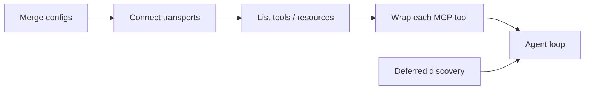

# Chapter 09: MCP Integration

> Wire external capabilities into the agent through a clear contract, predictable lifecycle, and tight control over what hits the context budget.

## Overview

**Model Context Protocol (MCP)** is a standard way for an agent to talk to **servers** that expose **tools** (callable functions with JSON schemas), and optionally **resources** (readable blobs or documents). If you think in ML terms: the LLM is a policy; MCP is the **adapter layer** that turns natural-language intent into **typed, schema-bound calls** to databases, notebooks, metrics APIs, or internal platforms—without baking those integrations into the model weights.

A concrete example of the full path:

```
MCP server "database" exposes tool "query" with schema { sql: string, limit: number }
  -> Agent sees: mcp__database__query
  -> Model calls it like any other tool
  -> Runtime forwards to MCP tools/call
  -> Result returns through the normal tool pipeline
```

After reading this chapter you should understand:

1. **Connection lifecycle** — How transports connect, which outcomes exist before tools are available, and why caches must be cleared on reconnect.
2. **Config merging** — Why precedence is **per-server id** (whole-record replace), not a deep merge of nested fields.
3. **Deferred tool discovery** — When full MCP schemas stay out of the initial tool list, how the meta-tool fits in, and what gates that mode (window budget, model/API capabilities, environment).
4. **Agent-facing tool identity** — How each remote tool becomes a first-class tool with a stable fully qualified name and shared execution behavior.

**Where to read next:** tool naming, permissions, and Tool Search behavior -> **[Chapter 02 -- Tool system](../02-tool-system/README.md)**. Context window, compaction, and budgets -> **[Chapter 07 -- Context management](../07-context-management/README.md)**. Plugin-delivered MCP, manifests, **`${user_config.*}`** -> **[Chapter 12 -- Skills and Plugins](../12-skills-and-plugins/README.md)**.

## How it fits together

Treat MCP as a **pipeline stage** between configuration and the agent loop. You merge human- and machine-authored config into one **server map**, connect each entry with the right transport, list tools (and optionally resources), **wrap** each listed tool for the agent runtime, then feed the resulting **tool surface** into the loop. When definitions would dominate the window, you **trim what the model sees first** and rely on the meta-tool for on-demand detail—same idea as not materializing a full catalog until the query needs it.



In operations, you run this stage **once per session** (or reconnect on failure for remote transports), invalidate list/schema caches when definitions change, and only then let the model plan over tools—so debugging "wrong tool shape" usually means **stale list**, **bad merge order**, or **transport dropped mid-handshake**, not a bad gradient.

## 9.1 Connection lifecycle

- **Transport** — Local deployments often use a **stdio** child process; remote servers use **HTTP**, **SSE**, or similar URL-backed streams. **WebSocket** may appear in some setups. Handshake order is conceptually: open the channel -> protocol `initialize` -> negotiate capabilities -> **`tools/list`** (and optionally resource listing). Each step should be **timeout-bounded**; teardown must close handles so processes and sockets do not leak.

- **Outcomes before "tools ready"** — A server can land in one of several states before it is usable:

| State | Meaning | Next step |
|-------|---------|-----------|
| **Disabled** | Configured but not started | Enable in config, then reconnect |
| **Connecting** | Transport open, handshake in progress | Wait (timeout-bounded) |
| **Connected** | Handshake complete, tools available | Ready for use |
| **Needs auth** | Remote OAuth not completed; an auth helper may appear in the tool list | User completes the OAuth flow |
| **Failed** | Transport or handshake error | Inspect logs; retry or fix config |

Subagents that declare **required** MCP servers may **wait** for pending connections up to a bounded time so they do not start with a false "server missing" error.

- **Resilience** — **Local** transports are often **single-shot**: if the process exits, you need an explicit reconnect policy. **Remote** streams may **retry** after disconnect. For remote servers that returned **401** or have **discovery but no token**, implementations may **skip immediate reconnect** for a cooldown and avoid hammering OAuth discovery—interactive flows then unblock via the documented MCP auth entry points.

- **Parallel cold start** — Local and remote servers are typically processed in **separate batches** with **different concurrency limits** (spawning many processes at once is expensive; opening many HTTP sessions is cheaper). Tool, command, and resource lists for a connected client are often fetched **in parallel** once the session is up.

- **Caches** — Tool lists and similar fetches are usually **memoized per server** with a bounded cache. **Reconnect** or config change should **invalidate** those entries so the model never plans against **stale** JSON schemas.

## 9.2 Config merging

Server definitions are collected from **several scopes** (plugins, global user settings, project tree, local project overrides, dynamically supplied entries, CLI-supplied files). The merge rule is deliberate:

- **Per server id, last layer wins the whole record** — Later scope **replaces** the entire entry for that id; nested fields from an earlier layer are **not** deep-merged. That matches operator mental models ("project owns `metrics` end-to-end") and avoids ambiguous combinations of env vars or headers.

A concrete example:

```
User config:     { "metrics": { url: "http://localhost:9090" } }
Project config:  { "metrics": { url: "http://prod:9090", headers: { "X-Team": "infra" } } }
Result:          { "metrics": { url: "http://prod:9090", headers: { "X-Team": "infra" } } }
  <- Project REPLACES user entirely (not deep merge)
```

Notice the user config's `url` is not preserved alongside the project's `headers`—the entire record is replaced.

- **Typical precedence (low -> high)** — **Plugin** < **user** < **project** < **local**. **Enterprise** managed config may be **exclusive** (user/project/plugin layers omitted). **Remote connectors** discovered automatically are usually merged **under** manually configured servers, with **content-based deduplication** so the same URL or command is not started twice under different ids.

- **Project `.mcp.json` walk** — Files are merged along the path from **repository root toward the current working directory**; directories **closer to CWD** override parents for the same server id (still whole-record replace per step).

- **CLI config files** — Multiple **`--mcp-config`** inputs are merged **in order**; **later file wins** on id clash.

- **After merge** — Expand variables when parsing, then apply **disabled** flags, **allowlists**, and policy filters so the effective map is what actually connects.

## 9.3 From MCP `tools/list` to agent tools (MCPTool pattern)

Each row returned by **`tools/list`** becomes one **agent tool** that:

- Uses a **fully qualified name** `mcp__<normalized_server>__<normalized_tool>` so tools from different servers never collide and permission rules stay precise.

- **Clones a shared template** ("MCPTool"): same permission flow, result rendering, progress hooks, and **call** implementation that forwards to **`tools/call`** on the right connection. Per-tool fields override the template: **input schema**, description, **read-only / destructive / open-world** hints from MCP annotations, optional **search hints** and **always-load** flags from server metadata, and **auto-classifier** input shaping for security modes.

- Keeps **`mcpInfo`** (server name + original tool name) for routing and display even when optional modes strip the prefix (e.g. some in-process SDK integrations).

This is why debugging MCP often involves **both** the wire name seen by the model and the **original** server-local tool name in logs.

> **Tie-in -- Chapter 02 (Tool system):** Once an MCP tool is wrapped with its fully qualified name, it is indistinguishable from any built-in tool in the agent's tool surface. The same permission checks, result rendering, and execution pipeline described in [Chapter 02](../02-tool-system/README.md) apply uniformly. MCP is how external capabilities become first-class agent tools.

## 9.4 Deferred tool discovery (Tool Search)

Full MCP tool definitions (name + description + JSON schema) can be **large**. Products therefore support **deferring** some tools: they are registered internally but sent to the API with **`defer_loading`** so they do not bloat the initial tool payload. The model retrieves definitions **on demand** via a fixed meta-tool named **`ToolSearch`** (aligned with the Tool Search feature).

- **Tool Search feature flag** — Unset defaults to behavior that still considers **auto** thresholds in many setups; explicit values include forcing deferral on, **off**, or **`auto` / `auto:N`** where **N** is a **percent of the context window** used as the size gate (default percentage when unspecified is on the order of **10%**).

- **Size estimation** — Implementations compare estimated **token** weight of deferred definitions to the threshold; when a token API is unavailable, a **characters-per-token** heuristic (on the order of **2.5** chars per token) is used for MCP tool text.

- **`tool_reference`** — Deferred mode may rely on **beta** wire shapes (e.g. **`tool_reference`** blocks). Models that do not support them fall back to **inlined** tools. A **host-level kill switch** (environment or config) can disable experimental beta shapes for gateways that reject them. Non-first-party API bases may disable optimistic Tool Search unless explicitly enabled—proxies that forward **`tool_reference`** can opt in via the same flag.

- **Invalidation** — When MCP servers connect or disconnect, deferred-tool token estimates are recomputed so gating stays accurate.

> **Tie-in -- Chapter 08 (Memory):** Deferred discovery is a direct application of the context-window budgeting principles from [Chapter 08](../08-memory-system/README.md). By keeping large MCP schemas out of the initial payload and loading them on demand through ToolSearch, the system preserves context space for conversation history, memory, and reasoning—the same tradeoff that drives compaction and summarization.

## 9.5 Resources and OAuth

**Resources** are listed and read on separate MCP methods from **`tools/list`**. When resources are supported, the product may inject **small built-in tools** to list or read them for the model. **OAuth** for remote servers follows HTTPS discovery (protected-resource and authorization-server metadata), **per-request timeouts**, token refresh, and often a **localhost redirect** for browser completion—plan for cancellation and UX-level timeouts across the full handshake.

## Key design decisions

- **Per-server replacement, not deep merge** — Same server id across layers: **whole entry** from the winning layer. That matches how operators reason about overrides ("project replaces user for `metrics`"), and avoids ambiguous merges of nested env or headers.

- **One logical tool surface, many transports** — **stdio**, **SSE**, **HTTP**, **WS** where supported all feed the same agent-facing tool namespace; lifecycle differs by transport (reconnect policy, child process cleanup).

- **Deferral as a first-class mode** — **`ToolSearch`** is a **stable name** so the model and API agree on how to pull schemas. Environment and model capabilities decide whether deferral is active.

## Insights

- **Parallelize cold start** — Preconnect and handshakes can overlap with other startup work (e.g. plugin cache and remote connector fetch) so the user-visible path is not strictly serial.

- **Treat cache as part of correctness** — Stale tool JSON is a silent failure mode; tie invalidation to config and reconnect signals.

- **Project MCP approval** — Servers from `.mcp.json` may remain **pending** until approved in settings; non-interactive flows may auto-approve under documented guardrails—plan security reviews accordingly.

## Code samples

Educational **Python 3** only—no application source tree, no other languages. Run from this directory, for example:

`python3 code-samples/mcp_client.py`

| Sample | What it illustrates |
|--------|---------------------|
| [`mcp_client.py`](code-samples/mcp_client.py) | Transport kinds and connection **lifecycle states** (educational enum) |
| [`mcp_config_merger.py`](code-samples/mcp_config_merger.py) | Ordered layers, **last wins per server id** (not deep merge) |
| [`mcp_tool_wrapper.py`](code-samples/mcp_tool_wrapper.py) | **Fully qualified** `mcp__server__tool` names, normalization, parsing caveat |
| [`deferred_tool_discovery.py`](code-samples/deferred_tool_discovery.py) | Window-fraction threshold helper, chars-per-token fallback, **`LazyToolRegistry`** pattern |
| [`mcp_oauth_flow.py`](code-samples/mcp_oauth_flow.py) | OAuth discovery ordering and per-request timeout budget (conceptual) |

## Build your own

1. **Normalize** each server record to a single struct: command/args/env for local, URL and headers for remote, explicit transport, timeouts.
2. **Connect** with a strict sequence: start process or open stream -> `initialize` -> negotiate capabilities -> `tools/list`—each step **timeout-bound**; on exit, tear down handles so zombies do not accumulate.
3. **Wrap** each MCP tool with a shared template: stable FQN, schema and hints from the server, **call** routed to **`tools/call`** on the active connection.
4. **Reconnect deliberately** — For remote streams, either retry with backoff or surface a clear error after a cap; for stdio, assume **one shot** unless you own restart policy.
5. **Merge** config in a **documented fixed order**, **per-id overwrite**; only then apply enterprise policy, disabled flags, and allowlists.
6. **Measure definition weight** — If MCP schemas would eat too much of the window, register **`ToolSearch`** (or equivalent) and keep full schemas in a side table until requested.

MCP is the agent's standardized plug-in bus—merged configs pick which servers run, transports define how they connect, each listed tool is wrapped into a uniform agent tool with a stable name, and lazy discovery keeps huge tool schemas from crowding the context window until the model actually needs them.

---

**Navigation:** [<- Chapter 08 -- Memory](../08-memory-system/README.md) | [Overview](../README.md) | [Next: Chapter 10 -- Subagents ->](../10-subagents/README.md)
