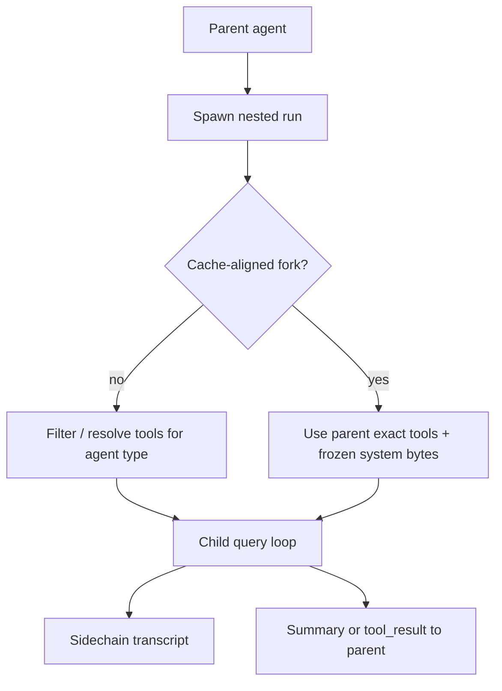
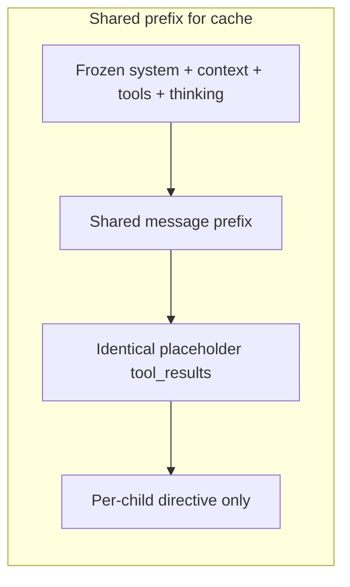

# Chapter 10: Subagents

> Nested agents with filtered tools, **frozen prompt bytes**, **cache-aligned forks**, **sidechain transcripts**, and optional progress signals while a child stream runs.

## Why subagents exist

The main agent loop eventually hits **cost**, **latency**, and **safety** limits. Delegating a slice of work to a **nested run** keeps the user-facing thread short: the parent gets a **summary** or a **single tool result**, while the child performs the same **model → tools → append results** cycle under tighter rules.

Two common shapes:

1. **Specialist subagent** — Narrow **tool allowlist**, custom instructions, often async. The child’s API request is allowed to **differ** from the parent’s (different tools, thinking disabled, slimmer context).
2. **Fork-aligned child** — The child must share the **same cache-key inputs** as the parent (system bytes, tools, model-related options, thinking config, shared message prefix). Tool definitions are often **copied verbatim** from the parent instead of re-filtered so serialized tool JSON **matches byte-for-byte**.

This chapter uses **educational names** for patterns that appear under different symbols in each codebase. A concrete reference stack often has: a **nested agent runner** (long-lived stream + tool loop), a **forked worker** helper (same cache-safe bundle as parent, usage rollup, optional no-transcript mode), and an **implicit fork** path (optional agent type, inherited prefix, guard against recursive fork).

## Core concepts

### Nested agent

A **nested agent** is a **separate** model session started by the parent. It increments **query depth**, respects **max turns**, and should **aggregate usage** (tokens, cost) back to the root session for billing and analytics. Mutable services (file read caches, content-replacement state, denial tracking) are typically **cloned** so the child cannot corrupt the parent mid-flight.

### Frozen prompt bytes

**Frozen** means the child’s **system** side of the request is fixed at **spawn time**: e.g. pass **already-rendered** system prompt blocks (or an immutable struct) instead of re-running a builder that might change with remote flags or time. If the parent and child must share a **prompt cache** prefix, any cold reassembly that drifts by one byte can **invalidate** the cache.

### Tool filtering vs exact tools

- **Filtering** — Build the child tool list from a **parent registry** using an **allowlist** (or agent-specific resolution). The child only **sees** tools it may call (read-only research, no shell, etc.).
- **Exact tools** — Skip re-resolution and use the **same tool array** (and related serialization) as the parent so the **tools** portion of the cache key matches. Session **permission allow rules** are often **replaced entirely** when `allowedTools` is set so **parent approvals do not leak** into a restricted worker.

### Sidechain transcript

A **sidechain** is a **parallel log** of nested turns: assistant / user / tool rows are **tagged or stored separately** from the main REPL transcript. That keeps the UI and session summaries clean while still allowing **replay**, **resume**, and **debug** of the child. The parent may append only a **trimmed summary** when the nested run completes.

### Fork (API branching, not OS fork)

A **fork** is a **child query** that continues from a **shared prepared prefix** with the parent so the provider can treat the long common beginning as **one cached block**. Sibling children often share an **identical** early tail: the same assistant **tool_use** layout and the **same placeholder** string for every **tool_result**; only the **final directive** differs per child. This maximizes prefix reuse under parallelism or repeated spawn.

The parent should pass a **frozen snapshot** of configuration when spawning so nested runs do not diverge from cache or feature flags mid-flight.

## How this chapter connects

- **[Chapter 01 – Agent loop](../01-agent-loop/README.md)** — Subagents use the same **async generator** pattern: stream output, run tools, append results. Recovery and turn limits apply **per** nested loop.
- **[Chapter 04 – System prompt](../04-system-prompt/README.md)** — Forks need **byte-stable** system text and context maps. Changing **max output tokens** can alter thinking/budget fields on some model paths and break cache parity with the parent.
- **[Chapter 07 – Context management](../07-context-management/README.md)** — Nested sessions share the overall **token budget**; sidechains keep nested traffic out of main-thread estimation where appropriate.
- **[Chapter 11 – Multi-agent coordination](../11-multi-agent-coordination/README.md)** — In-process teammates may still use the same nested **query** abstraction; mailboxes sit beside—not instead of—subagent isolation.

## How it fits together





## Reference stack patterns (names vary)

These rows describe **roles** often split across modules (e.g. an agent **tool** entrypoint, a **runner** coroutine, and a small **fork** helper). Symbols differ by project; the ideas recur together.

| Pattern | Role |
|--------|------|
| **Nested agent runner** | Single long-lived entry: **merge** optional parent prefix with **task messages**, choose **filtered** vs **exact** tools, apply **session allow rules** when an explicit allowlist is provided, build **system prompt** from **override** (frozen) or fresh assembly, **clone** file and replacement state when inheriting context, stream messages and optionally expose **`onCacheSafeParams`** (for periodic forked summaries) and **`onQueryProgress`** (liveness while thinking streams omit assistant rows). |
| **Forked worker loop** | Shorter helper path: run **`query()`** in a loop with **`CacheSafeParams`** identical to the parent, **isolate** `toolUseContext`, accumulate **usage**, optionally **`skipTranscript`** or **`skipCacheWrite`** for ephemeral work; optional **`onMessage`** for UI. |
| **Implicit fork spawn** | When policy allows **omitting** agent type, child inherits **full** parent message list and **rendered** system prompt; **exact** tool surface and **thinking** config match the parent for prefix parity. **Boilerplate** in history detects **fork children** to block **recursive** fork at call time. |
| **Fork message builder** | Emit **assistant** row with all **tool_use** blocks, then **user** row with **tool_result** blocks sharing **one** placeholder string, plus a **per-child directive** text block—only the directive differs across siblings. |
| **Sidechain recorder** | Persist nested lines with a **sidechain** flag and optional **parent / agent ids** for resume and debugging without treating them as ordinary main-thread turns. Optional **grouping key** for related nested runs. |

Additional practices:

- **Cache-safe bundle** — One immutable struct: system prompt, user/system context maps, tool context (tools, model, related options), shared message prefix. Forks must not flip one field independently.
- **Caution on `max_output_tokens`** — Overrides can change budget/thinking-related fields and invalidate cache alignment; safe when cache sharing with the parent is **not** required (e.g. compact summaries).
- **Incomplete tool calls** — Parent prefix may need **filtering or repair** so the API never sees orphan `tool_use` / `tool_result` pairs; fork helpers sometimes **defer** filtering to the same repair path as the main thread to keep the **repaired** prefix identical.
- **Parent UX** — Forward time-to-first-token and **per-chunk** progress from nested streams when the model emits long thinking blocks without a new assistant message.

## Key design decisions

- **Tool filtering** — Narrow tools for safety and cost; fork paths may use the **exact** parent tool list for cache parity instead of a subset.
- **Cache-safe fork** — Share **bytes and bundles**, not live builders; thread **rendered** system prompt at spawn.
- **Depth tracking** — Cap nesting depth and child turns; combine with a **fork-in-history** guard against unbounded recursive forking.
- **Sidechain vs main** — Omit or filter **sidechain** rows from session summaries where appropriate; keep full rows for resume.

## Insights

- Subagents often **roll up usage** to the root session for one bill and one analytics trace.
- A **different model** per subagent is a common cost/latency trade-off (when not using fork parity).
- Fork **placeholder** tool results must stay **identical** across sibling children so only the **directive** tail differs.
- **Nested spawn** should check depth **before** enqueueing work so adversarial or accidental recursion cannot exhaust resources.

## Code samples

Illustrative **Python** only, under this chapter’s [`code-samples/`](code-samples/) directory. Run from `docs/10-subagents/`:

```bash
python3 code-samples/subagent_spawner.py
python3 code-samples/cache_sharing.py
python3 code-samples/sidechain_transcript.py
python3 code-samples/liveness_callback.py
python3 code-samples/fork_message_prefix.py
```

| Sample | Description |
|--------|-------------|
| [`subagent_spawner.py`](code-samples/subagent_spawner.py) | Allowlist vs **exact** parent tools; session allow rules; depth guard |
| [`cache_sharing.py`](code-samples/cache_sharing.py) | Immutable **CacheSafeParams**; frozen rendered system bytes; save/read-last hook slot |
| [`sidechain_transcript.py`](code-samples/sidechain_transcript.py) | Sidechain-flagged rows, optional `parent_uuid`, **skip_persist** for ephemeral forks |
| [`liveness_callback.py`](code-samples/liveness_callback.py) | Progress hook on nested stream (thinking / TTFT-style liveness) |
| [`fork_message_prefix.py`](code-samples/fork_message_prefix.py) | Assistant + user wire shape; shared placeholders; per-child directive |

## Build your own

1. **Freeze prompt bytes** at subagent spawn (tuple of blocks or equivalent) so the child does not rebuild from shifting flags.
2. **Apply `tools_allowlist`** to the global registry unless you need the **exact** parent tool list for cache parity.
3. When using an allowlist, **replace** session-level allow rules so parent grants do not leak through.
4. **Append a structured tool result** (or summary message) to the parent when the child finishes so the main transcript stays balanced and auditable.
5. **Cap nesting depth** and total child turns; reject spawn when depth exceeds policy.
6. **For fork-style cache sharing**, keep placeholder **tool_result** strings **identical** across siblings; vary only the final **directive**.
7. **Record sidechain rows** with stable ids and optional parent links if you need resume or nested debugging without merging into the main turn list.

---

**Navigation:** [← Chapter 09 – MCP](../09-mcp-integration/README.md) | [Overview](../README.md) | [Next: Chapter 11 – Multi-Agent →](../11-multi-agent-coordination/README.md)
