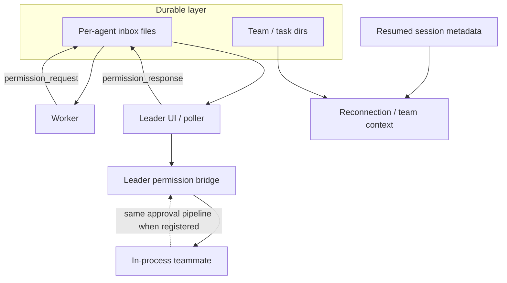

# Chapter 11: Multi-Agent Coordination

> Durable per-agent inbox files for cross-process mail, a leader-keyed permission bridge for in-process waits, and task-local identity (context variables or equivalent) so concurrent work never shares one global "who am I."

## Overview

Imagine several agents---different terminals, IDE sessions, or coroutines---on one **team**. They must **coordinate without a single shared memory space**, survive **crashes and disconnects**, and still answer **"which agent is acting right now?"** when tasks interleave.

This chapter is a **playbook** in three layers:

1. **Mailboxes** --- Each teammate owns inbox data on disk (often one JSON array per agent, guarded by a file lock with retries). Records can be conversational (read flags, previews) **or** carry **typed JSON payloads** in the body---`permission_request` / `permission_response`, sandbox asks, idle signals, shutdown handshakes---so the same durable channel serves chat-shaped traffic and control-plane round-trips.
2. **Leader bridge** --- One agent (the **leader**) owns the human-facing permission UI. Out-of-process workers post request/response envelopes through the leader's mailbox; **in-process** teammates register **futures keyed by request id** so the **same** approval path resolves without a second dialog stack.
3. **Async context isolation** --- Inside one process, **context variables** (`contextvars` in Python, **AsyncLocalStorage** in Node) carry per-task agent labels. **Across processes**, identity comes from startup (CLI/env), session metadata, and an authoritative **team roster**---the two ideas complement each other.

The umbrella term **Swarm** covers team and task directories, backends (separate panes vs co-located runners), team discovery and layout, mailbox I/O (read/modify/write under lock), and reconnection---rebuilding **who this process is** from a fresh spawn or from saved session fields reconciled against the current roster.

### Ties to other chapters

- **[Chapter 03 --- Permission system](../03-permission-system/README.md)** --- Workers hit the same permission modes and rules described in Chapter 03. Coordination adds **routing** on top: leader UI, mailbox round-trips, and cross-agent request ids that funnel decisions back to the right waiter.
- **[Chapter 10 --- Subagents](../10-subagents/README.md)** --- Subagents are **nested forks** with filtered tools. **Teammates** are **peers** with shared disk coordination---a fundamentally different isolation story. If you are choosing between the two, subagents give you a tighter parent-child hierarchy while teammates give you lateral collaboration.
- **[Chapter 13 --- Hooks and lifecycle](../13-hooks-and-lifecycle/README.md)** --- Swarm-style hooks should respect lifecycle order (e.g. team context before UI that depends on it).

## How it fits together



## 11.1 Teammate mailboxes

**Goal:** Any process can leave a message for a named teammate and that teammate can process it later---even if the sender exited.

**Minimal pattern:** append one JSON object per line to a file (durable log). Read by scanning lines---easy to teach; deployed teammate inboxes more often use a **single JSON array per agent** plus **serialized read--modify--write** under an OS-level lock (with **retry backoff** when many writers contend), matching how swarm-style mailboxes stay consistent when several agents touch the same file.

Append-only log:

```16:30:docs/11-multi-agent-coordination/code-samples/file_mailbox.py
def append_message(path: Path, payload: dict[str, Any]) -> None:
    path.parent.mkdir(parents=True, exist_ok=True)
    with path.open("a", encoding="utf-8") as f:
        f.write(json.dumps(payload, sort_keys=True) + "\n")


def read_messages(path: Path) -> list[dict[str, Any]]:
    if not path.exists():
        return []
    out: list[dict[str, Any]] = []
    for line in path.read_text(encoding="utf-8").splitlines():
        line = line.strip()
        if line:
            out.append(json.loads(line))
    return out
```

Locked JSON array inbox. The sample below uses `threading.Lock` for a single process; **cross-process** agents need **fcntl**/OS advisory locks or a **lockfile helper with retries and backoff**---the same **serialize writers** idea production swarms rely on:

```41:49:docs/11-multi-agent-coordination/code-samples/locked_inbox_array.py
    def append(self, message: dict[str, Any]) -> None:
        with self._lock:
            messages = self._load()
            messages.append(message)
            self._save(messages)

    def read_all(self) -> list[dict[str, Any]]:
        with self._lock:
            return list(self._load())
```

**Operational habits:** stable **request ids** shared by mailbox and bridge paths, explicit **read/ack** flags for user-visible rows, parsers that recognize **JSON bodies** with a `type` field, backoff on lock contention, and **one** leader-side consumer for permission responses if you want to avoid duplicate handling.

## 11.2 Leader permission bridge

**Goal:** In-process workers await permission the same way the interactive loop does---without inventing a second dialog system.

**Idea:** When a worker needs approval, it registers a **future** under a **request id**. The leader (or UI layer) calls **resolve** with **allow** or **deny** for that id. Out-of-process teammates use the same ids inside **mailbox envelopes** instead of this in-memory map.

```17:29:docs/11-multi-agent-coordination/code-samples/leader_permission_bridge.py
class LeaderPermissionBridge:
    def __init__(self) -> None:
        self._waiters: dict[str, asyncio.Future[Decision]] = {}

    def register(self, request_id: str) -> asyncio.Future[Decision]:
        fut: asyncio.Future[Decision] = asyncio.get_running_loop().create_future()
        self._waiters[request_id] = fut
        return fut

    def resolve(self, request_id: str, decision: Decision) -> None:
        fut = self._waiters.pop(request_id, None)
        if fut and not fut.done():
            fut.set_result(decision)
```

**Narrow on purpose:** the bridge exposes **one** pipeline (register -> user decision -> resolve). It does not replace policy rules from Chapter 03---it only **carries** decisions to the right waiter. Production code may also **route** the same `request_id` to either this in-memory map or a mailbox write, depending on whether the waiter shares the leader's process.

## 11.3 Async context isolation

**Goal:** While coroutine A runs as "worker-1" and coroutine B runs as "worker-2", neither overwrites a shared global that the other sees on the next `await`.

**Idea:** A `ContextVar` holds the current agent id for **concurrent coroutines in one interpreter**. Each task sets it for the duration of its work and **resets** in `finally` so teardown stays correct. Do not confuse this with **process-wide** teammate identity from env and roster---that is what reconnection rebuilds after restart.

```13:22:docs/11-multi-agent-coordination/code-samples/async_context_isolation.py
current_agent_id: ContextVar[str | None] = ContextVar("current_agent_id", default=None)


async def worker(name: str) -> str:
    token = current_agent_id.set(name)
    try:
        await asyncio.sleep(0)
        return current_agent_id.get() or ""
    finally:
        current_agent_id.reset(token)
```

Concurrent tasks keep distinct values:

```25:27:docs/11-multi-agent-coordination/code-samples/async_context_isolation.py
async def main() -> None:
    a, b = await asyncio.gather(worker("A"), worker("B"))
    assert a == "A" and b == "B"
```

## 11.4 Reconnection and team identity

**Goal:** After restart or session resume, the process must know **team name**, **agent display name**, and whether it is the **leader** or a **member**. A common convention: the **leader** has **no** per-member agent id in context (`None` / omitted), while **members** carry a stable id **looked up by name** in the current team roster so renames and removals stay honest.

Fresh spawn vs resumed session are two **sources of truth** for the same `TeamContext` shape:

```29:52:docs/11-multi-agent-coordination/code-samples/swarm_reconnection_context.py
def context_from_fresh_spawn(
    team_name: str,
    agent_name: str,
    agent_id: Optional[str],
) -> TeamContext:
    """New process started with explicit team / teammate env or CLI."""
    return TeamContext(
        team_name=team_name,
        agent_name=agent_name,
        agent_id=agent_id,
    )


def context_from_resumed_session(
    team_name: str,
    agent_name: str,
    member_agent_id: Optional[str],
) -> TeamContext:
    """Session replay: names from transcript; id from current team roster if present."""
    return TeamContext(
        team_name=team_name,
        agent_name=agent_name,
        agent_id=member_agent_id,
    )
```

**Habit:** pair transcript metadata with an **authoritative roster file** so removed members do not keep stale ids.

## Key design decisions

- **Files over pure in-memory IPC** when terminals detach or SSH drops.
- **Locks around inbox mutation** (or equivalent) so concurrent writers serialize; prefer **retry backoff** on contention.
- **Explicit message shape** (`type`, `request_id`, read flags) so parsers can split chat from control traffic and dedupe cleanly.
- **Task-local context** for in-process concurrency; **roster + env** for cross-process identity---not a single module-level "current agent" global used everywhere.
- **Two permission paths** (bridge vs mailbox) keyed by the **same request id** so in-process and multi-process deployments each get a natural UX.

## Insights

- **Reconnection** is **identity and roster consistency**, not TCP keepalive.
- Mailbox **poll intervals** trade latency against load; permission flows benefit from **idempotent** handling and stable **request_id** correlation.
- The leader bridge and mailbox are **dual transports** for the same conceptual approval step, not two different policies.
- **Swarm utilities** (team files, backends, layout, mailbox helpers) should stay **thin**: orchestration and I/O, not business rules---policy stays in the permission and tool layers.

## Code samples

Run from this chapter directory, for example:

`python3 code-samples/file_mailbox.py`

| Sample | Description |
|--------|-------------|
| [`file_mailbox.py`](code-samples/file_mailbox.py) | Append-only JSON lines (simple durable log) |
| [`locked_inbox_array.py`](code-samples/locked_inbox_array.py) | JSON array inbox with lock + read--modify--write |
| [`leader_permission_bridge.py`](code-samples/leader_permission_bridge.py) | Resolve permission futures by request id |
| [`async_context_isolation.py`](code-samples/async_context_isolation.py) | `contextvars` for per-task agent identity |
| [`swarm_reconnection_context.py`](code-samples/swarm_reconnection_context.py) | Fresh spawn vs resumed session team context |

## Build your own

1. Define a message protocol with **stable ids** and **read** or **ack** markers.
2. Use **advisory file locks** (or equivalent) around inbox mutation; prefer **retry backoff** on contention.
3. Store **`ContextVar`** values for `agent_id` / `team_name` and reset between tasks and tests.
4. For leader-mediated permissions: **register** host UI hooks for in-process workers, or use **mailbox** request/response with a single leader consumer.
5. On resume, **rehydrate** team context from persisted session fields plus an authoritative **team roster** file.

**Navigation:** [<- Chapter 10 -- Subagents](../10-subagents/README.md) | [Overview](../README.md) | [Next: Chapter 12 -- Skills & Plugins ->](../12-skills-and-plugins/README.md)
