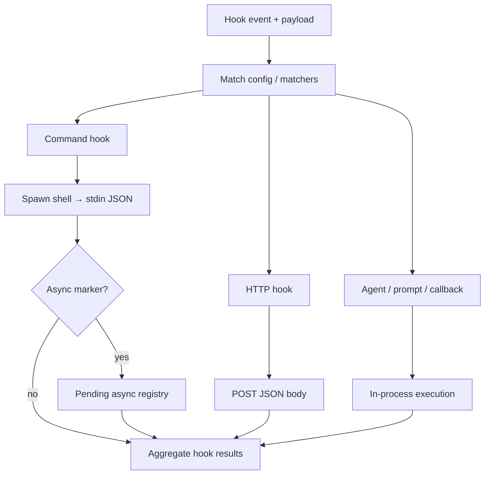

# Chapter 13: Hooks and Lifecycle

> Hook resolution, pending async subprocesses, session lifecycle events, and execution backends.

## Overview

**Hooks** let users and integrators run code at well-defined points in the agent runtime. The runtime picks a **hook event** name (for example `PreToolUse`, `SessionStart`), matches configured handlers, runs them under policy, and merges their outcomes for the caller.

### Two different “registries”

Do not conflate these:

1. **Event / matcher resolution** — At fire time, the runtime **merges** hook definitions from several sources (saved settings, session-scoped hooks from skills or agent frontmatter, plugin-registered matchers, and internal callbacks), **sorts** matchers by priority, and runs every hook whose matcher fits the payload. This is the structural “what hooks exist for this event” graph, not a single in-memory `Map` in the samples.

2. **Pending async subprocess registry** — Command hooks may print a first-line JSON object with an **async** marker and keep running. The runtime then **tracks** that shell handle in a dedicated global map: default timeout (order of tens of seconds), periodic checks for a **synchronous** JSON line on stdout, delivery of progress/outcomes, and **finalization** on shutdown. That tracker is what implementors often call the **async hook registry** in code review, even though it is only about long-running shell hooks—not about subscribing arbitrary async functions to event names.

The generic “many async subscribers per event name” pattern is illustrated in [`hook_registry.py`](code-samples/hook_registry.py) as **`MultiHandlerHookRegistry`**. The pending-shell pattern matches [`async_pending_hooks.py`](code-samples/async_pending_hooks.py).

**Compaction** is the step that shrinks or summarizes the transcript (context management). **Pre-compact** hooks run immediately *before* that mutating work; **post-compact** hooks run in a `finally`-style path *after* it, so observers always see a balanced pair even when compaction fails—see [`lifecycle_hooks.py`](code-samples/lifecycle_hooks.py).

A **session** here is one conversational agent run from first touch through teardown. **Session hooks** are handlers bound to session-scoped events such as `SessionStart` and `SessionEnd` (and related setup/teardown names in the canonical list).

**Stop hooks** are handlers for the `Stop` event (end of a turn on the main trajectory) and, on error paths, `StopFailure`. **Subagents** use `SubagentStop` instead of `Stop` when the hook runner is scoped to an agent id—agent frontmatter `Stop` hooks are mapped to `SubagentStop` for that reason. The stop phase can also surface **blocking** errors and **prevent continuation** when policy requires it. A concise procedural model is in [`stop_hooks_pipeline.py`](code-samples/stop_hooks_pipeline.py); the agent loop may consult stop-related signals (see [Chapter 01 – Agent loop](../01-agent-loop/README.md)).

**Execution backends** are the different ways a matched hook actually runs: for example a **command** backend spawns a subprocess with JSON on stdin and reads hook JSON from stdout; an **HTTP** backend POSTs the same JSON to a URL under allowlists and timeouts; other backends include in-process **agent** runs, **prompt** templates, **plugin callbacks**, and **function** hooks backed by session storage. No single backend fits every trust model and latency budget—[`hook_execution_backends.py`](code-samples/hook_execution_backends.py) sketches the dispatch idea.

**Shell command hooks** spawn a subprocess (bash by default, or PowerShell when configured): one JSON payload on **stdin**; **stdout** parsed line-by-line for hook JSON. If the first JSON line declares **async**, the process may stay alive: the runtime registers it in the **pending async** registry, applies a timeout, polls for a later JSON line with the decision, then finalizes.

**HTTP hooks** POST the same JSON string to a configured URL, parse the response body as hook JSON, and respect URL allowlists, timeouts, optional SSRF handling, and sandbox network routing when enabled.

**[Chapter 03 – Permission system](../03-permission-system/README.md)** is prerequisite in practice: in interactive mode, **workspace trust** is required before **any** hook runs, so hooks are not a bypass for permission boundaries. **[Chapter 11 – Multi-agent coordination](../11-multi-agent-coordination/README.md)** shows how swarm and teammate flows plug into the same lifecycle without redefining hook semantics.

## Hook event registry and config metadata

**Resolution** builds the effective list of hooks for one firing:

- Definitions from **settings** (user / project / local layers, merged elsewhere in the stack).
- **Session hooks** attached for the current session (skills, agent frontmatter, and similar).
- **Plugin hooks** re-registered when plugins load so the active set swaps atomically with the rest of session lifecycle.
- **Priority and matcher strings** decide order and which hooks run for tool- or field-scoped events.

**Metadata for UX and docs** — A separate, memoized layer maps each canonical event name to human-readable **summary** and **description** text (stdin shape, exit-code semantics, blocking vs fire-and-forget). For events that use matchers (`tool_name`, `source`, `trigger`, …), it also exposes which fields and example values apply. **Grouping helpers** merge settings-based hooks with plugin-registered matchers so settings UIs can list hooks **by event and matcher key** without reimplementing merge rules. This layer is read-only documentation and layout logic: it does **not** execute hooks.

The canonical name union for events is a single ordered tuple (public SDK and docs should stay aligned)—[`hook_event_surface.py`](code-samples/hook_event_surface.py).

## Stop hook pipeline (conceptual)

When a turn ends cleanly on the main thread, the runtime typically:

1. Builds a **hook context** snapshot (messages so far, system prompt, user/system context maps, tool context, query source).
2. Optionally runs **side jobs** that are not themselves “hook matchers” (for example prompt suggestions, memory extraction, or auto-dream), gated by mode and environment—**fire-and-forget** where appropriate so scripted runs are not blocked.
3. Invokes **`Stop`** matchers through the same hook execution machinery used elsewhere, streaming **progress** and **attachment** messages, collecting **blocking** errors and **prevent continuation** outcomes.
4. For **teammate** flows, may chain additional events after `Stop` (for example task completion hooks) using the same streaming pattern.

On **API failure** ends of a turn, **`StopFailure`** may run instead of `Stop`; its contract is observability-oriented (outputs often ignored). **Abort** during stop handling short-circuits and surfaces interruption to the user.

Subagents must not overwrite **main-thread-only** snapshots (for example cache-safe params used by follow-up controls); only main-thread query sources perform those writes.

## How it fits together

Matching hooks for one event typically run **in parallel**, each with its own timeout; results are aggregated for the caller. Command and HTTP paths both carry the same logical payload; only the execution backend differs.

## Production concepts

- **Shell command backend** — Many hooks are **spawned subprocesses**: JSON on stdin, structured JSON on stdout, session paths in environment variables—strict **timeouts** and **output caps** are mandatory.

- **Subscriber fan-out vs pending async registry** — Fan-out is “run every matched hook for this event.” The pending registry tracks **long-running shell** hooks until stdout delivers a sync JSON line or shutdown finalizes outstanding processes.

- **Pre-compact / post-compact / session / stop** — Distinct hook surfaces: compaction boundaries (`PreCompact`, `PostCompact`), session lifecycle (`SessionStart`, `SessionEnd`, …), and stop/failure (`Stop`, `StopFailure`, `SubagentStop`).

- **Post-sampling** — Hooks may observe or reshape assistant output before tool execution begins (event names in the canonical list).

- **Config-driven** — User config merges hook definitions with CLI overrides; invalid entries surface early.

- **Wide event surface** — The canonical hook event tuple spans `PreToolUse` through `FileChanged`; SDK schemas stay in sync with it—[`hook_event_surface.py`](code-samples/hook_event_surface.py).

- **Broadcast vs lifecycle** — Some events are **always emitted** to subscribers (e.g. **SessionStart**, **Setup**) for backwards compatibility; others require opting into full hook-event streaming so noise stays low by default.

- **Trust gate** — Hooks are skipped when workspace trust is not accepted in interactive mode, same as other high-risk paths.

## Key design decisions

- **Async all the way** — Hooks await I/O; failures optionally non-fatal per policy.

- **Ordering** — Stable order for deterministic builds; priority overrides optional.

- **Backend isolation** — HTTP hooks run outside the process; agent hooks run inside with tool access.

- **Parallel hook instances** — Matching hooks for one event run concurrently; each has its own timeout and outcome.

- **Pending async shell hooks** — A long-running command hook registers until stdout delivers a sync JSON line or shutdown finalizes outstanding processes.

## Insights

- Post-sampling hooks can modify or filter model output before tools execute.

- Stop hooks run on clean turn end (`Stop`) and API-error paths (`StopFailure`); subagent completion uses `SubagentStop`. Watch for double fire or overlapping semantics with session end.

- Keep **matcher merge** and **pending subprocess** state in separate designs: one answers “which hooks run,” the other answers “which shells are still producing stdout.”

- Pick **execution backends** per hook from trust and latency: shell for easy audit scripts, HTTP for network-isolated integrators, agent for reuse of the tool graph.

## Code samples

The examples are small, runnable Python sketches under [`code-samples/`](code-samples/); they illustrate patterns, not a drop-in production stack.

| Sample | Description |
|--------|-------------|
| [`hook_registry.py`](code-samples/hook_registry.py) | Generic **async fan-out** registry: `on` / `emit` runs subscribers in parallel (not the pending-shell tracker). |
| [`async_pending_hooks.py`](code-samples/async_pending_hooks.py) | Pending async **shell** hook pattern (timeout, stdout buffer, poll, finalize). |
| [`stop_hooks_pipeline.py`](code-samples/stop_hooks_pipeline.py) | **Stop** phase: context snapshot, optional side tasks, `Stop` execution, blocking vs prevent-continuation. |
| [`lifecycle_hooks.py`](code-samples/lifecycle_hooks.py) | **Pre-compact** / **post-compact** wrapper: `pre`, `compact`, `post` with `finally`. |
| [`hook_execution_backends.py`](code-samples/hook_execution_backends.py) | Stub dispatch for **execution backends** (command vs HTTP vs agent). |
| [`hook_event_surface.py`](code-samples/hook_event_surface.py) | Full canonical hook event tuple and broadcast vs opt-in notes. |

## Build your own

1. Define an enum or tuple of hook event names with versioned strings for compatibility—align with a single canonical list for schemas and docs.

2. Implement `register(name, async fn)` with dedupe by id on a **subscriber registry** used for fan-out.

3. `emit(name, payload)` awaits all handlers for that name; collect errors into a summary.

4. Route each handler by **execution backend** metadata (`command` | `http` | `agent` | …).

5. For long-running subprocess hooks, keep a **pending** map keyed by process id, poll stdout incrementally, and **finalize** on shutdown.

6. Wrap **compaction** with **pre-compact** and **post-compact** hooks so post always runs after attempt, success or failure.

7. Wire **session** and **stop** events into the same resolution model so lifecycle and shutdown stay one coherent story; use distinct event names for subagent boundaries if your product has nested runs.

---

**Navigation:** [← Chapter 12 – Skills & Plugins](../12-skills-and-plugins/README.md) | [Overview](../README.md) | [Next: Chapter 14 – Startup →](../14-startup-optimization/README.md)
