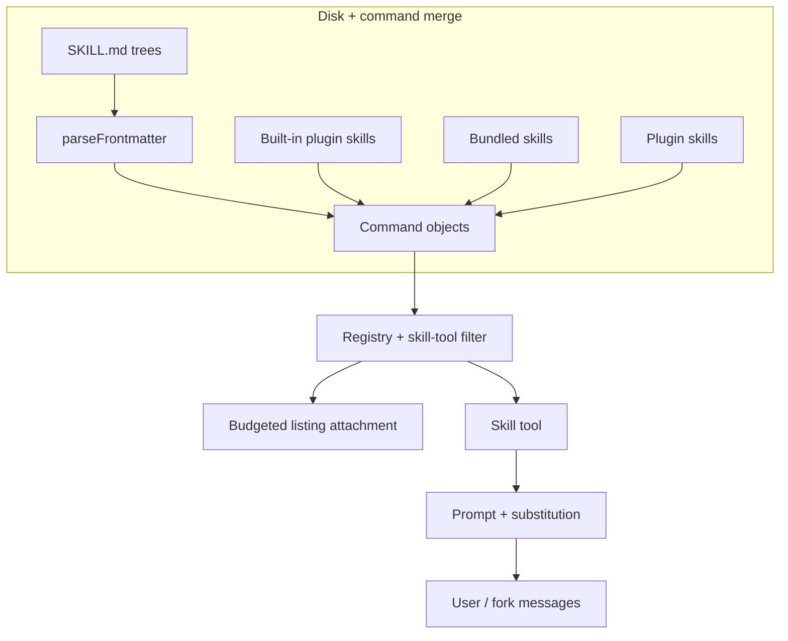
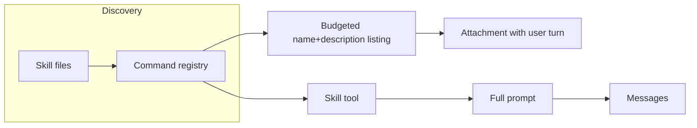

# Chapter 12: Skills and Plugins

> Reusable skill documents, plugin bundles, YAML frontmatter, and safe argument substitution—how they load from disk, merge with built-in and marketplace plugins, surface to the model, and execute through the Skill tool.

**Scope.** This chapter is **self-contained**: you can understand skills vs plugins, frontmatter, listing vs full-body delivery, and substitution without reading other chapters. Cross-links point to the agent loop, tools, permissions, and context when you want the full stack.

## Overview

Claude Code extends its capabilities through two complementary mechanisms: **skills** and **plugins**. Skills are single-file Markdown instructions that teach Claude how to perform a specific task. Plugins are larger bundles that can package skills together with hooks, MCP servers, and other components.

Both are discovered automatically at startup. The runtime builds a compact catalog of available skills (names and short descriptions kept under a character budget) and only loads the full body when a skill is actually invoked—via a slash command, a **Skill** tool call, or a subagent preload. This lazy-loading design means you can add dozens of skills without bloating every conversation's context.

> **Tie-in -- Chapter 02 (Tool System).** Skills surface to the model as invocations of the **Skill** tool, which is part of the same tool pipeline covered in Chapter 02. Permission checks, tool allowlists, and execution flow all follow the standard tool system rules.

## 12.1 Skills

A **skill** is a reusable instruction pack stored as a Markdown file (usually with YAML frontmatter). Each skill lives in its own directory as `skill-name/SKILL.md` under a recognized config root (managed, user, project, or `--add-dir`).

Skills are **data, not code**. They scale naturally with what users and projects add to disk. The runtime discovers them, shows the model a compact catalog entry, and loads the full body only on invocation.

**Skills vs hardcoded commands.** Slash commands implemented in TypeScript (`source: 'builtin'`) are not the same as file-backed skills. The Skill tool only targets **prompt-type** commands that pass validation (and merges in MCP skills that are explicitly `loadedFrom === 'mcp'`).

Here is a complete, minimal skill as an example:

```yaml
---
name: Review PR
description: Review a pull request for issues
allowed-tools: Read Grep Glob
context: fork
---
Review the PR at $ARGUMENTS. Focus on:
- Security issues
- Performance problems
- Missing tests
```

This file would live at `.claude/skills/review-pr/SKILL.md`. When the model calls the Skill tool with `review-pr`, the runtime substitutes `$ARGUMENTS` with whatever the user or model provided and runs the prompt in a forked sub-agent (because `context: fork` is set).

## 12.2 Plugins

A **plugin** is a **bundle**: a manifest that declares paths to commands, skills, agents, hooks, MCP servers, and more. Plugins are loaded at startup and are closer to **shipping features** than a single Markdown file.

**Built-in plugins** ship with the CLI, appear in the plugin UI, and can be **enabled or disabled** (persisted in user settings). Their identifier shape is typically **`{name}@builtin`**. A small in-code registry stores definitions (`name`, `description`, optional `skills`, `hooks`, `mcpServers`, `isAvailable`, `defaultEnabled`) and runs an init pass at startup. Only **enabled** built-in plugins contribute skills.

**Contrast with always-on bundled skills.** Bundled skills are always-on Markdown playbooks checked into the product. Built-in plugins are for features operators or users should explicitly toggle.

**Marketplace plugins** resolve from git or remote sources and carry **manifest** metadata (name, description, version), a filesystem root, optional skill paths, hooks, MCP servers, etc. The loader validates and registers components; failures should be typed errors where possible. For a minimal JSON manifest shape, think: `name`, `version`, and entry paths for the components your host supports.

> **Tie-in -- Chapter 10 (MCP).** MCP servers can provide **remote skills** that appear alongside local ones in the catalog. Remote/MCP-sourced skills are merged under strict filters so the model cannot invoke arbitrary remote names. Inline shell execution is disabled for remote skill bodies—treat them as untrusted content.

## Conceptual map (no proprietary paths)

| Concern | What to implement |
|--------|-------------------|
| Discovery | Scan configured skill roots, optional legacy command dirs, dedupe by resolved file identity, conditional activation via frontmatter `paths`, dynamic extra dirs when the workspace changes |
| Merge | Concatenate bundled disk skills, built-in plugin skills, workflow entries, marketplace plugin skills, then host builtins — **order matters** for name shadowing |
| Skill tool | Model-invokable entry with inline vs fork execution; merge remote (e.g. MCP) prompt commands under explicit rules |
| Built-in plugins | Code-registered toggles (`name@builtin` style), separate from always-on bundled markdown |
| Substitution | Shell-aware `$ARGUMENTS`, positional and named slots, session/skill directory variables |
| Listing | Character budget for names + blurbs; full body only on invocation |

## 12.3 Skill layout and loading

**Modern `/skills/` layout.** Under each config root (managed, user, project, `--add-dir`), only **`skill-name/SKILL.md`** is supported. A loose `.md` at the top level of `/skills/` is **ignored**—every skill lives in its own directory named after the command.

**Sources (high level).** A typical loader pulls in parallel: policy skills, user skills, project skills (walking parents), extra dirs from CLI flags, and optionally legacy flat **`/commands/`** markdown. A **bare** mode can skip default discovery and only read explicit add-dir paths (still subject to policy locks).

**Deduplication.** Skills are deduped by **resolved realpath** of the markdown file so symlinks and overlapping trees do not register the same playbook twice. The first winning source is kept.

**Conditional skills.** If frontmatter **`paths`** lists globs (same idea as project rule files), the skill may be held back until matching files are touched, then activated.

**Dynamic discovery.** When tools operate on files, the host can find nested skill directories below the cwd and merge them with **deeper paths overriding** shallower ones. Gitignored trees are skipped.

**Prompt materialization.** When a skill runs, the host builds content with an optional base-directory prefix, **argument substitution**, session/skill directory variables, then (for trusted local skills only) optional inline shell for fenced blocks—remote or MCP-sourced skills should skip shell execution.

## 12.4 The Skill tool

- **Name.** Conventionally a fixed tool name such as `Skill` in hosts that expose it.
- **Input.** Command name (optional leading `/` stripped) and optional **`args`** string passed into the same materialization path as slash commands.
- **Command universe.** The tool should only see **prompt-type** commands the host allows, plus explicitly merged remote prompts (e.g. MCP) under strict filters so the model cannot invoke arbitrary remote names.
- **Execution.** **Inline** expands into the current thread; **`context: fork`** runs in a sub-agent with its own budget and telemetry. Permission checks follow the normal tool pipeline.
- **Discovery listing** (separate from the tool body) is attached on turns when the tool set includes the skill tool; see **Production concepts** and Chapter 07 for budgets.

## 12.5 Frontmatter

Keys below mirror common host schemas (hyphenated keys are literal YAML keys).

```yaml
---
name: Display title (optional; skill directory name is the command name for /skills/)
description: Short summary for listings
when_to_use: Extra routing hint merged into catalog lines
allowed-tools: Bash Read  # string or list — tool allowlist for the skill run
arguments: foo bar       # named placeholders $foo, $bar in the body
argument-hint: "[foo] [bar]"
user-invocable: true     # false => slash hidden; model may still use Skill if allowed
disable-model-invocation: false
model: sonnet            # or inherit
context: fork            # optional; fork => sub-agent
agent: general-purpose   # when forked
paths: "lib/**"          # conditional activation globs
effort: medium
shell: bash              # for !` and ```! blocks
hooks: {}                # validated with HooksSchema when present
---
# Body

Use $ARGUMENTS or $0 / $1 or $foo after declaring arguments.
```

**`arguments` naming.** Numeric-only names are rejected—they would collide with `$0`, `$1`, …

## 12.6 Argument substitution

| Mechanism | Role |
|-----------|------|
| `$ARGUMENTS` | Full raw args string |
| `$ARGUMENTS[n]`, `$n` | Positional tokens (shell-quote aware via `parseArguments`) |
| `$name` | Named slot when `arguments:` lists `name` in order |
| Append `ARGUMENTS: …` | If no placeholder matched and args non-empty (`appendIfNoPlaceholder`) |
| `${CLAUDE_SKILL_DIR}` | Absolute skill directory (file-backed skills only; normalized on Windows) |
| `${CLAUDE_SESSION_ID}` | Current session id |

Named replacement uses a regex that avoids partial matches on `$fooBar` when the key is `foo`. User content is still **data**: keep shell snippets in skills reviewed like code.

## How it fits together





## Production concepts

- **Directory scans** — Stable ordering; invalid frontmatter fails with path in the error.
- **Merge order** — Typical hosts concatenate: bundled skills, built-in plugin skills, skill-dir commands, workflows, marketplace plugin commands, then host builtins. Later entries can shadow by name depending on lookup rules.
- **Built-in vs marketplace vs bundled** — Three different axes: code-registered toggles (`@builtin`), git-based manifests, and always-on bundled markdown shipped with the product.
- **Telemetry** — Skill load and invocation events use hashed or redacted identifiers; avoid logging full skill bodies in production analytics.
- **Skill listing attachment** — Local and MCP skills merge by name; **delta** listings track per-agent "already sent" sets; resume may suppress a duplicate catalog. Optional skill-search features can narrow turn-0 listings.
- **Execution modes** — Inline vs forked sub-agent; fork reuses the same materialization path as slash commands.
- **Security** — No inline shell from MCP skill bodies; gitignored nested skill dirs skipped; plugin-only policy can disable user skills.

## Key design decisions

- **Discovery over hardcoding** — Drop folders in the right place; reload plugins or invalidate caches when manifests change.
- **Strict frontmatter** — Fail fast with paths; do not silently skip broken YAML in security-sensitive hosts.
- **Substitution safety** — Shell-aware argument splitting; explicit named keys; treat skill markdown as code adjacent to injection surfaces.

## Insights

- Skills may be gated by feature flags or enterprise policy (plugin-only installs, bare mode).
- The skill-tool listing filters to prompt commands with model invocation allowed and a usable description (explicit text, `when_to_use`, or equivalent).
- Per-entry description caps prevent one verbose `when_to_use` from consuming the whole listing budget.
- **Remote / canonical skills** (experimental) are discovered out of band; static listing may omit them until the feature loads them.
- **`estimateSkillFrontmatterTokens`** helps context analysis count listing-related metadata without reading full bodies.

## Code samples

Runnable Python under [`code-samples/`](code-samples/) illustrates discovery, merge order, built-in registry shape, and substitution—educational stubs, not a port of any proprietary host.

| Sample | Description |
|--------|-------------|
| [`skill_loader.py`](code-samples/skill_loader.py) | Frontmatter stub + `skill-name/SKILL.md` layout note |
| [`load_skills_merge.py`](code-samples/load_skills_merge.py) | Toy merge order for skill slices (first match wins by name) |
| [`skill_context_pipeline.py`](code-samples/skill_context_pipeline.py) | Listing budget, per-entry cap, bundled-vs-rest trimming, delta tracker |
| [`plugin_registry.py`](code-samples/plugin_registry.py) | Built-in registry (`@builtin`) vs marketplace-style manifest record |
| [`argument_substitution.py`](code-samples/argument_substitution.py) | `$ARGUMENTS`, `$n`, named args (simplified shell split) |

## Build your own

1. Walk `**/SKILL.md` (or your chosen layout) with a real YAML parser; require stable **`name`** / **`description`** semantics for listing.
2. Validate frontmatter with a schema (hooks, paths, enums for `context`).
3. Load marketplace plugins from validated manifests; register built-ins in a small in-memory map with `name@builtin` identifiers.
4. Implement **`substituteArguments`** with shell-aware tokenization and named keys from frontmatter.
5. Keep a **catalog** under a fixed budget; load **full markdown** only in the skill tool / slash / subagent paths; merge MCP skills explicitly if your host exposes them.

---

**Navigation:** [← Chapter 11 – Multi-Agent](../11-multi-agent-coordination/README.md) | [Overview](../README.md) | [Next: Chapter 13 – Hooks →](../13-hooks-and-lifecycle/README.md)
