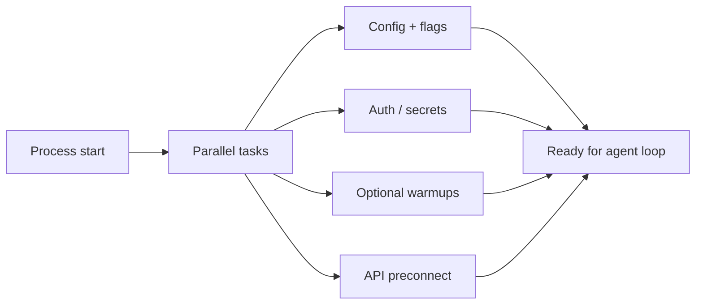

# Chapter 14: Startup Optimization

> Parallel boot, feature gates, lazy loading, and API preconnect — cold-start patterns for engineers shipping agent runtimes.

## Overview

If you build **agents** (orchestrators around models, tools, and retrieval), **startup time** is part of user-perceived latency and of cost when you spin workers often. This chapter covers four ideas production stacks combine: run **independent work in parallel**, **gate** optional capabilities so they do not load by default, **defer** heavy imports until a code path needs them, and **preconnect** to APIs so the first model or tool HTTP round-trip overlaps with other boot work.

## 14.1 Parallel boot

Configuration, credential resolution, optional service warmups, and connector handshakes that do not depend on each other should run **concurrently** with explicit timeouts, not in an arbitrary serial order. Early in the process, fire cheap IO (subprocess probes, secret prefetch) **before or beside** long module graphs so wall-clock overlaps with import evaluation.

**Concrete example — parallel boot timeline:**

```
 0 ms  Process start
       ├── [credential prefetch]  ─────────────────────────► done  45 ms
       ├── [config file load]     ──────────────► done  30 ms
       ├── [MCP handshake]        ────────────────────────────────► done  80 ms
       └── [import heavy modules] ───────────────────────► done  60 ms
 80 ms All parallel tasks complete (wall clock = slowest task)

 Serial equivalent: 45 + 30 + 80 + 60 = 215 ms
 Parallel actual:   80 ms  (2.7x faster)
```

## 14.2 Feature gates

Optional stacks (extra tools, experimental UI, coordinator modes) stay **off by default** or behind flags resolved **once** at startup. Hot paths read stable booleans; bundlers can drop dead branches when gates are compile-time constants.

## 14.3 Lazy loading

Import or construct expensive modules, clients, and Zod-style schemas **inside** the functions that need them, or behind factories, so "ready to accept work" arrives before paying for every dependency.

## 14.4 API preconnect

Reuse HTTP sessions with connection pooling; when TLS trust material and proxy settings are finalized, overlap **TCP/TLS setup** with later startup so the first real API call reuses a warm connection (skip preconnect when the transport does not share that pool).

---

**Typical production stack (conceptual).** Many CLIs overlap cheap IO with module load: credential or policy probes at process start, named **checkpoints** from "imports loaded" through config and first action, a **memoized init** that resolves TLS trust and proxy settings before warming HTTP pools, and **parallel dynamic imports** for analytics or optional subsystems. Preconnect runs only after the transport stack is configured; it may be skipped when the deployment uses a vendor-specific API client or a non-shared dispatcher.

> **Tie-in — Chapter 10 (Subagents):** MCP cold start overlaps with boot. When the agent spawns MCP servers or subagent processes during startup, those handshakes are prime candidates for parallel boot. The connection lifecycle described in [Chapter 09 – MCP Integration](../09-mcp-integration/README.md) and the fork-vs-tool decision from [Chapter 10 – Subagents](../10-subagents/README.md) both influence how many parallel tasks appear on the critical path.

## How it fits together



## Production concepts

- **Bounded parallelism** — Independent IO (config files, secret stores, MCP or tool registry probes) runs under `asyncio.gather` (or equivalent) with **timeouts**; failed non-critical tasks should degrade without blocking the whole boot.
- **Overlap with imports** — Work that does not need the full module graph can start at the entrypoint so it runs **in parallel with** remaining imports (same idea as overlapping TLS with later phases).
- **Single resolution of gates** — Feature flags and experiments resolve **once** at startup into values the loop and tools read; avoid per-request flag lookups that add latency and nondeterminism.
- **Deferred heavy imports** — Large libraries (OpenTelemetry stacks, React dialogs on error paths only, optional assistants) load via dynamic `import()` / conditional `require()` when a gate or branch demands them.
- **Preconnect ordering** — Warm connections only **after** trust material and proxy/mTLS configuration are applied; otherwise you warm the wrong host or lock the TLS store too early.
- **Connection reuse** — One shared HTTP client (or global pool) for model traffic; optional early requests overlap handshake with unrelated work.
- **Boot observability** — Named **checkpoints** or phases (entry, imports loaded, init, settings, pre-action, first API) make regressions visible in logs, files, or analytics; see [`startup_profiling.py`](code-samples/startup_profiling.py).

## Key design decisions

- **Overlap before the agent loop** — Anything that must complete before the first user turn belongs on a **critical path** with explicit ordering; everything else runs in parallel or after `ready`.
- **Gates at boundaries** — Optional subsystems register behind flags so default binaries stay lean; document flags for operators.
- **Lazy by default for rare paths** — Code that runs on a small fraction of sessions should not dominate import time for the rest.
- **Security is not a feature flag** — Gates trim product features, not permission checks or trust boundaries.

## Insights

- **MCP and tools** — Connector handshakes are startup IO; batching or parallel connects matters with many servers. **[Chapter 09 – MCP Integration](../09-mcp-integration/README.md)** covers lifecycle; map "preconnect" to overlapping that work with config and auth when dependencies allow.
- **Registry or catalog fetches** — Fire-and-forget cache warmups are fine only when they **cannot** block readiness; use timeouts and ignore failures for non-essential lists.
- **Circular dependencies** — Lazy requires or dynamic imports are often the smallest fix; prefer that over fragile import reordering across a large graph.

## Code samples

Run with **`python3`** from this chapter directory, e.g. `python3 code-samples/parallel_boot.py`. Samples live under **`code-samples/*.py`** only.

| Sample | Description |
|--------|-------------|
| [`parallel_boot.py`](code-samples/parallel_boot.py) | Concurrent async init with `asyncio.gather` and per-task timeouts |
| [`feature_gates.py`](code-samples/feature_gates.py) | Resolve flags once into a session snapshot; optional branches avoid loading gated modules |
| [`lazy_loading.py`](code-samples/lazy_loading.py) | Deferred `importlib` import and a small lazy factory |
| [`api_preconnect.py`](code-samples/api_preconnect.py) | Shared async HTTP client; optional HEAD warm-up (needs network only if you enable it) |
| [`startup_profiling.py`](code-samples/startup_profiling.py) | Checkpoints, deltas, and phase durations analogous to mark pairs |

## Build your own

1. **Inventory** — List startup tasks; mark dependencies and draw the critical path.
2. **Parallelize** — Run independent tasks concurrently; cap wall time per task; define fallback when something times out.
3. **Centralize gates** — One place sets feature booleans for the session; avoid scattered environment reads deep in libraries.
4. **Lazy-load** — Move heavy imports into functions or optional packages loaded only when a gate is on.
5. **Preconnect** — Apply TLS/proxy config first; then use a shared client or pool; skip warming when the real client will not reuse it.
6. **Measure** — Named checkpoints or spans from process start through first successful agent turn; track regressions in CI or staging.

**Summary:** Faster, more predictable agents come from **overlapping** independent boot work (including with import time where safe), **gating** optional depth, **deferring** heavy imports, **warming** API connections only when configuration and pooling align, and **measuring** phases. The Python snippets are minimal illustrations — adapt the same ideas to your stack.

---

**Navigation:** [← Chapter 13 – Hooks](../13-hooks-and-lifecycle/README.md) | [Overview](../README.md) | [Next: Chapter 15 – Cost & Observability →](../15-cost-and-observability/README.md)
