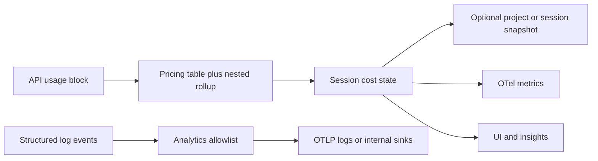

# Chapter 15: Cost and Observability

> Token cost tracking, PII-safe analytics metadata, and optional OpenTelemetry export.

## Overview

This chapter covers three pillars of production cost and observability: turning raw API usage into priced totals, logging structured events without leaking sensitive data, and optional OpenTelemetry integration for metrics, traces, and logs.

> **Tie-in — Chapter 01 (Agent Loop):** The agent loop feeds the usage accumulator. Each API iteration attaches a **usage** block to assistant messages; the loop (and nesting depth for nested turns) should feed one accumulator so turn-level and session-level totals match. A stable correlation id ties nested work to analytics. See [Chapter 01 – Agent Loop](../01-agent-loop/README.md).

## 15.1 Token cost tracking

**Token cost tracking** means turning every model response's **usage** (input tokens, output tokens, cache read/write when applicable, optional tool-specific counts) into **numbers you can sum and price**. You keep **per-model** totals because prices differ by SKU. Nested work (subagents, secondary model calls such as classification or summarization) must **add into the same session** as the main loop so UI caps, invoices, and persisted session snapshots stay consistent.

- **Usage block** — Providers return structured counts after each completion; map them 1:1 into your accumulator before you merge streaming fragments into the transcript.
- **Pricing table** — Maintain **per-model** rates (input, output, cache tiers). If the model string is unknown, record usage in raw tokens but flag **cost unknown** so the UI does not imply a dollar total.
- **Rollup** — One **session** object holds per-model rows and a running total; **merge** child trackers after nested runs so billing matches what the user sees in one thread.
- **Do not mix SKUs** — Summing "total tokens" without a model dimension is misleading; dashboards should group by model (or a coarse **model family** label you control).

**Concrete example — usage block to cost calculation:**

```
API response usage block:
  { model: "claude-sonnet-4-20250514", input_tokens: 1200, output_tokens: 350,
    cache_read_tokens: 800, cache_creation_tokens: 400 }

Pricing table (per million tokens):
  claude-sonnet-4-20250514: input=$3.00, output=$15.00, cache_read=$0.30, cache_creation=$3.75

Calculation:
  input:          1200 / 1M * $3.00   = $0.003600
  output:          350 / 1M * $15.00  = $0.005250
  cache_read:      800 / 1M * $0.30   = $0.000240
  cache_creation:  400 / 1M * $3.75   = $0.001500
                                        ──────────
  Turn total:                           $0.010590
  Session running total:  $0.042 + $0.011 = $0.053
```

## 15.2 PII-safe analytics

**PII-safe analytics** means logging **structured events** (who ran what, which model, coarse outcome) **without** workspace paths, raw prompts, or file contents. Use a **short, fixed list of fields** you allow on each event name, and review that list like a contract: if a field is not on the list, it does not go into analytics payloads. A small **analytics service** at the boundary validates outgoing events so ad-hoc dicts cannot bypass the contract.

- **Allowlist per event name** — For each `event_name`, define the exact keys allowed (`model`, `session_id`, `outcome`, ...). Reject or strip anything else at send time.
- **Typed metadata** — Optional `TypedDict` or small dataclasses force authors to name fields explicitly and document which values must never hold paths or snippets.
- **Separate pipelines** — Product analytics, audit logs, and debug dumps have different retention and access; do not route high-risk content into the same sink as coarse metrics.
- **Cardinality** — Even in events, avoid unbounded strings (full error stacks with paths, user-generated titles) unless the sink is designed for them.

## 15.3 OpenTelemetry patterns

OpenTelemetry is an optional layer: **metrics** (counters and histograms) for tokens and cost with **low-cardinality** attributes (for example model id, coarse environment), **traces** for latency and dependency edges when you need them, and **log records** (or **events** on spans) for permission decisions and session-scoped facts. Prompt bodies and host paths stay **out of metric labels** and usually **out of default export**; enable OTLP or other exporters only when operators explicitly turn them on.

- **Resource** — Process-level attributes (`service.name`, deployment environment) set once on the `Resource`; they identify *where* the agent runs, not *what* the user asked.
- **Metrics** — **Counters** for cumulative token or cost totals; **histograms** for latency or tokens per turn. Attribute keys must be **bounded** (enum-like values). Never attach file paths, repo names, or prompt hashes as metric labels unless you have a strict allowlist and cardinality budget.
- **Traces** — Optional **spans** per agent turn, tool call, or subagent; propagate **trace id** (and optionally **parent session**) through context so nested work links to one distributed trace.
- **Logs vs span events** — Use **log records** or **span events** for high-signal, lower-volume facts (permissions, model errors). Correlate with `trace_id` / `span_id` when the exporter supports it.
- **Stdout and machine protocols** — Console exporters can interleave with **line-oriented machine output** on the same stream; disable console telemetry when stdout is reserved for structured control traffic.
- **Gating** — Register OTLP exporters only when an environment flag is on; avoid accidental export to vendor backends in local or air-gapped runs.

## How this chapter relates

- **[Chapter 01 – Agent loop](../01-agent-loop/README.md)** — Each API iteration can attach **usage** to assistant messages; the loop (and **nesting depth** for nested turns) should feed one accumulator so turn-level and session-level totals match. A stable **correlation id** (shared session or trace) ties nested work to analytics.
- **[Chapter 10 – Subagents](../10-subagents/README.md)** — Fork and agent-tool paths still hit the same billing path: nested usage rolls into the **parent session**. In-process context carries **agent type** and **agent id** so concurrent nested agents do not overwrite each other's attribution.
- **[Chapter 11 – Multi-agent](../11-multi-agent-coordination/README.md)** — Swarm teammates may run in separate processes; combine **in-process context** with **environment-provided ids** so exported events share one shape.

## How it fits together



## Production concepts

- **Usage to cost** — Map each streaming **usage** block to money using a **pricing table** per model; unknown models should surface "estimate missing" so the UI can warn instead of showing a false total.
- **Per-model aggregation** — Keep one row per model: input, output, cache dimensions, optional web search counts, and **cost in USD** (or your billing unit). Secondary callers (side models, nested tools) still roll into the same session totals.
- **OTel metrics** — Use **histograms and counters** for tokens and cost; attribute keys should be **bounded** (model, coarse flags). Never use file paths or free-form user strings as metric labels.
- **OTel events** — Name events clearly (for example permission granted or denied); attach **session id**, **event sequence**, optional **prompt id**; restrict workspace paths to pipelines that explicitly expect them.
- **Third-party export** — Gate customer-facing OTLP behind an **environment flag**; when off, do not register trace or log exporters that would leave the process.
- **Internal analytics** — You can attach a second exporter (for example batch to a warehouse) while sharing the same meter provider as production metrics.
- **Persisted session stats** — Replaying **saved sessions** from storage can rebuild daily activity and model usage without calling the API again; document whether **live session state** or **replay** is authoritative for billing if the two differ.
- **Deep traces** — Optional profiling or alternate trace endpoints can sit beside the main OTel path for debugging without enabling full export for every user.

## Key design decisions

- **Per-model tables** — Never sum token counts across models without the model key; one aggregate "total tokens" without a model dimension is misleading for cost.
- **Allowlisted analytics fields** — Prefer a **documented set of keys** per event over ad-hoc dicts so paths and snippets never slip in by mistake.
- **Cardinality** — Metrics: model plus a few coarse flags. Events: richer context allowed. Do not put unbounded strings on counters or histogram labels.
- **Sampling** — High-volume success paths may sample; errors and permission decisions should remain observable at full rate.

## Insights

- **Subagent vs main thread** — Concurrent nested agents need **per-async-context** attribution, not one global "current agent" variable.
- **Stdout vs telemetry** — Console OTel exporters can break line-oriented protocols; disable them when stdout is reserved for structured machine output.
- **Replay vs live** — Dashboards built from storage replay can diverge slightly from in-session counters if definitions differ; say which source is authoritative for money.

## Code samples

Teaching samples are Python only under [`code-samples/`](code-samples/):

```bash
python3 code-samples/cost_tracker.py
python3 code-samples/pii_safe_analytics.py
python3 code-samples/analytics_service.py
python3 code-samples/session_telemetry.py
python3 code-samples/otel_patterns.py
```

| Sample | Description |
|--------|-------------|
| [`cost_tracker.py`](code-samples/cost_tracker.py) | Per-model usage, cache dimensions, pricing table hook, unknown model flag, rolling a nested child session into parent totals |
| [`pii_safe_analytics.py`](code-samples/pii_safe_analytics.py) | Typed metadata for coarse, non-path fields and agent kind |
| [`analytics_service.py`](code-samples/analytics_service.py) | Allowlist per event name; rejects unknown keys before emit |
| [`session_telemetry.py`](code-samples/session_telemetry.py) | Trace id and session correlation, optional parent session, monotonic event sequence |
| [`otel_patterns.py`](code-samples/otel_patterns.py) | Conceptual metric names, safe attribute keys, gating—no SDK import |

## Build your own

1. On every assistant message that includes **usage**, call one function that updates **per-model rows** and **session totals** (for example `add_session_cost(model, usage, priced_amount)`).
2. Persist **last session id** and **last cost snapshot** so **resume** does not reset spend.
3. Wrap analytics as **`log_event(name, fields)`** where **fields** may only contain keys from a **central allowlist** reviewed for PII (no paths, no prompt text unless in a separate, locked-down pipeline).
4. Initialize OpenTelemetry **once** at process start; inject **trace id** and **session id** into hooks and structured events.
5. For nested agents, run child work inside a context that sets **agent type** and **parent session** for downstream metadata.

---

**Navigation:** [← Chapter 14 – Startup](../14-startup-optimization/README.md) | [Overview](../README.md) | [Next: Chapter 16 – IDE Bridge →](../16-ide-bridge/README.md)
