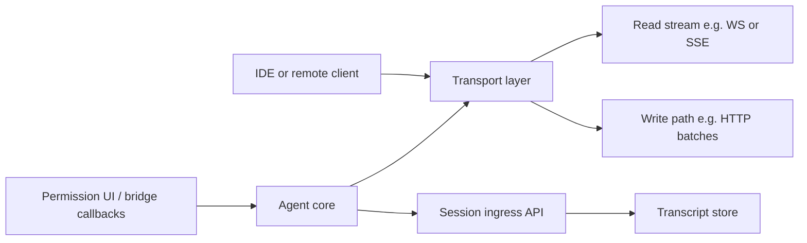

# Chapter 16: IDE Bridge

> The IDE bridge is the conceptual layer that connects editors and remote clients to the same agent core through chosen transports, session-scoped persistence, and short-lived bearer-style credentials—without forking the query loop.

## Overview

Editors and remote surfaces (desktop IDEs, web, companion apps) need structured, bidirectional control beyond a plain terminal REPL. Integrations treat the agent as a **shared backend**: the IDE sends prompts and control messages, and receives transcript deltas, tool events, and permission prompts routed to wherever the user actually is.

> **Tie-in — Chapter 03 (Permission System):** Permission routing differs between local and remote surfaces. When the user is remote, "ask" must land in that UI via the same rules as the terminal. The bridge forwards **control requests** and **control responses** without reimplementing policy. See [Chapter 03 – Permission System](../03-permission-system/README.md) for the full model.

## 16.1 Transport and framing

Payloads are **framed** so a single connection can carry multiplexed traffic: newline-delimited JSON with per-message **correlation ids**, or SSE-style blocks where `event`/`data` lines delimit logical units. Framing is what makes async RPC, streaming chunks, and control-plane messages coexist without ambiguity.

A common production shape is a **split read/write path**: a long-lived **read** channel (WebSocket or SSE with sequence numbers and reconnect semantics) plus **separate writes** (HTTP batches, heartbeats, registration). The critical rule is **separation of concerns** — do not assume the transcript ingress URL is the right place for every outbound post; streams, command batches, and persistence may use different endpoints or token scopes.

**Concrete example — framed NDJSON message exchange:**

```
── Client → Agent (request) ──────────────────────────────
{"id":"req-42","method":"submit_prompt","params":{"text":"Refactor the auth module"}}

── Agent → Client (streaming response, same correlation id) ──
{"id":"req-42","type":"delta","content":"I'll start by reading..."}
{"id":"req-42","type":"delta","content":"the current auth files."}
{"id":"req-42","type":"tool_use","tool":"FileReadTool","input":{"path":"src/auth.ts"}}
{"id":"req-42","type":"permission","tool":"FileEditTool","action":"write src/auth.ts"}

── Client → Agent (permission response) ──────────────────
{"id":"req-42","type":"permission_response","decision":"allow"}

── Agent → Client (completion) ────────────────────────────
{"id":"req-42","type":"done","usage":{"input_tokens":1420,"output_tokens":680}}
```

## 16.2 Sessions

A **session** binds workspace context, transcript chain, and reconnect state. Clients map roots or tabs to a **session id**, attach **session-scoped** credentials for append/fetch APIs, and track **last-seen sequence or cursor** so retries and concurrent writers do not corrupt ordering. Reconnect should carry enough state for the server to **resume** instead of replaying from zero when possible.

## 16.3 Authentication

Ingress layers often use **short-lived bearer tokens** (frequently JWT-shaped). Claims may bind **session id**, **worker or environment identity**, and **expiry**. Two layers matter: (1) **join / persist** auth — who may attach to or write this session's remote log; (2) **inner policy** — whether a given tool or RPC is allowed inside the agent. Refresh schedules can read **`exp` from the payload** to fire **before** hard expiry, while **signature verification** stays on the server or on trusted issuance paths — clients sometimes decode only for scheduling, not for trust.

## 16.4 Integration patterns

These patterns show up in production bridges; they are described **by role**, not by source file layout.

| Pattern | Idea |
| -------- | ---- |
| **Same core, different host** | The agent loop, tools, and permissions model stay one implementation. A **standalone bridge process** (spawned by the CLI for "headless" or capacity modes) and an **in-process bridge** beside the interactive REPL both drive that core—only **I/O surface** and **where prompts render** differ. |
| **Explicit bootstrap parameters** | Bridge startup needs **cwd**, **identity metadata** (machine name, repo hints), **ingress base URLs**, and **OAuth or API token providers** injected from the shell or IDE extension. Keeping this boundary explicit avoids dragging UI-only dependencies into SDK or daemon embeds. |
| **Hybrid transport** | Combine a **streaming inbound** path with **buffered outbound** posts: flush gates and teardown grace periods prevent losing the last events when the connection drops. |
| **Permission callbacks** | When the user is remote, **approve/deny** for tools must flow through the same policy as the terminal—implemented as **callbacks** registered for the session lifetime so the bridge can forward **control requests** and **control responses** without reimplementing policy. |
| **Worker registration and epochs** | A new primary instance may **register** with the backend and invalidate a previous **worker epoch**; superseded clients should stop, obtain fresh tokens, and reconnect rather than fighting for the same work lease. |
| **Session id compatibility** | Over time, **external session ids** and **infrastructure ids** may differ; a small compatibility layer maps between them so reconnect, rename, and foreign-session rejection stay consistent. |
| **Token refresh scheduler** | Decode **JWT expiry** (or follow a fixed fallback interval when the token is opaque), schedule refresh **minutes before** `exp`, cap **consecutive failures**, and cancel timers per session on teardown so multi-tab clients do not leak timeouts. |

## How it fits together



## Production concepts

- **Framed multiplexing** — Correlate async replies with stable ids over one stream or split channels so concurrent RPC-style calls stay debuggable.
- **Split read/write** — When reads are SSE or similar, document which URL accepts **command batches** vs **event streams** so clients do not post to the wrong host.
- **Affinity and resume** — Persist `{session_id, cursor or sequence, cwd}` client-side; reconnect with backoff and a **high-water mark** so the server can bound replay.
- **Token hygiene** — Short-lived bearer tokens, proactive refresh, and header updates for multi-session clients; enterprise setups rotate signing material on a schedule.
- **Epoch / registration** — Invalidate stale workers when a new primary registers; close superseded transports cleanly.
- **Shared core** — Bridge, REPL, and SDK-style subprocesses reuse the same query loop; only transport and **where** permission prompts render differ.

## Key design decisions

- **Schema-first RPC** — Define request/response shapes per method; never execute opaque payloads.
- **Sequential transcript append** — Serialize or chain per-session writes so UUID or sequence chains stay consistent under retries.
- **Ingress vs message auth** — Bearer on HTTP ingress answers "may this client append/fetch this session"; inner policy answers "may this tool run now."
- **Heartbeat and delivery** — Outbound clients may batch events, emit heartbeats, and report **state** so remote UIs reflect stalls, approvals, and stream completion.

## Insights

- The bridge is a **contract**, not a second agent: same loop, different surfaces.
- **Read-path** reconnect semantics (sequence, deduplication) and **write-path** idempotency must be designed together or clients see gaps or duplicates.
- Treat **permission** as end-to-end: if the user is remote, "ask" must land in that UI via the same rules as the terminal (see [Chapter 03](../03-permission-system/README.md)).

## Code samples

All samples are **Python 3** under `code-samples/` in this chapter.

Run from this directory:

`python3 code-samples/bridge_transport.py`

| Sample | Description |
|--------|-------------|
| [`bridge_transport.py`](code-samples/bridge_transport.py) | NDJSON framing with request/response **correlation ids** |
| [`sse_event_parser.py`](code-samples/sse_event_parser.py) | SSE `event`/`data` blocks (read-path analogue) |
| [`session_manager.py`](code-samples/session_manager.py) | Session id, **sequence cursor**, reconnect backoff with jitter |
| [`jwt_auth.py`](code-samples/jwt_auth.py) | Mint/verify HS256 JWT; **decode `exp` without verify** for refresh scheduling |

## Build your own

1. Define request/response schema for each RPC method; correlate async replies with a stable `id`.
2. Choose framing: NDJSON for stdio, or SSE plus separate POST if you mirror split read/write semantics.
3. Track `{session_id, last_seq_or_cursor, cwd}` and pass **resume tokens** on reconnect.
4. Validate `Authorization: Bearer` on the server for ingress; keep expiry short; separate **join** auth from **per-message** policy.
5. If you split read/write, document which endpoint handles **streams** vs **command batches**.
6. Optional: schedule token refresh from decoded `exp`; verify signatures only where you trust the issuer.

---

**Navigation:** [← Chapter 15 – Cost & Observability](../15-cost-and-observability/README.md) | [Overview](../README.md) | [Chapter 03 – Permissions](../03-permission-system/README.md)
