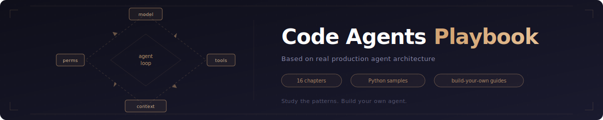

# Code Agents Playbook

> A playbook for learning how coding agents are put together — and for building your own

## What This Is

The playbook is built on examples from real **production coding agents**, including **Claude Code**. 
18 chapters bring together best practices in architecture, patterns, and production trade-offs into a reference you can act on.

**Two ways to use it:**

1. 📖 **Study** — Read the chapters to understand how a production-grade code agent actually works under the hood
2. 🛠️ **Build** — Hand this playbook to an AI agent (or follow it yourself) as a blueprint to create your own code agent from scratch

**What's inside:**

- 📝 **18 chapters** of original prose and diagrams covering every subsystem — from the agent loop to IDE integration
- 🐍 **Runnable Python code samples** (`code-samples/`) — original implementations that demonstrate each pattern
- ✅ **"Build your own" checklists** in every chapter — step-by-step guidance to reimplement each subsystem

**Chapter structure** (same across all parts — from intuition to detail):

| Section                  | What you get                                                            |
| ------------------------ | ----------------------------------------------------------------------- |
| **Overview**             | What the subsystem does and why it matters, in plain language.          |
| **How it fits together** | Architecture, data flow, and mermaid diagrams — how the pieces connect. |
| **Production concepts**  | Practices and mechanisms inferred from production coding agents. |
| **Key design decisions** | Trade-offs and non-obvious choices.                                     |
| **Insights**             | Gotchas, edge cases, and lessons worth remembering.                     |
| **Code samples**         | Links to runnable Python in `code-samples/` for that chapter.           |
| **Build your own**       | Concrete steps to reuse the pattern in your own system.                 |

Reading order within a chapter is **easier at the top** (Overview) and **more specific toward the bottom** (Insights, samples, Build your own).

## Who This Is For

- **Engineers building their own code agents** — use this as a blueprint
- **AI agents** consuming this as documentation for building custom systems — see [AGENTS.md](AGENTS.md)
- **Anyone curious** about how a production LLM tool system works under the hood

**How to use this material**

| Audience                                      | Suggested path                                                                                                                                                                                                                          |
| --------------------------------------------- | --------------------------------------------------------------------------------------------------------------------------------------------------------------------------------------------------------------------------------------- |
| **Learning (human)**                          | Read each chapter top to bottom: *Overview* → *How it fits* → *Key design decisions* → *Insights*. Run `code-samples/*.py` to see patterns as code.                                                                                     |
| **Building a production agent (human or AI)** | Start with [AGENTS.md](AGENTS.md): principles, anti-patterns, concept→chapter index, and staged build steps. Use each chapter’s **Build your own** as a checklist; cross-check **Production … (concepts)** bullets against your design. |

## Mission & Contributing

**Mission:** Grow into a **full Playbook** for **reliable, production-grade open-source coding agents** — one reference for architecture, safety, operations, and implementation patterns.

**Contributing:** **Extend chapters**, **propose edits**, fix mistakes, clarify text, or improve `code-samples`; issues and pull requests keep this resource accurate for everyone building coding agents in the open.

## How to Read This

The chapters are ordered from fundamentals to advanced topics. Each chapter is self-contained but builds on earlier concepts.

| Part                        | Chapters | Focus                                                                 |
| --------------------------- | -------- | --------------------------------------------------------------------- |
| **I — Foundations**         | 01–05    | Agent loop, tools, permissions, execution scope, system prompt          |
| **II — Core Systems**       | 06–10    | Tool implementations, streaming, context, memory, MCP                 |
| **III — Advanced Patterns** | 11–14    | Subagents, multi-agent, skills, hooks                                 |
| **IV — Production**         | 15–17    | Startup, cost tracking, IDE integration                               |

**Recommended path:** Read Part I first. Then jump to whichever Part II–IV chapter matches what you're building.

## Table of Contents

### Part I: Foundations

| #   | Chapter                                        | Description                                                                |
| --- | ---------------------------------------------- | -------------------------------------------------------------------------- |
| 01  | [The Agent Loop](01-agent-loop/)               | Generator-based state machine that drives the entire agent. The heartbeat. |
| 02  | [The Tool System](02-tool-system/)             | How tools are defined, registered, validated, and executed concurrently.   |
| 03  | [The Permission System](03-permission-system/) | Four permission modes, speculative classification, and frozen contexts.    |
| 04  | [Execution Scope & Sandboxing](04-execution-scope/) | Filesystem, network, and tool boundaries; worktrees; layered sandbox config. |
| 05  | [System Prompt Engineering](05-system-prompt/) | Priority-based prompt assembly, context injection, and cache-safe forking. |

### Part II: Core Systems

| #   | Chapter                                            | Description                                                                       |
| --- | -------------------------------------------------- | --------------------------------------------------------------------------------- |
| 06  | [Tool Implementations](06-tool-implementations/)   | Deep dive into Bash, FileEdit, and Search tools — security, validation, patterns. |
| 07  | [Streaming & Messages](07-streaming-and-messages/) | Message type hierarchy, SSE streaming, normalization for the API.                 |
| 08  | [Context Management](08-context-management/)       | Compaction strategies, token budgets, circuit breakers, and cache interactions.   |
| 09  | [Memory System](09-memory-system/)                 | Scoped persistent memory, auto-extraction, team sync, and CLAUDE.md.              |
| 10  | [MCP Integration](10-mcp-integration/)             | Model Context Protocol: connections, config merging, deferred tool discovery.     |

### Part III: Advanced Patterns

| #   | Chapter                                                  | Description                                                                  |
| --- | -------------------------------------------------------- | ---------------------------------------------------------------------------- |
| 11  | [Subagents](11-subagents/)                               | Nested agent spawning, tool filtering, cache sharing, sidechain transcripts. |
| 12  | [Multi-Agent Coordination](12-multi-agent-coordination/) | Teammates, file-based mailboxes, leader bridge, AsyncLocalStorage isolation. |
| 13  | [Skills & Plugins](13-skills-and-plugins/)               | Frontmatter-based skills, plugin manifests, argument substitution.           |
| 14  | [Hooks & Lifecycle](14-hooks-and-lifecycle/)             | Event-driven hook registry with agent, HTTP, and prompt execution backends.  |

### Part IV: Production

| #   | Chapter                                            | Description                                                                      |
| --- | -------------------------------------------------- | -------------------------------------------------------------------------------- |
| 15  | [Startup Optimization](15-startup-optimization/)   | Parallelized boot, feature gates, lazy loading, API preconnect.                  |
| 16  | [Cost & Observability](16-cost-and-observability/) | Per-model token tracking, PII-safe analytics, OpenTelemetry integration.         |
| 17  | [IDE Bridge](17-ide-bridge/)                       | VS Code/JetBrains integration, session management, JWT auth, transport protocol. |

### Reference

| #   | Page                                               | Description                                                                                         |
| --- | -------------------------------------------------- | --------------------------------------------------------------------------------------------------- |
| 18  | [Architecture Overview](18-arch-overview/)         | End-to-end diagram: user/IDE, query engine, tools, services, permissions. Not an implementation chapter. |

## Code Samples

Every chapter includes **runnable Python code samples** that implement the patterns.

These are educational implementations — simplified but faithful to the original design.

**Run the samples:** from the repository root, install dependencies once with `pip install -r docs/code-samples-requirements.txt`, then run any sample with `python3 docs/<chapter-folder>/code-samples/<file>.py` (or `python` if that is your interpreter).
